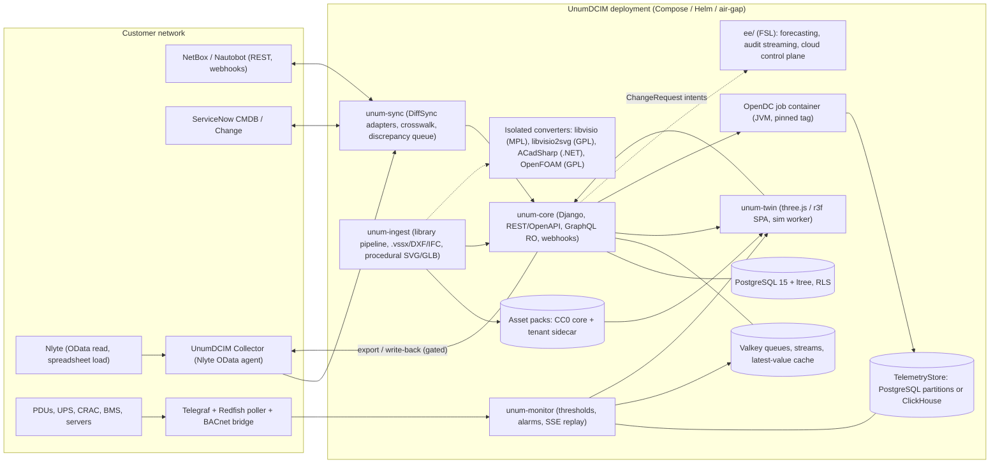

# UnumDCIM: Design Decision Walkthrough

> **Implementation amendment:** ADR 0021 supersedes the monolith, broad in-process
> community extensions, cadence-only compatibility and centralized offline audit
> assumptions below. See `../implementation-status.md` for actual coverage.

> **Status:** accepted with amendments, 2026-09-12. This is the round-1 synthesis (D01 to D31) as preserved from the research session, with Addendum A's corrections C1 to C15 applied in place, D05 rewritten to the single open-core rule (Addendum B D72), D07 and D30 amended per Addendum B corrections C.2, and identity-field ownership pointed at D76. Founder decisions recorded on 2026-09-08 supersede any remaining mentions of a hosted Cloud tier (self-hosted only for the first 24 months) and settle the license (Apache-2.0) and funnel (balanced). The canonical fact list is `docs/fact-sheet.md`; where this document's section 7 and the fact sheet differ, the fact sheet wins.
>
> Corrections applied in place (from `01-addendum-a.md` section A.1): C1 native-mastered objects are what NetBox/Nautobot cannot hold, not "incumbents"; C2 `$metadata` probe with `$top=1` fallback; C3 Nlyte-sourced overlays limited to outlet readings; C4 Sparkplug B via Telegraf `xpath_protobuf`; C5 Cisco EoX entitlement verified for SNTC/PSS; C6 Change Management license unverified, netbox-branching NLUL; C7 150k-rack figure is 2015 marketing; C8 relicensing forks limited to Terraform and Redis; C9 Grafana sentiment removed; C10 Nlyte Linux-Docker scope unverified; C11 EMF-heavy masters are general, not Cisco-specific; C12 SCIM is a differentiator, not a norm; C13 one-hour install is an exit criterion; C14 OGrEE-3D importer caveat; C15 Icecat's promotion-only purpose clause is not in the OPL text and remains UNVERIFIED (counsel question narrowed to the Fair Use Policy). Also applied: the round-1 correction to Cisco's icon terms.

Prepared 2026-09-08 for the founder. This is the synthesis of the research digest, the three competing designs, and the three-judge panel. The winning angle (twin-first, product-led wedge on a NetBox-superset data layer) is the spine; the strongest ideas from the NetBox-platform and greenfield-core designs are grafted in where the judges flagged them, and every factual error the judges caught is corrected here. Claims marked **UNVERIFIED** in the research are treated as assumptions to validate, never as design contracts.

---

## 1. Executive summary: the decisions that shape everything

| # | Decision | Recommended answer (one line) |
|---|---|---|
| 1 | **Positioning and wedge** | Ship an open, simulation-ready asset library plus a browser-native 2D/3D twin that installs beside an incumbent (Nlyte first, NetBox as the free funnel); a one-hour install is the Phase 1 exit criterion, not a capability claim (correction C13), and grow a native DCIM data layer behind it via a per-field ownership ratchet, so it is never "just a viewer". |
| 2 | **Substrate** | Greenfield Django platform whose schema is a strict superset of NetBox 4.7 vocabulary; NetBox, Nautobot and Nlyte are first-class sync peers, not the substrate. No NetBox plugin bundle, no fork. |
| 3 | **License** | Apache-2.0 core forever; buyer-based open core with a self-converting FSL-1.1-Apache-2.0 `ee/` directory fencing only multi-Organization portfolio rollups, ML ensembles and AI placement, portfolio Monte Carlo, lead-time optimization, colo revenue analytics, audit streaming and the hosted control plane (see D05 as revised by Addendum B D72). Connectors, SSO, SCIM, RBAC, audit and webhooks are free. |
| 4 | **Governance** | DCO on core, CLA only inside `ee/` (GitLab pattern); registered "UnumDCIM" mark with a Grafana/LF-style policy; zero dependency on NetBox Labs' Limited-Use-licensed components; foundation donation revisited at 3+ independent maintainers. |
| 5 | **Data model and source of truth** | NetBox-superset schema with a written deviations list (upstream power chain, cooling chain, metric geometry), a Provenance mixin on every object, a per-(tenant, entity, field) OwnershipPolicy, and a single "proposed placement" intent state so rack placement is one fact, not two. |
| 6 | **Asset library** | Bundle only CC0 data (netbox-community + nautobot devicetype-library, merged); UnumDCIM definitions CC0, art CC-BY-4.0; every encumbered source (Icecat, Visio, vendor tools, Sketchfab) fetched user-side into a tenant-private, license-tagged sidecar that CI refuses to merge; procedural SVG/GLB as the always-available default. |
| 7 | **Twin stack** | three.js + react-three-fiber + drei (MIT), one scene graph for plan/elevation/orbit/walk, WebGPU with WebGL2 first-class, instancing/LOD budgets validated in a Phase 0 spike on an Intel iGPU; game mechanics limited to what reviews reward (cabling/rack mounting, snapping, templates, animated flow, EOL badges) and thermal shown as fact/estimate/CFD tiers. |
| 8 | **Nlyte coexistence** | Read-first OData polling with customer credentials, snapshot-hash change detection, a crosswalk table, discrepancy queue, spreadsheet export as the phase-1 reverse path (format to be verified with the customer), API write-back only after a customer supplies docs and a write-enabled account; design assumes zero cooperation from Carrier. |

Two corrections to the winning design that the judges required and this document adopts: the enterprise security baseline (MFA, SCIM, Organizations isolation, offline bundle) moves into the MVP, and native threshold/alarming moves into Phase 2 alongside the collector contract so a customer's Power IQ/NEO spend can begin to shrink before month 30. The roadmap is expressed as which incumbent modules can be retired at which phase, not as a vendor KPI.

---

## 2. Decision walkthrough

Decisions are ordered by when they must be made and by dependency. Format per decision: why it matters, options (each with the strongest objection), recommendation, rationale with citations, dependencies, door type, and the evidence that would change the recommendation.

### Phase 0 decisions (before the first public commit)

#### D01. Product positioning and the wedge

**Why it matters.** Incumbents (Nlyte, dcTrack/Power IQ, IT Advisor, Device42, Hyperview, FNT, iTRACS) built fifteen feature categories over 10-15 years; Vertiv discontinued Trellis in 2021 as "too large and complex" (https://journal.uptimeinstitute.com/dcim-past-and-present-whats-changed/). A new entrant cannot win on feature count in year one, but it can own the two things no incumbent has: an open, redistributable, simulation-ready asset library and a browser-native game-grade twin.

**Options.**
- *A. Twin-only viewer over Nlyte/NetBox.* Objection: owns no data, so no retention or pricing power; Nlyte already resells an AR twin add-on (DC Smarter DC Vision), so a pure viewer is replicable.
- *B. Twin + open library + native data layer that masters what NetBox/Nautobot structurally cannot hold and what incumbents hold only in closed, non-exportable form (correction C1), with an ownership ratchet (recommended).* Objection: it is still a greenfield source of truth wearing a wedge costume; the MVP backlog must be policed hard.
- *C. Full parity first, twin later.* Objection: multi-year silence before any release; the Trellis outcome.

**Recommendation.** Option B. Day-one native-mastered objects: metric floor geometry, 2D/3D art and rack blueprints, overlays and seeded scenarios, cooling chain, upstream power chain above the rack PDU, sensor placements, simulation-grade device attributes (idle/max W, core counts), sustainability derivations. Customers promote further entity types and whole sites to UnumDCIM mastery per site, reversibly, over time. Two funnels from launch: the free twin for NetBox users (21.5k-star community, https://api.github.com/repos/netbox-community/netbox) and the Nlyte collector for enterprises; the judges were right that the NetBox path is the larger top-of-funnel and should not be under-invested relative to Nlyte.

**Rationale.** Nlyte's OData model exposes only GridReferenceRow/Column/Layer for placement and no 3D (https://raw.githubusercontent.com/vmware-archive/flowgate/master/nlyte-worker/src/main/java/com/vmware/flowgate/nlyteworker/model/NlyteAsset.java); its AR twin is a partner add-on (https://www.nlyte.com/resource/nlyte-software-add%E2%80%91ons-connectors/). Game reviews reward hand cabling/rack mounting most, animated packet flow second, and punish missing tutorials and slow first-person movement (https://steamcommunity.com/app/4170200/reviews/?browsefilter=toprated). An API-addressable model library is not unique (dcTrack 8.0.1 has one, https://hostingjournalist.com/news/latest-sunbird-dctrack-release-drives-further-data-center-automation); an *open* one is.

**Depends on:** none. **Door:** two-way for scope, one-way for the ratchet mechanism (D12). **Would change it:** a design partner who wants a full replacement on day one and will fund it; or evidence that Nlyte/NetBox users will not install a second data layer even read-only.

#### D02. Substrate: greenfield vs NetBox plugin vs fork

**Why it matters.** Fixes who owns the schema, the upgrade treadmill, the tenancy ceiling, and exposure to NetBox Labs' commercial posture.

**Options.**
- *A. NetBox plugin bundle plus sibling services.* Highest reuse (inventory, cables, feeds, 4.7 cooling, permissions, change log, REST/OpenAPI, event rules, SSO, packaging, CC0 library on day one). Objection: plugins "cannot modify core models", cannot register URLs outside `/plugins`, cannot override core templates, and "internal elements are subject to change at any time" (https://netboxlabs.com/docs/netbox/plugins/development/); three minors a year with breaking odd releases and a v5.0 that makes RackType mandatory (https://netboxlabs.com/docs/netbox/models/dcim/rack/); NetBox Labs' Limited Use License on Diode and netbox-branching bars products that "extend NetBox in a way that competes with any product or service of NetBox Labs" (https://raw.githubusercontent.com/netboxlabs/netbox-branching/main/LICENSE.md); tenancy is labels, not isolation (https://netboxlabs.com/docs/netbox/features/tenancy/). A facilities director who does not own the NetBox instance cannot make NetOps' upgrade schedule a precondition for a DCIM purchase.
- *B. Greenfield Django platform with a NetBox-superset schema and first-class connectors (recommended).* Objection: rebuilds permissions, change log, bulk import, API conventions; no installed base.
- *C. Fork NetBox.* Objection: Nautobot shows a fork is viable only with a sustaining company and still diverged painfully (3.0 Bootstrap-5 rewrite forced App rewrites, dual 3.2.x/2.4.x LTS, https://docs.nautobot.com/projects/core/en/stable/release-notes/version-3.0/).

**Recommendation.** Option B, borrowing NetBox's vocabulary, permission-constraint design, change-log design and REST conventions verbatim (Apache-2.0, https://raw.githubusercontent.com/netbox-community/netbox/main/LICENSE.txt) so the rebuild is a port, not an invention. Ship an optional thin Apache-2.0 NetBox plugin later (deep-link tab plus an event-rule action that posts changes to UnumDCIM), never a plugin bundle that masters data inside NetBox.

**Rationale.** The plugin path's "plugin-less degraded mode" was judged incoherent (nothing masters extension data without the plugin), and a NetBox Labs certification request is hope, not mitigation. Correction to the competing designs: NetBox Cloud tiers are Starter (certified plugins), Professional (adds compatible plugins), Premium (private plugins) (https://netboxlabs.com/pricing/), so exclusion is partial, not total; it still makes hosted NetBox buyers a poor primary market for a plugin.

**Depends on:** D01. **Door:** one-way. **Would change it:** NetBox Labs publishing a partner program that certifies competing DCIM extensions under Apache-2.0 terms; or a design partner base that is 100% NetBox-hosted.

#### D03. Feature-parity scope and what "parity" means

**Why it matters.** RFPs are checklists; over-scoping kills. The table-stakes list must be explicit so the roadmap can say which incumbent module retires when.

**Table stakes (every major suite ships it; sources: https://www.sunbirddcim.com/what-dcim, https://www.fntsoftware.com/en/use-cases/data-center, https://www.nlyte.com/products/, https://uptimeinstitute.com/professional-services/dcim-consulting):**
1. Asset lifecycle (receiving to retirement), rack elevations with scaled front/rear images, vendor model library, custom fields, bulk import.
2. Capacity: space (U), power, cooling, weight/floor load, ports, at rack and upstream device level.
3. Power chain: utility to generator/ATS to switchgear/transformer to UPS to panel/breaker to rack PDU to outlet to PSU, with auto-generated one-line diagrams and end-to-end trace (AC and DC, three-phase).
4. Structured cabling: port-level connections, patch panels, media validation, circuit trace.
5. Change management: MAC requests with approvals, work orders, audit trail, ticketing connectors (ServiceNow/Jira/BMC).
6. Monitoring: SNMP/Modbus/BACnet polling of PDUs/UPS/CRAC/sensors, thresholds, trap receipt, notification.
7. Energy/PUE/sustainability reporting (now a baseline RFP line).
8. 2D floor plans, rack elevations, and 3D (3D is now table stakes: dcTrack since 2016, Device42, Hyperview base plan, FNT 3D Footprint).
9. Dashboards, custom reports, BI export (SQL/ODBC views, Power BI feeds).
10. REST API with OpenAPI, tokens/OAuth2, webhooks; ServiceNow/VMware connectors.
11. RBAC, SAML/OIDC SSO, MFA, audit logging.
12. Multi-site with tenant isolation.
13. Mobile/barcode/QR audit.

Differentiators (only some ship them): what-if simulation and automated placement, power-failure/redundancy simulation, streaming telemetry API with replay, models-library CRUD API, walk-through/AR twin, NL query and anomaly detection, agentless discovery.

**Options.**
- *A. Full parity in the first major.* Objection: Trellis.
- *B. Wedge sequencing: library + twin + power/cooling chain + capacity + coexistence sync at MVP; monitoring and thresholds in Phase 2; workflow, cabling completion, sustainability, mobile in Phase 3; AI/AR later (recommended).* Objection: a dcTrack+Power IQ shop keeps both incumbents for ~18 months.
- *C. Monitoring-only or twin-only wedge.* Objection: fails goals (c) and (d); Power IQ/IT Expert own that slot.

**Recommendation.** Option B, with two judge-required adjustments: port-level cabling is modeled from Phase 1 (the twin cannot animate "network paths" the model cannot represent) and native thresholds/alarming ship in Phase 2 with the collector, so the retirement path for NEO/Power IQ opens before month 30. Thermal remains sensor/CFD-import driven; even dedicated games did not ship thermal simulation (https://steamcommunity.com/app/1917160/allnews/).

**Depends on:** D01, D02. **Door:** two-way; revisit at each phase gate. **Would change it:** design partners ranking workflow above monitoring, which would swap Phases 2 and 3 for the operations layer.

#### D04. Core license

**Why it matters.** Determines which upstream code can be vendored, enterprise legal friction, OEM embedding, and foundation eligibility. Terraform's and Redis's relicensings each produced a Linux Foundation-hosted fork (OpenTofu, Valkey); other relicensings produced no fork but did produce trust loss (correction C8) (https://www.linuxfoundation.org/press/announcing-opentofu, https://www.linuxfoundation.org/press/linux-foundation-launches-open-source-valkey-community).

**Options.**
- *A. Apache-2.0 (recommended).* Objection: hyperscalers/MSPs may host it freely; GPL code and art (openDCIM, RackTables, dctycoon sprites, libvisio2svg, LibreDWG, OpenFOAM) can never be linked in-process (ASF: GPLv3 into Apache is incompatible, https://www.apache.org/licenses/GPL-compatibility.html).
- *B. AGPL-3.0.* Section 13 deters hosted copies (Grafana 2021, Zabbix 7.0). Objection: enterprise legal review friction; cannot contribute back to Apache NetBox/Nautobot; CNCF-ineligible; spooks OEM/embedding partners the wedge needs.
- *C. Source-available core (BSL/FSL).* Objection: not open source; contradicts the positioning against NetBox Labs' NLUL and Nlyte's closed docs.

**Recommendation.** Apache-2.0 for the core, connectors, asset tooling and collectors, declared in the governance charter as permanent. GPL material admitted only as process-isolated services (libvisio2svg, LibreDWG, OpenFOAM containers) and never as an in-process "theme plugin" (the competing design's GPL-theme option is a legal grey zone and is dropped).

**Rationale.** Both DCIM/SoT comparables and the CNCF default are Apache-2.0 (https://raw.githubusercontent.com/nautobot/nautobot/develop/LICENSE.txt, https://raw.githubusercontent.com/cncf/foundation/main/charter.md). All high-value reuse candidates are MIT/BSD/Apache/CC0: three.js (https://github.com/mrdoob/three.js/blob/dev/LICENSE), r3f/drei (https://github.com/pmndrs/react-three-fiber/blob/master/LICENSE), datacenter-survival (https://raw.githubusercontent.com/pshenok/datacenter-survival/main/LICENSE), OpenDC (https://raw.githubusercontent.com/atlarge-research/opendc/master/LICENSE.txt), FlowGate (https://raw.githubusercontent.com/vmware-archive/flowgate/master/LICENSE.txt), Telegraf (https://raw.githubusercontent.com/influxdata/telegraf/master/LICENSE), Nautobot SSoT (https://raw.githubusercontent.com/nautobot/nautobot-app-ssot/develop/LICENSE).

**Depends on:** D02. **Door:** one-way. **Would change it:** nothing short of a hosted competitor materially capturing the market before the FSL tier (D05) exists, and even then the fence goes on add-ons, not the core.

#### D05. Open-core boundary and the fence on add-ons

**Why it matters.** Comparables split: Grafana gates RBAC/SAML/SCIM/audit to Enterprise (correction C9) (https://grafana.com/docs/grafana/latest/introduction/grafana-enterprise/); GitLab paywalls SCIM but keeps audit events free (https://docs.gitlab.com/user/compliance/audit_events/); Zabbix ships SAML, SCIM and native HA free and sells only support (https://www.zabbix.com/support). Mis-placing the wall either starves revenue or alienates the community.

**Options.**
- *A. No fence, support and hosting only.* Objection: nothing stops a Carrier- or hyperscaler-hosted copy.
- *B. Buyer-based open core with FSL-1.1-Apache-2.0 on an `ee/` directory and the SaaS control plane; converts to Apache-2.0 after two years (recommended).* Objection: some community skepticism of Fair Source; requires directory discipline.
- *C. PolyForm Shield / NLUL-style non-compete.* Objection: no conversion date; exactly the posture this project criticizes.

**Recommendation.** Option B, as revised by Addendum B D72 so that the published rule has one form. **Free forever (Apache-2.0 core):** twin, library, all ingestion and sync connectors (never fenced), OIDC/SAML/LDAP, MFA, SCIM 2.0, object and field-level RBAC, change log with snapshots, webhooks, OpenDC integration, air-gap install, LTS releases, single-Organization demand and forecast management (ResourcePool, Reservation, DemandRequest, Runway, Scenario, trend runway with prediction and conformal intervals, headroom dashboards, exhaustion and lead-time alerts, ServiceNow demand mirror, MSP client and site rollups within one Organization), and the MCP server with all its tools. **FSL tier (`ee/`, FSL-1.1-Apache-2.0):** multi-Organization portfolio rollups (cross-tenant aggregation), ML auto-model selection and ensembles, AI placement optimization, portfolio Monte Carlo, procurement-lead-time optimization, colo revenue analytics with rate plans, audit-event streaming to SIEM, hosted control plane, certified-connector packaging, extended-support backports. Publish the rule in the README before v1.

**Rationale.** Sentry's FSL converts each version on its second anniversary (https://raw.githubusercontent.com/getsentry/sentry/master/LICENSE.md, https://fsl.software/); the buyer-based rule is GitLab's (https://opencoreventures.com/insights/a-standard-pricing-model-for-open-core/). Judges' correction adopted: SCIM stays free (free in at least one comparable, Zabbix, and paid in Grafana and GitLab; chosen as a deliberate differentiator, not an industry norm; correction C12) and LTS *releases* stay public; only extended support is paid (Zabbix LTS is public, support tiers are paid, https://www.zabbix.com/life_cycle_and_release_policy).

**Depends on:** D04, D07. **Door:** two-way for placement of individual features; one-way for the promise that the core and connectors are never fenced. **Would change it:** community backlash measured in fork activity, or enterprise buyers refusing FSL components in procurement.

#### D06. Contribution agreement, governance and trademark

**Why it matters.** CLA-vs-DCO, vendor-vs-foundation and trademark ownership are linked: CNCF requires Apache-2.0 + DCO + trademark transfer (https://raw.githubusercontent.com/cncf/foundation/main/charter.md); NATS/Synadia ended with the marks assigned to the LF (https://www.cncf.io/blog/2025/05/01/cncf-and-synadia-align-on-securing-the-future-of-the-nats-io-project/).

**Options.**
- *A. DCO only.* Objection: forecloses relicensing community code into `ee/`.
- *B. CLA everywhere.* Objection: suppresses contributions; rug-pull suspicion after 2023-2025.
- *C. DCO for core, CLA only for `ee/` contributions, registered mark, public charter (recommended).* Objection: two regimes to explain.

**Recommendation.** Option C, as GitLab does (https://raw.githubusercontent.com/gitlabhq/gitlabhq/master/CONTRIBUTING.md). Trademark policy modeled on Grafana/LF: no marks on modified derivatives, product names or domains (https://grafana.com/trademark-policy/, https://www.linuxfoundation.org/legal/trademark-usage). Never use "NetBox" in the product name. Zero dependency on NLUL components (Diode server and plugin, netbox-branching); the Diode protobufs and SDKs are Apache-2.0 and may be targeted as an optional producer output (https://github.com/netboxlabs/diode). Contribute schema improvements (DeviceType mm dimensions, typical power) upstream to NetBox; note RackType already carries outer_width/height/depth (https://raw.githubusercontent.com/netbox-community/devicetype-library/master/schema/racktype.json), so the upstream gap is DeviceType, not RackType. Foundation donation of the Apache core is revisited at three or more independent maintainers.

**Depends on:** D04, D05. **Door:** two-way (foundation), one-way (trademark registration timing). **Would change it:** a second vendor contributing materially, which triggers the foundation review.

#### D07. Business model and monetization sequence

**Why it matters.** Incumbents anchor on per-cabinet ($19.50/cabinet/month dcTrack, $27.50 suite, https://www.sunbirddcim.com/pricing), per-asset ($3/asset/year Hyperview, https://hyperviewhq.com/pricing/), per-node ($5.50/node/month Power IQ), per-user (FNT EUR99-319/user/month, https://www.fntsoftware.com/en/pricing), or custom (Nlyte, https://www.nlyte.com/company/pricing/).

**Options.**
- *A. Support tiers first, single-tenant cloud second, FSL enterprise tier third (recommended).* Objection: slow revenue ramp; support scales with headcount.
- *B. Per-cabinet from day one.* Objection: requires metering an estate the product does not yet master; positions it as an add-on cost to Nlyte.
- *C. SaaS only.* Objection: most DCIM is hosted on-prem (secondary Uptime data, UNVERIFIED but consistent with Nlyte/NetBox Enterprise "Air Gap Edition" demand, https://netboxlabs.com/products/netbox-enterprise/).

**Recommendation.** Option A. "Supported" priced per site (SLA, backports, certified connector packs); "Cloud" single-tenant reusing the same Helm chart; "Enterprise" (FSL tier, 24x7, FIPS guide). Per-cabinet pricing is retired (Addendum B corrections, C.2 item 3): the Supported tier is priced per billable site (a building or campus containing at least one data_hall, computer_room, micro_edge_dc or server_room; closet-class Locations roll up to their parent) or per weighted managed asset in MSP mode and closet-heavy estates (D69); `ee/` entitlements are licensed per Organization by an unweighted asset-count band; single-tenant Cloud is out of scope for the first 24 months by founder decision. Paid services (Nlyte migration, library curation) are the first revenue. Correction: the "49% cannot justify ROI / 6-12 month deployment" figures are undated and appear to be mid-2010s; Uptime's 2024 post treats ROI skepticism as historical, so do not use them in sales collateral as current statistics.

**Depends on:** D05, D26. **Door:** two-way. **Would change it:** design partners willing to pre-pay per-cabinet for the FSL tier, which would pull Option B forward.

#### D08. License and tiering of asset-library data

**Why it matters.** Only netbox-community and nautobot devicetype-library are cleanly redistributable (CC0-1.0, https://raw.githubusercontent.com/netbox-community/devicetype-library/master/LICENSE.txt). Icecat's Open Content License 1.4 is copyleft on derivatives, requires a database-right notice, caps fair use at 1M datasheets/month and voids on ML training (https://iceclog.com/open-content-license/). VisioCafe collections are "copyrighted to their respective owner" with no redistribution grant; NetZoom's EULA bars extracting shapes to bundle with any other product (https://www.visiostencils.com/support/faq.html).

**Options.**
- *A. CC0 for definitions and art.* Objection: incumbents can absorb art silently.
- *B. CC0 definitions, CC-BY-4.0 authored art, everything else tenant-private (recommended).* Objection: attribution must be surfaced in the UI.
- *C. ODbL.* Objection: blocks upstreaming to CC0 devicetype-library.

**Recommendation.** Option B with two physical stores enforced in code and CI: `library-core` (CC0/CC-BY only, shipped) and `library-sidecar` (per-tenant, user-fetched, SPDX-tagged, never merged). CC0 cannot clear third-party rights in contributed elevation images (CONTRIBUTING.md has no image policy, https://raw.githubusercontent.com/netbox-community/devicetype-library/master/CONTRIBUTING.md), so an image-rights audit and takedown policy precede the first public asset pack.

**Depends on:** D04. **Door:** one-way. **Would change it:** netbox-community adopting an image-rights policy, which would let more upstream images ship unaudited.

#### D09. Language and framework stack

**Why it matters.** Code reuse (NetBox/Nautobot serializers, DiffSync, pynetbox, ezdxf, pymodbus, BACpypes3, usd-core are Python), hiring pool, and runtime count for a small team.

**Options.**
- *A. Python 3.12 / Django 5.2 LTS + DRF + drf-spectacular + Strawberry; TypeScript/React twin; Telegraf (Go, MIT) as the collector; OpenDC as a JVM 21 job container (recommended).* Objection: Python ingestion ceilings (mitigated by Telegraf doing protocol work and a ClickHouse option).
- *B. Go backend.* Objection: no DCIM ecosystem to reuse; weaker ORM/migrations for a 100+ table schema.
- *C. TypeScript end-to-end.* Objection: no SoT comparable; loses Python integration libraries.

**Recommendation.** Option A. Two application languages only (Python, TypeScript); Go appears only as an unmodified Telegraf binary plus, if needed, a small Redfish PowerDistribution poller; JVM (OpenDC) and .NET (ACadSharp for DWG) only as isolated containers. The competing design's "Go collector carved from Telegraf inputs" is rejected as owning a fork of Telegraf.

**Rationale.** NetBox and Nautobot are ~95% Python (https://api.github.com/repos/netbox-community/netbox/languages, https://api.github.com/repos/nautobot/nautobot/languages); Sentry proves Python + ClickHouse at telemetry scale (https://raw.githubusercontent.com/getsentry/snuba/master/README.rst); Django 5.2 LTS is supported to April 2028 and 6.2 to April 2030 (https://www.djangoproject.com/download/); professional developer usage is Python 54.8%, TypeScript 48.8%, Go 17.4% (https://survey.stackoverflow.co/2025/technology). OpenDC's SDK exists only on master and is not on Maven Central beyond 2.0 (https://central.sonatype.com/namespace/org.opendc), so JVM isolation is mandatory anyway.

**Depends on:** D02. **Door:** one-way. **Would change it:** OpenDC publishing a stable SDK to Maven Central would not change the language choice, only the sidecar's build.

#### D10. Datastores

**Why it matters.** TimescaleDB's compression, continuous aggregates and retention policies live in the TSL-licensed `tsl/` tree (https://raw.githubusercontent.com/timescale/timescaledb/main/tsl/LICENSE-TIMESCALE); ClickHouse and VictoriaMetrics core are Apache-2.0 but VictoriaMetrics gates downsampling/multi-retention/backups as Enterprise; Redis 8 is tri-licensed with AGPL/SSPL/RSAL (https://redis.io/blog/agplv3/).

**Options.**
- *A. PostgreSQL 15+ (ltree for location hierarchy, PostGIS optional) for inventory and geometry; Valkey (BSD-3) for queues and streams; telemetry behind a `TelemetryStore` interface with PostgreSQL partitions as default and ClickHouse as the large-estate implementation (recommended).* Objection: partitioned PostgreSQL needs home-grown downsampling/retention jobs.
- *B. PostgreSQL + TimescaleDB Community.* Objection: TSL is not OSI; compression is TSL-only (https://www.zabbix.com/documentation/current/en/manual/appendix/install/timescaledb); the TSL permits value-added SaaS (s2.1(b)/s3.10) but a bare managed-database offering is barred, which needs counsel review before a cloud tier.
- *C. Kafka + ClickHouse from day one.* Objection: kills the one-hour install; Confluent Schema Registry is non-OSI.

**Recommendation.** Option A. TimescaleDB Community remains an approved alternate implementation of `TelemetryStore` for self-hosted customers who already run it. NATS JetStream (Apache-2.0) is an optional transport for multi-site collectors in Phase 3, never in the reference install.

**Depends on:** D09, D28. **Door:** two-way (behind the interface). **Would change it:** 1-minute polling of tens of thousands of outlets in early customers, which would make ClickHouse the default sooner.

#### D11. Canonical data model

**Why it matters.** The schema is the product in a greenfield SoT; it must round-trip NetBox 4.x/5.0 and Nautobot losslessly, map Nlyte entities, and carry what none of them have.

**Options.**
- *A. Invent an ontology (DTDL/ISO 23247 first).* Objection: every importer becomes lossy; no buyer asks for DTDL.
- *B. NetBox 4.7 vocabulary as the shared base plus explicit extensions and a written deviations list (recommended).* Objection: must track NetBox schema drift (4.3 module profiles, 4.5 port-mappings, 4.6 owner/counts, 4.7 cooling/EOL/module_bay_types) with a versioned mapper.
- *C. Nlyte's entity model.* Objection: instance-configurable enumerations, no public docs, ties the platform to the incumbent.

**Recommendation.** Option B. Shared base: Region/SiteGroup/Site/Location (ltree), RackGroup, RackType-first physical attributes (anticipating NetBox v5.0), Rack, DeviceType/ModuleType with airflow, weight, cooling_method, end_of_life, Module/ModuleBay, front/rear ports with port-mappings, Cable with multi-termination and bundles, PowerPanel/PowerFeed/PowerPort/PowerOutlet with feed_leg, CoolingSource/CoolingFeed/CoolingIntake/CoolingOutflow (NetBox 4.7, https://github.com/netbox-community/netbox/releases/tag/v4.7.0), Tenant, CustomField, Tag. Extensions: PowerSource (utility/generator/battery, typed with Redfish PowerEquipmentType vocabulary), PowerNode (switchgear, transformer, ATS/MTS, UPS, RPP, busway, power shelf) with parent link, kVA/kW, voltage, phases, A/B path; PanelExtension (parent panel, main breaker amps, poles) in the openDCIM shape (https://raw.githubusercontent.com/samilliken/openDCIM/master/create.sql); Breaker with position/poles/feed_leg in the Nautobot 2.4.15 shape, plus panel-to-panel destination_panel (https://docs.nautobot.com/projects/core/en/stable/user-guide/core-data-model/dcim/powerfeed/); DC circuits (24/48 V); CoolingUnit capacity with derating; floor geometry (D13); RackTemplate/Blueprint; Scenario/SimulationRun; Sensor/Reading; ChangeRequest/WorkOrder intents (D30); ExternalReference crosswalk (D12). Written deviations from NetBox: multi-port feeds, PowerSource above panels, cooling loops as connections, metric geometry. Keys: NetBox slug for library types; UUIDv7 for instances. Device-type superset fields: width/depth/height mm, typical/max/idle W, heat BTU/hr with confidence, PSU count/wattage/voltage/redundancy, CPU coreCount/coreSpeed, memory, GPU (OpenDC-ready), EOS/EOL, SKUs, media with license.

**Rationale.** NetBox stops at PowerPanel ("the furthest upstream power element modeled", https://netboxlabs.com/docs/netbox/features/power-tracking/) and declares facilities management out of scope (https://netboxlabs.com/docs/netbox/introduction/); Nlyte's Materials fields (external W/D/H, weight, UHeight, ports, plugs, RequiresDiversePower, airflow, PublishedPowerConsumption, MPAF, MaxA/MaxV) define the enrichment target (https://raw.githubusercontent.com/vmware-archive/flowgate/master/nlyte-worker/src/main/java/com/vmware/flowgate/nlyteworker/model/Material.java).

**Depends on:** D02, D09. **Door:** one-way for the shared subset (freeze at v1.0). **Would change it:** NetBox 5.0's actual schema, which would move the mapper target but not the model.

#### D12. Source-of-truth semantics: provenance, ownership, ID mapping, placement as one fact

**Why it matters.** This is the ownership ratchet's mechanism (D01) and the answer to the class of sync bugs (port sync, removal sync, autosave separation) the games' co-op changelogs document. It is also where the judges found the winning design's one real correctness flaw: rack placement encoded twice (UnumDCIM-owned metric geometry vs Nlyte-owned GridReference/UMounting) would reopen a discrepancy on every Nlyte snapshot.

**Options.**
- *A. Global SoR flag per instance.* Objection: cannot express "Nlyte owns lifecycle status, we own geometry" on the same asset.
- *B. Provenance mixin on every object plus a per-(tenant, entity, field) OwnershipPolicy with a discrepancy queue, ExternalReference crosswalk, and a single placement fact with a proposed-placement intent state (recommended).* Objection: more machinery; ownership visible everywhere in UI and API.
- *C. Last-writer-wins.* Objection: silent corruption between snapshot polling and interactive edits.

**Recommendation.** Option B. Rules: (1) only the owning system writes a field; other systems' values land in staging. (2) ExternalReference rows keyed (system_instance_id, entity_set, native_id) map to UnumDCIM UUIDs; external IDs are never primary keys; secondary matching on serial, asset number, tag with confidence thresholds and human confirmation. (3) Discrepancies get side-by-side values, owner-wins default, logged manual override, and a badge on the rack in the twin. (4) Identity fields (serial number, asset tag, MAC) follow the per-tenant precedence list of Addendum B D76 (one owner per field). Defaults during Nlyte coexistence: Nlyte owns lifecycle/RecordStatus/OperationalStatus, workflow/RFC state, audit and purchasing fields; NetBox owns IPAM/VLAN/cable terminations when present; UnumDCIM owns geometry, art, templates, scenarios, cooling and upstream power chains, sensor placements, crosswalk; shared identity fields use configurable precedence. (5) **Placement is one fact:** a rack's position (tile/GridReference, U position, face) has one owner; a planner's drag in the twin creates a ChangeRequest intent in a "proposed" state rendered as a ghost until the owner system confirms (via the reverse path or promotion), so metric geometry is derived from the confirmed placement plus a UnumDCIM-owned offset/rotation, not an independently ownable copy. (6) Soft deletes mirror RecordStatus; nothing is auto-deleted.

**Rationale.** RF Code's Nlyte connector "alerts you to any discrepancies" (https://www.rfcode.com/blog/optimize-nlyte-dcim-integration-rf-code-centerscape); Nlyte's ServiceNow sync splits attributes (ServiceNow owns asset attributes, Nlyte owns cabinet/U location, https://www.nlyte.com/blog/master-your-assets-nlyte-servicenow-cmdb-integration/). No public evidence of ETag/$deltatoken on Nlyte's OData means change detection is snapshot-hash based (FlowGate does full re-sync, https://raw.githubusercontent.com/vmware-archive/flowgate/master/nlyte-worker/src/main/java/com/vmware/flowgate/nlyteworker/scheduler/job/NlyteDataService.java).

**Depends on:** D11. **Door:** one-way. **Would change it:** a customer's Nlyte exposing $deltatoken or modified-date filters, which would add an incremental path without changing the ownership model.

#### D13. Floor geometry representation

**Why it matters.** Peers disagree: Nlyte GridReference row/col/layer, netbox-floorplan-plugin fabric.js pixels, Nautobot/GLPI tile grids, openDCIM MapX/Y on a drawing, OpenDC RoomTile x/y. The 3D twin needs metric coordinates.

**Options.**
- *A. Metric-first: per-Room origin, rotation, declared tile grid (pitch, offset); rack footprint from RackType outer dims plus yaw; grid references derived, not stored (recommended).* Objection: importing from grid-only systems needs a calibration step.
- *B. Tile grid canonical.* Objection: cannot express angled rows, containment, cable trays, DXF underlays.
- *C. Free canvas pixels.* Objection: no physical units; breaks capacity per m² and 3D.

**Recommendation.** Option A, with a grid-calibration step in importers (place one rack, infer pitch/origin) and adapters for Nlyte GridReference, nautobot-app-floor-plan tiles (Apache-2.0, https://github.com/nautobot/nautobot-app-floor-plan), netbox-floorplan-plugin (LGPL-3.0, consumed as data only, https://github.com/netbox-community/netbox-floorplan-plugin) and OpenDC RoomTile (https://app.opendc.org/q/openapi). Note GridReference fields are asset (placement) attributes and LocationGroups carry lat/long (https://raw.githubusercontent.com/vmware-archive/flowgate/master/nlyte-worker/src/main/java/com/vmware/flowgate/nlyteworker/scheduler/job/common/HandleAssetUtil.java).

**Depends on:** D11, D12. **Door:** one-way. **Would change it:** nothing foreseeable.

#### D14. Twin rendering engine and delivery platform

**Why it matters.** The commercial games are native Unity/Unreal; an OSS, air-gapped, browser DCIM cannot be. The engine fixes the front-end skill set for years.

**Options.**
- *A. three.js + react-three-fiber + drei (MIT), WebGPURenderer with automatic WebGL2 fallback (recommended).* Objection: monthly three.js releases with occasional breaks (pin); React coupling; fidelity below native.
- *B. Babylon.js (Apache-2.0).* Objection: thin instances are all-or-nothing visibility with one bounding box; smaller React ecosystem; either engine, not both.
- *C. Unity/Unreal web export or Pixel Streaming.* Objection: Unity Industry is required for non-game orgs over $1M and Unity Web has no managed C# threads (https://unity.com/pricing, https://docs.unity3d.com/6000.0/Documentation/Manual/webgl-technical-overview.html); Unreal charges 5% royalty above $1M for products licensed to third parties or $1,850/seat/year for internal apps and is source-available, not OSI; Pixel Streaming needs one UE instance per interactive viewer (https://dev.epicgames.com/documentation/en-us/unreal-engine/unreal-engine-pixel-streaming-reference).
- *D. Godot web / Bevy.* Objection: Godot web is WebGL2-only, no C#, single-threaded by default (https://docs.godotengine.org/en/stable/tutorials/export/exporting_for_web.html); Bevy is "early stages" with breaking releases every ~3 months (https://github.com/bevyengine/bevy).

**Recommendation.** Option A with explicit budgets: at most 1,000 draw calls, 100k instances via InstancedMesh per library model plus BatchedMesh for heterogeneous geometry, three LOD tiers, three-mesh-bvh picking, `frameloop="demand"`, PerformanceMonitor with a user-facing quality slider (https://r3f.docs.pmnd.rs/advanced/scaling-performance, https://threejs.org/docs/pages/BatchedMesh.html). Phase 0 gate: 10k racks / 100k devices within budget on an Intel iGPU laptop under WebGL2. Vendor pinned ESM builds; never CDN globals (pshenok's cdnjs r128 boot guard is the anti-pattern for air-gap). Reference codebases: 2listic/datacenter-planner (MIT, three.js), detain/3d-datacenter-live-walkthrough (MIT), OGrEE-3D (MPL-2.0, Unity; reference only for scene organization, never its importer, which depends on the paid TriLib 2 asset; correction C14), vr-dc-ex (BSD-2, archived).

**Depends on:** D09. **Door:** one-way. **Would change it:** the Phase 0 spike failing on enterprise laptops, which would force a server-rendered fallback discussion, not an engine change.

### Phase 1 decisions (MVP build)

#### D15. Twin UX: scene model and which game mechanics ship

**Why it matters.** Dual 2D/3D scene state is the sync-bug factory; the games show which mechanics users reward and punish.

**Options.**
- *A. One scene graph with camera modes (orthographic plan with MapControls, isometric, orbit, rack-elevation preset, optional PointerLock walk) plus an SVG/HTML overlay for labels and print (recommended).* Objection: text-heavy plan printing needs an overlay pipeline.
- *B. Separate 2D editor (Pixi/Konva/Fabric) synced to 3D.* Objection: two scene graphs; Konva Canvas 2D costs ~41 MB per layer at 1080p retina (https://konvajs.org/docs/performance/All_Performance_Tips.html).

**Recommendation.** Option A. First-class mechanics: tile-grid snapping with row alignment and an occupancy map; U-slot drag resolving to the nearest free U range with ghost preview; rack templates ("design room", Waseku v1.1.9, https://steamcommunity.com/app/4170200/allnews/); port-level cable drawing with media validation from Phase 1; animated flow overlays on power paths and network paths (telemetry-driven when present, labeled illustrative otherwise); heat tiles as fact (sensor/PDU) / estimate (labeled heuristic) / CFD; EOL, warranty, redundancy and discrepancy badges; inspector pane for planners; diegetic handheld view reserved for the later technician PWA; guided tutorial and sample site on first run; keyboard alternatives for every drag and 24 px targets (WCAG 2.2 Dragging Movements, Target Size, https://www.w3.org/TR/WCAG22/). Do not ship first-person as the primary mode or Workshop-style ad hoc modding.

**Rationale.** Corrected reading of reviews: hand cabling/rack mounting is the most praised mechanic, packet flow secondary; missing tutorials and thin network semantics are the top complaints; "walking speed is so slow" is punished (https://steamcommunity.com/app/4170200/reviews/?browsefilter=toprated, https://steamcommunity.com/app/1917160/discussions/). Waseku's patch notes on cable LOD by length, distance culling and an FPS-budget slider are the concrete performance levers.

**Depends on:** D14, D13. **Door:** two-way. **Would change it:** technician design partners preferring the handheld view on desktop.

#### D16. 2D/3D asset formats and generation policy

**Why it matters.** No game or vendor provides accurate, permissively licensed 3D; the twin must render every device type on day one; the elevation-image corpus is ~909 MB.

**Options.**
- *A. Procedural SVG elevations and glTF/GLB from dimensions, U-height, airflow and port templates as the always-available default, with overrides from CC0/CC-BY/CC-BY-SA assets and tenant-private uploads; commissioned CC-BY-4.0 stylized set for facility equipment (recommended).* Objection: less photo-real than dcTrack's true-to-scale vendor images.
- *B. Rely on devicetype-library images + Sketchfab.* Objection: rear coverage ~60% of front, uncleared rights, most Sketchfab is non-redistributable.
- *C. Vendor CAD/Visio-derived meshes.* Objection: license breach (VSD Grafx, Schneider LicenseRef-Proprietary, GrabCAD non-commercial).

**Recommendation.** Option A. Canonical runtime: GLB (glTF 2.0, ISO/IEC 12113:2022) with EXT_mesh_gpu_instancing (Khronos-ratified, https://github.com/KhronosGroup/glTF/blob/main/extensions/2.0/Vendor/EXT_mesh_gpu_instancing/README.md), Draco/KTX2; SVG for elevations; WebP rasters; asset packs versioned and served from object storage or side-loaded, never baked into the app image. OpenUSD export server-side via usd-core for Omniverse/SimReady interchange only; OpenUSD now has an official Emscripten build (25.11/26.03) but core-only with no Hydra, so it is not a browser runtime (https://github.com/PixarAnimationStudios/OpenUSD/blob/release/LICENSE.txt). Omniverse is treated as an optional interop target: as of May 2026 NVIDIA states it is free for production and redistribution, but the license is non-OSI and restricts Omniverse to NVIDIA platforms, and the DSX blueprint requires an RTX Pro 6000 (https://forums.developer.nvidia.com/t/nvidia-omniverse-licensing-change/375138, https://github.com/NVIDIA-Omniverse-blueprints/omniverse-dsx-blueprint-for-ai-factories).

**Depends on:** D08, D14. **Door:** two-way. **Would change it:** a vendor (Lenovo/VisioCafe-style partnership) granting redistribution of real-scale models.

#### D17. Asset-library schema and ingestion pipeline

**Why it matters.** The seed is thin (7,181 device types across 327 manufacturers, 2,002 module types, 140 rack types, 2,472 elevation images, as of 2026-09-08, https://api.github.com/repos/netbox-community/devicetype-library) against Sunbird's "over 44,000 smart models" claim; it lacks mm dimensions, typical/max power, heat, EOL, SVG and 3D. The pipeline, not the seed, is the product.

**Options.**
- *A. Ship devicetype-library as-is.* Objection: no dimensions/power/heat; possible unlicensed renders.
- *B. Superset record keyed by NetBox slug with a sidecar overlay, three-tier pipeline, CI cloned from devicetype-library (recommended).* Objection: audit and normalization effort; two files per model.
- *C. Central UnumDCIM-hosted aggregated library.* Objection: redistributes VisioCafe/NetZoom/Icecat content in breach of terms.

**Recommendation.** Option B.
- **Tier 0 (bundled, CC0/CC-BY):** netbox-community merged with nautobot/devicetype-library (3,018 files, image naming by model not slug) by slug/part_number, NetBox precedence; images audited and re-encoded to WebP; procedural SVG/GLB for every record.
- **Tier 1 (user-fetched sidecar):** fetch recipes (URL, checksum, file family, scale class, license text acknowledged) for Cisco Brand Center, APC/Schneider, VisioCafe collections, Icecat, Sketchfab Download API (CC0/CC-BY/CC-BY-SA only), HPE Power Advisor JSON, Cisco EoX with the customer's own SNTC/PSS-entitled credentials (verified, correction C5); NetZoom and ShapeSource blocked by policy.
- **Tier 2 (customer imports):** Nlyte Materials via OData, Sunbird library exports, Device42 hardware models, openDCIM XSD templates (https://raw.githubusercontent.com/opendcim/openDCIM/master/openDCIMdevicetemplate.xsd), RackTables dictionary names as aliases (facts, not the GPL file); gated portals (Supermicro, Arista, Vertiv partner) are bring-your-own-file.
- **Normalizer:** JSON Schema 2020-12 validation cloned from devicetype-library's tests (https://raw.githubusercontent.com/netbox-community/devicetype-library/master/tests/definitions_test.py); unit conversion; U detection at 44.45 mm multiples; front/rear classification; dedupe by slug + geometry hash; heat derived as W × 3.412 with confidence flags; provenance precedence (measured > vendor tool > vendor spec > Icecat > community).
- **Round-trip:** versioned mapper to NetBox 4.3/4.5/4.6/4.7 YAML/JSON bulk import (device/module types accept CSV, JSON or YAML with nested components in JSON/YAML; images only via REST multipart; the REST serializer does not accept nested component templates, which go to their own endpoints, https://raw.githubusercontent.com/netbox-community/netbox/main/netbox/dcim/api/serializers_/devicetypes.py).
- **Launch gate:** top-200 server/PDU/UPS/CRAC/switch SKUs fully enriched. In-app "contribute this model" flow opens CC0 PRs to netbox-community.

**Depends on:** D08, D11, D16. **Door:** two-way (pipeline), one-way (two-store split). **Would change it:** netbox-community accepting schema extensions upstream, which would shrink the overlay.

#### D18. Visio stencil handling (conversion and legal)

**Why it matters.** VSD Grafx/VisioCafe physical stencils are authored at real-world scale ("work best for any scale templates from 1:2 to 1:30 but NOT Visio's Blank Page", https://www.visiocafe.com/vsdfx.htm), so master Width/Height cells (internal inches) × DrawingScale/PageScale yield physical dimensions; but every collection is non-redistributable, legacy .vss is reverse-engineered, and MS-VSDX is not under the Open Specification Promise (Microsoft's patent map lists US 8825722 against it).

**Options.**
- *A. Own Apache-2.0 OOXML (.vssx) reader porting geometry logic from draw.io's importer.js and Apache POI XDGF (both Apache-2.0); libvisio (MPL-2.0, linkable) vss2xhtml for binary .vss in a worker container; libvisio2svg/libemf2svg (GPL-2.0) as an optional process-isolated EMF vectorizer (recommended).* Objection: EMF-heavy masters (most binary .vss shapes in general; correction C11) render poorly without the GPL sidecar; patent review prudent.
- *B. Aspose.Diagram OEM ($2,397 Developer OEM / $11,186 Site OEM).* Objection: proprietary, incompatible with unrestricted OSS forks.
- *C. LibreOffice headless.* Objection: does not register .vss/.vssx extensions and renders stencils without pages in the non-stencil path.

**Recommendation.** Option A. Classify masters by provenance (VSD Grafx physical vs Cisco topology icons), never bundle vendor art, store output in the Tier 1 sidecar with license id. Cisco's current topology-icons page says "You may use them freely, but you may not alter them"; the older "unmodified format" and "Courtesy of Cisco Systems, Inc." credit-line wording is not on current pages (round-1 verification) (https://www.cisco.com/c/en/us/about/brand-center/copyright-use.html). Sources: https://learn.microsoft.com/en-us/office/client-developer/visio/introduction-to-the-visio-file-formatvsdx, https://raw.githubusercontent.com/LibreOffice/libvisio/master/src/lib/VisioDocument.cpp, https://github.com/kakwa/libvisio2svg, https://raw.githubusercontent.com/jgraph/drawio/dev/src/main/webapp/js/diagramly/vsdx/importer.js.

**Depends on:** D04, D17. **Door:** two-way. **Would change it:** a vendor partnership granting mirror rights, or counsel advising against a read-only VSDX extractor on patent grounds.

#### D19. Vendor data, power/thermal and EOL enrichment connectors

**Why it matters.** OpenDC projection and thermal overlays need idle/max W and core counts; EOL countdowns are both a loved game mechanic and a lifecycle feature.

**Options.**
- *A. User-authenticated connectors writing to the sidecar: Open Icecat JSON (sponsor brands HP, Dell, Lenovo, APC, Vertiv, Netgear, QNAP, CyberPower confirmed, https://icecat.com/content-subscription/), HPE Power Advisor JSON (https://poweradvisorext.it.hpe.com/?Page=Index), Cisco EoX (https://developer.cisco.com/docs/support-apis/eox/), Lenovo Press, Sketchfab; manual/CSV; derived heat with confidence (recommended).* Objection: connector maintenance; Icecat data must never feed ML normalization.
- *B. Central scraping service.* Objection: ToS and EU database-right exposure.
- *C. Measured power profiles from telemetry.* Objection: needs the telemetry plane; Phase 3.

**Recommendation.** Option A now; Option C in Phase 3 as opt-in, CC0-publishable aggregate profiles per model (Schneider Genome analogue) learned only from customer telemetry, never from Icecat-derived records.

**Depends on:** D17, D28. **Door:** two-way. **Would change it:** vendors publishing machine-readable spec data under redistributable terms.

#### D20. CAD/BIM floorplan ingestion

**Why it matters.** DWG is the dominant facilities format; enterprise objections start here.

**Options.**
- *A. DXF (ezdxf server-side, dxf-parser/three-dxf client-side, all MIT) + IFC (web-ifc MPL-2.0, ThatOpen components/Fragments MIT) in core; DWG via ACadSharp (MIT, .NET, reads R14-R2018) as a conversion sidecar (recommended).* Objection: adds a .NET container; MPL file-level copyleft on web-ifc modifications.
- *B. LibreDWG isolated service.* Objection: GPLv3; reader is fine but adds a GPL container for something ACadSharp does under MIT.
- *C. ODA Drawings SDK.* Objection: subscription with distribution rights ending on lapse (UNVERIFIED from primary); incompatible with unrestricted forks.

**Recommendation.** Option A; MVP ships DXF + IFC, ACadSharp sidecar in Phase 2. Correction to earlier research: DWG *does* have a permissive native path (ACadSharp, https://github.com/DomCR/ACadSharp).

**Depends on:** D09, D13. **Door:** two-way.

#### D21. Nlyte integration

**Why it matters.** Goal (d). What is publicly verified: Nlyte exposes an OData-style API at `/nlyte/integration/api/odata/` with `GET auth/AuthenticateBasic` (HTTP Basic to session cookie), `@odata.nextLink` paging, `$expand`/`$filter`, entity sets Servers, Cabinets, PowerStrips, Networks, Chassis, LocationGroups, manufacturers, {BladeServer|StandardServer|Cabinet|PowerStrip|Network|Chassis}Materials, and a bound function `PowerStrips(id)/GetRealtimeValues`, all evidenced as **reads only** by VMware FlowGate (BSD-2, archived 2025-11-21, https://raw.githubusercontent.com/vmware-archive/flowgate/master/nlyte-worker/src/main/java/com/vmware/flowgate/nlyteworker/restclient/NlyteAPIClient.java). `AssetsAndHosts` with `$select` is evidenced only by a ServiceNow forum post. Write capability is vendor-asserted (NgageAPI datasheet: the API "directly updates the Nlyte Central Repository") but undocumented publicly. No public EULA, API terms, rate limits, `$metadata` or delta support; docs sit behind the customer portal (https://www.nlyte.com/support/customer-support/); no webhooks (SMS/email alarms only, https://www.nlyte.com/resource/nlyte-alarms-data-sheet/); the Technology Partner Program is contact-us only (https://www.nlyte.com/company/partners/). Nlyte v16 (2025-11-19) supports Windows and Linux-Docker deployment and Nlyte-hosted tenants exist (https://www.nlyte.com/press-releases/nlyte-software-announces-launch-of-nlyte-software-version-16-delivering-next-generation-data-center-infrastructure-management/); 16.0.300 (2026-02-26) retired connectors and changed ServiceNow REST calls (https://www.nlyte.com/news/nlyte-16-0-300-release-enhancements-integrations-and-fixes/).

**Options.**
- *A. Read-first OData polling with customer credentials, snapshot-hash change detection, crosswalk, discrepancy queue; reverse path phase 1 = export in the customer's bulk-load format for a Nlyte admin; API write-back only per customer after docs and a write-enabled account (recommended).* Objection: full-snapshot polling loads IIS/SQL on large estates (the 150k-racks-per-instance figure is 2015 Nlyte marketing, not current sizing data; correction C7); reverse flow is manual until phase 2.
- *B. Bidirectional API sync from day one.* Objection: write endpoints, semantics and license permission unverified; a bug corrupts the customer's system of record.
- *C. Sync through ServiceNow CMDB as neutral hub.* Objection: third system, only CMDB attributes; offered as an alternate adapter for shops running Nlyte Asset Sync for ServiceNow.

**Recommendation.** Option A, packaged as an on-prem "UnumDCIM Collector" container (Python/httpx) or HTTPS mode for hosted Nlyte. Specifics: self-throttling with per-entity-set staging, configurable concurrency and off-hours full pulls; TLS with custom CA/insecure toggle; a startup probe that attempts `$metadata` and, on 404/401, falls back to per-entity-set `$top=1` sampling to infer fields and types (correction C2), records OData version and entity-set drift per Nlyte release (a mitigation for an unknown, since entity stability across v14/15/16 is UNVERIFIED); filter `IsTemplateRelated` and inactive `RecordStatus`; decommission detection by absence across two snapshots plus re-query by AssetNumber; enumerations (MaterialType/Subtype/Category, SubStatus, LocationGroupType strings, LocationPurposeId) discovered per customer into an editable mapping table; grid calibration for GridReference; `GetRealtimeValues` (AssetId, ConnectorNo, Unit, Value, Phase1-3, RecordedDateTime) into the telemetry plane; Materials into the Tier 2 sidecar; optional read-only SQL data-warehouse reader (a trained customer pattern, https://nlyte.com/web/wp-content/uploads/2026/02/Reporting-against-the-Data-Warehouse-and-Nlyte-Database_Remote.pdf). **Reverse path caveat:** the Excel-template basis of BDM/Asset Autoloader is UNVERIFIED and schemas are not public (https://www.nlyte.com/training/); the export contract is designed only after a design partner supplies their licensed templates. Legal posture: customer confirms their Nlyte contract permits third-party API/DB access; no Nlyte help text or templates embedded; FlowGate code carries BSD-2 attribution; assume zero Carrier cooperation.

**TCO framing for the customer:** Phase 1 retires nothing but replaces the Floor Planner view and any 3D/AR add-on; Phase 2 lets NEO/Power IQ monitoring migrate device by device; Phase 3 lets Asset Optimizer become a downstream mirror.

**Depends on:** D11, D12, D28. **Door:** two-way. **Would change it:** a customer-supplied write-capable API spec, or Nlyte publishing API terms.

#### D22. NetBox/Nautobot relationship and the generic sync framework

**Why it matters.** NetBox shops will not abandon NetBox; openDCIM's lead maintainer has announced retirement with an unreleased "final" 26.01 (https://raw.githubusercontent.com/samilliken/openDCIM/master/README.md) and RackTables' last tag is 0.22.0 (2022), so their installed bases are a free acquisition channel; ServiceNow is the universal ITSM hub.

**Options.**
- *A. DiffSync-pattern adapters (Apache-2.0 Nautobot SSoT pattern) in core, with a NetBox compatibility policy borrowed from the plugin design (recommended).* Objection: connector treadmill (NetBox 3 minors/year; Nautobot dual-track).
- *B. One-time import only.* Objection: fails coexistence.
- *C. GraphQL-first sync.* Objection: GraphQL is read-only in NetBox, Nautobot and GLPI.

**Recommendation.** Option A. NetBox adapter over DRF REST + OpenAPI with ETag/If-Match, cursor pagination, all-or-none bulk, `changelog_message` naming the source, and event-rule webhooks for change capture (https://netboxlabs.com/docs/netbox/integrations/rest-api/, https://netboxlabs.com/docs/netbox/features/event-rules/); versioned mappers for 4.3/4.5/4.6/4.7 and 5.0 when it lands; **compatibility policy:** support the current and previous NetBox minor, CI matrix against NetBox main, connector releases within 30 days of each NetBox minor. Nautobot via REST/Jobs (2.4 LTM and 3.x), including its richer breaker/A-B/destination_panel feed fields. openDCIM via its Slim/Swagger REST (https://github.com/samilliken/openDCIM/releases) or direct MySQL, RackTables via MySQL, GLPI via OAuth2 HL API v2 or v1 REST, Device42 REST, i-doit JSON-RPC 2.0 (API add-on availability on Open is disputed), ServiceNow CMDB bi-directional with the Nlyte ownership split, vSphere via pyVmomi, spreadsheet import with devicetype auto-matching. A thin optional Apache-2.0 NetBox plugin (deep-link tab plus an event-rule action) ships in Phase 2. Diode wire protocol supported as an optional producer output only.

**Depends on:** D11, D12. **Door:** two-way. **Would change it:** NetBox Labs shipping a facility/twin layer, which would make the NetBox funnel adversarial rather than complementary.

#### D23. Public API surface and webhooks

**Why it matters.** Incumbents ship OpenAPI REST with tokens/OAuth2, webhooks, streaming telemetry (IT Expert), OData/ODBC BI access (Nlyte, dcTrack).

**Options.**
- *A. DRF REST + OpenAPI 3.1 as the only write API with NetBox conventions (`?brief=`/`?fields=`, offset and cursor pagination, all-or-none bulk, ETag/If-Match, `changelog_message`, prefixed `udt_` tokens with write restriction and IP allowlist, OAuth2 client credentials); read-only Strawberry GraphQL; HMAC-signed webhooks via event rules; SSE stream with replay cursor for telemetry and twin updates; read-only OData feed and SQL views for BI (recommended).* Objection: three read surfaces to maintain.
- *B. GraphQL read/write.* Objection: no peer does it; bulk/transactions awkward.
- *C. gRPC-first.* Objection: poor fit for browsers and integrators; keep gRPC/protobuf for the collector SDK only.

**Recommendation.** Option A, versioned under the tick-tock rule (D27) with a published API changelog; model-library CRUD is public (dcTrack parity) with license metadata enforced on writes. IT Expert's Apache-2.0 streaming/replay samples are the design template (https://github.com/EcoStruxureIT-Public/IT-Expert-Rest-API).

**Depends on:** D09, D27. **Door:** two-way.

#### D24. Plugin and extension model

**Why it matters.** Unmanaged modding breaks every update (Waseku's Workshop was called "absolute trash" by reviewers); NetBox's documented-surface-only model works but exposes internals; connectors need customer-network isolation.

**Options.**
- *A. Three extension points: in-process Django plugins with a documented, versioned API (own models, REST under `/api/plugins/`, GraphQL types, menus, template slots, object tabs, search indexes, event-rule actions, background queues, min/max version pins); out-of-process connectors/collectors/converters as containers with a manifest, any license, speaking REST/OTLP/gRPC with Python and Go SDKs; frontend overlay/panel plugins as versioned ES modules against a stable twin SDK (recommended).* Objection: three surfaces to document.
- *B. In-process only.* Objection: GPL contamination risk; connectors need remote deployment anyway.
- *C. No plugins until parity.* Objection: loses the library flywheel.

**Recommendation.** Option A with a certified-connector program in the Supported tier; the twin SDK stub ships in MVP to avoid churn.

**Depends on:** D23, D14. **Door:** two-way.

#### D25. Security: RBAC, SSO, SCIM, audit, tenancy

**Why it matters.** Buyers expect OIDC/SAML, SCIM, field-level RBAC (dcTrack 9.1/9.3, https://www.sunbirddcim.com/blog/introducing-dctrack-93), MFA, immutable audit, FIPS 140-2/3 at rest for US government (VA TRM constraint on Nlyte, https://www.oit.va.gov/services/trm/ToolPage.aspx?tid=16487), and tenant isolation for colo (Nlyte v16 "multi-tenant cabinet views", FNT "isolated data areas"). The judges required this baseline in the MVP, not Phase 2.

**Options.**
- *A. NetBox-style object permissions with JSON constraints extended to field-level read/write masks; OIDC/SAML/LDAP via python-social-auth/djangosaml2/django-auth-ldap; optional bundled Keycloak (Apache-2.0, CNCF incubating) for air-gapped IdP; SCIM 2.0 (RFC 7644) server free; MFA (TOTP/WebAuthn); change log with pre/post snapshots, actor, request UUID, message; Grafana-style Organizations as the hard isolation boundary enforced by a mandatory tenant column plus PostgreSQL row-level security; schema-per-tenant (django-tenants) reserved for MSPs; audit-event streaming in the FSL tier; RFC 9116 security.txt and a 5-working-day security SLA (recommended).* Objection: RLS adds query complexity and interacts with bulk operations and reporting.
- *B. Grafana model (RBAC/SAML/SCIM/audit paid).* Objection: contradicts the buyer-based rule and the segment's expectations.
- *C. NetBox model as-is (labels, no field RBAC, no SCIM).* Objection: fails colo RFPs and dcTrack field-RBAC parity.

**Recommendation.** Option A, with the permission check behind an interface so OpenFGA (Apache-2.0) can back cage/rack scopes in Phase 3. Sources: https://netboxlabs.com/docs/netbox/administration/permissions/, https://www.rfc-editor.org/rfc/rfc7644, https://grafana.com/docs/grafana/latest/administration/organization-management/, https://www.rfc-editor.org/rfc/rfc9116.html.

**Depends on:** D05, D09, D10. **Door:** one-way for the tenant column and RLS; two-way for the rest. **Would change it:** colo design partners requiring sub-instance isolation at MVP, which would pull OpenFGA forward.

#### D26. Deployment, air-gap, HA/DR and product observability

**Why it matters.** On-prem dominates DCIM hosting; Nlyte customers are Windows/IIS shops; government needs FIPS and offline installs; signed artifacts and SBOMs are procurement checkboxes (CISA 2025 SBOM minimum elements, https://www.cisa.gov/sbom; Kubernetes signs all artifacts with cosign and publishes SPDX SBOMs, https://kubernetes.io/docs/tasks/administer-cluster/verify-signed-artifacts/).

**Options.**
- *A. Docker Compose reference install (app, worker, PostgreSQL, Valkey, twin, pipeline, collector; optional sidecars) with a one-hour target; Helm chart patterned on netbox-chart with PostgreSQL/Valkey subcharts; Kopf (MIT) operator later; offline bundle (images, wheels, asset packs, fetch-recipe cache) with no phone-home or license check in the community edition; Sigstore keyless signing, SPDX/CycloneDX SBOMs, SLSA provenance, OpenSSF badge; HA as stateless app replicas over PostgreSQL HA with documented backup/restore, active/standby collectors; OpenTelemetry traces/metrics/logs exported via OTel Collector/Grafana Alloy (Apache-2.0), Prometheus `/metrics`, JSON logs, health endpoints (recommended).* Objection: Compose is not HA; the operator and offline verification docs are ongoing work.
- *B. Kubernetes-only with a Go operator.* Objection: excludes small sites; second language.
- *C. SaaS-first.* Objection: conflicts with on-prem norms and FedRAMP.
- *D. Native Windows installer beside Nlyte.* Objection: Python/PostgreSQL Windows service packaging is a support burden; Nlyte v16 advertises Linux-Docker deployment options (scope unverified; the VA TRM still lists Windows Server/IIS/SQL Server); the Windows-installer rejection stands on support-burden grounds alone (correction C10).

**Recommendation.** Option A; the Nlyte Collector is the only component that must sit inside the customer network for hosted deployments; single-tenant Cloud reuses the same chart; ship example Grafana dashboards as JSON, never the AGPL Grafana server, in the bundle. Sources: https://github.com/netbox-community/netbox-chart, https://docs.sigstore.dev/, https://slsa.dev/, https://raw.githubusercontent.com/grafana/alloy/main/LICENSE.

**Depends on:** D09, D10. **Door:** two-way.

#### D27. Release cadence, LTS and schema-migration guarantees

**Why it matters.** NetBox ships three minors a year with breaking odd releases (tick-tock from 4.4, https://github.com/netbox-community/netbox/discussions/19899); Zabbix LTS every 1.5 years supported 5 years (https://www.zabbix.com/life_cycle_and_release_policy); Nautobot LTM backports only data-loss and CVE fixes (https://docs.nautobot.com/projects/core/en/stable/user-guide/administration/security/); Django LTS windows constrain majors.

**Options.**
- *A. Three minors/year with tick-tock (even minors non-breaking for API/plugins/connectors; odd minors may deprecate with two-cycle warnings), one major/year aligned to Django LTS, biweekly patches, security backports to N-2, a public LTS line every 18 months supported 3 years plus 2 years security, with extended-support SLAs paid; OpenAPI diffed in CI; migrations forward-compatible within a major; external-system mappers versioned per peer release (recommended).* Objection: LTS branch maintenance cost.
- *B. Rolling releases.* Objection: enterprise rejection; air-gapped customers upgrade rarely.
- *C. Annual only.* Objection: too slow for a parity chase.

**Recommendation.** Option A. Correction to the competing design: LTS *releases* are public (Zabbix ships its LTS freely); only extended support is a paid entitlement.

**Depends on:** D05, D07. **Door:** two-way.

### Phase 2 decisions (operations layer)

#### D28. Telemetry and monitoring: protocols, collectors, storage, alarming

**Why it matters.** Monitoring is the most common DCIM use (the "72%" figure is secondary and UNVERIFIED, but Sunbird's DCIM definition demands tens of thousands of nodes via SNMP/Modbus/BACnet, https://www.sunbirddcim.com/what-dcim); incumbents ship it as a separately licensed product (Power IQ, NEO, IT Expert). Redfish PowerDistribution v1.6.0 now standardizes RackPDU, FloorPDU, transfer switches, switchgear, power shelves, buses and battery shelves (https://redfish.dmtf.org/schemas/v1/PowerDistribution.json); Facility v1.4.2 models rooms/floors/buildings (https://redfish.dmtf.org/schemas/v1/Facility.json); the IPMI promoters (Intel, Dell, HPE, NEC) announced in 2020 that no further IPMI updates are planned.

**Options.**
- *A. Separate `unum-monitor` service (own scaling) with a collector contract: Telegraf (MIT) configs generated from inventory for snmp (v1/v2c/v3 with SHA-512/AES-256; AES192/256 variants need gosmi or a Blumenthal-enabled net-snmp), modbus (TCP/RTU/ASCII), opcua (SignAndEncrypt), ipmi_sensor (ipmitool), mqtt_consumer (TLS; Sparkplug B decoded with `data_format = "xpath_protobuf"` and the Eclipse Tahu `.proto`, so no custom decoder; a small stateful birth/death-certificate mapper remains in `unum-monitor`; correction C4), redfish (legacy Chassis Power/Thermal only); a UnumDCIM Redfish PowerDistribution/Facility poller (gofish, BSD-3, or Python aiohttp) because Telegraf lacks it; a BACpypes3 (MIT, pre-alpha) BACnet/IP bridge; OTLP/HTTP ingest into `TelemetryStore`; latest-value cache in Valkey for overlays; threshold/alarm engine with SNMP trap receiver, SMS/email/webhook notification; streaming-with-replay API; federation connectors that ingest from Power IQ, IT Expert REST (Apache-2.0 samples), Prometheus remote-read, Nlyte `GetRealtimeValues` so customers keep existing monitoring while migrating (recommended).* Objection: two collector processes; Redfish PDU adoption uneven; OTel snmpreceiver is alpha; BACnet is Python-only.
- *B. Monitoring inside the Django control plane.* Objection: Python polling ceilings; cannot scale or license independently.
- *C. Rely on Prometheus/Zabbix/Grafana.* Objection: no outlet-to-device-to-rack semantics; Zabbix and Grafana are AGPL.

**Recommendation.** Option A, with Phase 1 overlays fed by Nlyte pass-through and optional Prometheus/OTLP push, Phase 2 delivering the collector contract **and** native thresholds/alarms (judges' correction), Phase 3 adding outlet control and NATS JetStream for multi-site fan-in. Internal metric model shaped after Redfish PowerDistribution/Facility. Sources: https://raw.githubusercontent.com/influxdata/telegraf/master/plugins/inputs/snmp/README.md, https://raw.githubusercontent.com/influxdata/telegraf/master/plugins/inputs/redfish/README.md, https://raw.githubusercontent.com/open-telemetry/opentelemetry-collector-contrib/main/receiver/snmpreceiver/README.md.

**Depends on:** D10, D11, D21. **Door:** two-way. **Would change it:** a MIT/Apache Go BACnet collector appearing, or Redfish PDU support becoming ubiquitous (SNMP-first vs Redfish-first).

#### D29. Simulation (OpenDC) and CFD/thermal ambition

**Why it matters.** What-if, failure and single-point-of-failure simulation are differentiators (Nlyte NEO, IT Advisor predictive impact); overclaiming physics is where DCSG failed and where liability lives. OpenDC (MIT, Kotlin/JVM 21) models compute workloads, power curves, carbon and failures but not cooling, network or PDU/UPS chains (https://raw.githubusercontent.com/atlarge-research/opendc/master/docs/index.md); its SDK exists only on master (PR #436, 2026-07-17), the latest tagged release is v2.4u (2026-05-21) with tags v2.4h-s cut without releases, and the experiment format is in a 2.4-to-3.0 transition (`--legacy` flag, https://raw.githubusercontent.com/atlarge-research/opendc/master/opendc-cli/README.md). OpenFOAM is GPL (https://openfoam.org/licence/); vendor CFD is cloud/GPU-backed and commercial.

**Options.**
- *A. Three tiers: (1) static capacity on current plus planned state (open intents); (2) interactive deterministic power-chain/heat engine ported from datacenter-survival's MIT `src/sim` (typed forest source, link, fanout, load; leaf-to-root pull; proportional derating; inverse-time breakers; UPS buffer/bridging; generator fuel/transfer switch; 30×30 4-neighbour heat diffusion; rack throttle thresholds) re-parameterized from nameplate data and labeled "planning estimate", running in a web worker with seeded reproducible runs; (3) OpenDC as an out-of-process job (pinned tag v2.4u CLI/GHCR image, never the master-only SDK in-process) fed by a deterministic projector from rooms/racks/devices to clusters/hosts/powerModel/powerSource/battery topology JSON and synthesized task/fragment Parquet traces, results (per-host power_draw, energy_usage, carbon_emission, uptime) ingested as series; (4) CFD via connectors to Cadence Reality DC / Schneider IT Advisor CFD and an optional isolated OpenFOAM container later (recommended).* Objection: game constants must be replaced; OpenDC has one dominant committer (~46/61 commits in 2025) and a 46-minute runtime for a 7-day HPC simulation in OpenDT; OpenFOAM automation is a product in itself.
- *B. Embed the OpenDC SDK in a JVM microservice.* Objection: master-only, not on Maven Central, API stability unknown.
- *C. In-house CFD.* Objection: years; credibility risk.

**Recommendation.** Option A. Thermal shown in the UI as fact (sensor/PDU) / estimate (labeled diffusion heuristic) / CFD. Corrections: in datacenter-survival PUE is computed in the UI layer (hud.js) from sim outputs and no WUE metric was found (water use is tracked as liters/hour), so PUE/WUE derivations are UnumDCIM code; OpenDT's calibration loop is an architecture blueprint only (no license published). Sources: https://raw.githubusercontent.com/pshenok/datacenter-survival/main/docs/ARCHITECTURE.md, https://opendc.org/learn/documentation/Input/Topology/, https://arxiv.org/html/2604.11445.

**Depends on:** D11, D19, D28. **Door:** two-way. **Would change it:** OpenDC 3.0 publishing a stable SDK to Maven Central (would allow streaming sinks in the sidecar), or a permissive CFD project with adequate meshing automation.

#### D30. Workflow, projects and work orders

**Why it matters.** MAC workflow with approvals and work orders is table stakes (dcTrack, Nlyte Workflow, IT Advisor Change); NetBox Labs' netbox-branching is NLUL-licensed and its Change Management product is a paid Premium/Enterprise product whose license text is not public (correction C6); neither can be depended on; the intent model doubles as the "proposed placement" state required by D12.

**Options.**
- *A. Intent-based Project/ChangeRequest (target object, action, proposed values, window)/WorkOrder/Approval models; execution applies intents transactionally with `changelog_message`; planned-state evaluation feeds capacity checks and ghost placements; adapters to ServiceNow Change and Jira; a mobile technician PWA (barcode/QR audit, job checklist, confirm install) (recommended).* Objection: not a full database branch; multi-object plans need ordering rules.
- *B. Depend on netbox-branching.* Objection: NLUL forbids it.
- *C. Defer to ServiceNow entirely.* Objection: non-ServiceNow customers get nothing; on-floor flow needs local work orders.

**Recommendation.** Option A, with the ChangeRequest model present from Phase 1 (as the placement intent) the minimal approve/reject intent screen with D12, ServiceNow Change attachment and its approval gate in Phase 2 (Addendum B D65, corrections C.2 item 2), and the full approval/work-order UI, Jira/BMC adapters and PWA in Phase 3. Nautobot 3.0 Approval Workflows and Ralph's transitions are the design references.

**Depends on:** D12, D22. **Door:** two-way.

#### D31. Community and contribution program

**Why it matters.** The library only beats 44k-model commercial catalogs through contribution volume; devicetype-library's 1,390 forks show the appetite (https://api.github.com/repos/netbox-community/devicetype-library). Caveat: server-survival's 6.4k stars belong to a cloud-services tower-defense game, not the 21-star physical-DC sister project, so it evidences appetite for infra learning games, not for DC twins specifically.

**Options.**
- *A. Library-first community: public "request a model" queue, in-app "contribute this model" flow generating CC0 PRs to netbox-community and CC-BY art PRs, monthly asset packs, public demo site with seeded scenarios, connector marketplace, contributor leaderboard, governance seat for top library contributors, image-rights policy and DMCA process (recommended).* Objection: moderation and rights-audit load.
- *B. Code-first community.* Objection: slower to produce differentiated value.

**Recommendation.** Option A, plus a design-partner program (one Nlyte shop, one NetBox shop, one colo) before MVP freeze, openDCIM/RackTables migration wizards, and built-in ROI reporting (cabinets reclaimed, stranded power, audit hours).

**Depends on:** D06, D08, D17. **Door:** two-way.

---

## 3. Reference architecture

**Control plane (`unum-core`).** Python 3.12 / Django 5.2 LTS monolith organized as apps (org, dcim, power, cooling, cabling, floor, capacity, library, workflow, provenance, sync) on PostgreSQL 15+ with ltree and a mandatory tenant column under row-level security. It exposes DRF REST with OpenAPI 3.1, read-only Strawberry GraphQL, an OData read feed and SQL views for BI, SSE streams, HMAC webhooks via event rules, and prefixed tokens plus OAuth2 client credentials. Every object carries a Provenance mixin; every (tenant, entity, field) has an OwnershipPolicy; ExternalReference rows form the crosswalk to Nlyte, NetBox, ServiceNow and others; ChangeRequest intents hold proposed placements and planned state. Django-rq workers on Valkey run sync jobs, ingestion, simulation projection and webhook delivery. The `ee/` directory (FSL-1.1-Apache-2.0) holds executive dashboards, forecasting/placement, audit streaming and the cloud control plane.

**Asset pipeline (`unum-ingest`).** Python CLI and service: mirrors the CC0 corpora, runs fetch recipes and customer imports into the tenant sidecar, parses .vssx (own reader), DXF (ezdxf), IFC (client-side web-ifc/ThatOpen) and GLB, normalizes into the superset schema, generates procedural SVG/GLB with LOD tiers, validates with the cloned JSON-Schema/pytest suite, routes to a review queue, and publishes versioned asset packs. Isolated worker containers: libvisio (MPL) for binary .vss, optional libvisio2svg/libemf2svg (GPL), ACadSharp (.NET, MIT) for DWG.

**Twin (`unum-twin`).** TypeScript/React/Vite SPA on three.js via react-three-fiber and drei: one scene graph with camera modes, InstancedMesh/BatchedMesh with LOD, three-mesh-bvh picking, demand rendering, a Zustand store fed by REST/GraphQL and a WebSocket/SSE change feed, an engine-agnostic domain layer (tile grid, occupancy bitmaps, snapping, U-slot resolution, path evaluation), a command stack synchronized with the change log, an overlay/panel plugin SDK, and an in-browser deterministic sim worker. Served by its own container; embeddable via deep links; standalone in NetBox-only deployments.

**Telemetry (`unum-monitor`, Phase 2).** Separately deployable Django app plus ingest endpoint: OTLP/HTTP from Telegraf, the Redfish PowerDistribution/Facility poller, the BACpypes3 bridge and federation connectors; `TelemetryStore` (PostgreSQL partitions default, ClickHouse for scale, TimescaleDB Community as an approved alternate); latest-value cache in Valkey; thresholds, SNMP traps, notifications, streaming with replay.

**Sync runtime (`unum-sync`).** DiffSync-pattern adapters in Python: Nlyte OData Collector (on-prem container), NetBox/Nautobot, ServiceNow CMDB/Change, vSphere, Device42, GLPI, i-doit, openDCIM/RackTables migrators; every adapter writes through provenance and ownership, stages snapshots with content hashes, and feeds the discrepancy queue.

**Simulation sidecars.** OpenDC runner (JVM 21, pinned tag) as a job container with a topology projector and Parquet result ingestion; optional OpenFOAM (GPL) container in Phase 3; connectors to Cadence Reality DC and Schneider IT Advisor CFD.

**Deployment.** Docker Compose reference (app, worker, PostgreSQL, Valkey, twin, ingest; optional monitor, collector, sidecars), Helm chart with subcharts, Kopf operator later, signed/SBOM'd offline bundle, no phone-home. Single-tenant Cloud reuses the chart. OpenTelemetry for the product's own observability.

---

## 4. Phased roadmap with exit criteria

### Phase 0: Foundations (months 0-3)
**Deliverables.** Apache-2.0 core + FSL `ee/` layout; DCO/CLA split; trademark filing; governance charter with the open-core rule; superset schema v1 with the deviations list, Provenance/OwnershipPolicy, ExternalReference, ChangeRequest intent, metric geometry, UUIDv7; Tier 0 library build (merged CC0 corpora, normalizer, cloned CI, image-rights audit, procedural SVG/GLB); twin performance spike; Compose one-hour install; cosign/SBOM/SLSA/security.txt in CI; OTel metrics and logs; design partners recruited (Nlyte shop, NetBox shop, colo); upstream PR to NetBox proposing DeviceType mm dimensions and typical power.
**Exit criteria.** 10k racks / 100k devices render within budget under WebGL2 on an Intel iGPU laptop; a CC0 asset pack passes the rights audit; schema round-trips a NetBox 4.7 export losslessly in CI; three design partners signed.

### Phase 1: MVP, wedge beside NetBox and Nlyte (months 3-10)
**Deliverables.** Twin with plan/iso/orbit/elevation/walk modes, snapping, U-slot placement, rack templates, port-level cabling with media validation, power-path and network-path overlays where UnumDCIM or NetBox holds the topology (Nlyte-sourced overlays are limited to per-outlet realtime values on rack PDUs, correction C3), EOL/discrepancy badges, inspector, tutorial and sample site; native-mastered objects (geometry, templates, scenarios, cooling chain, upstream power chain with one-line SVG and pull-based capacity evaluator, sensor placements); interactive deterministic sim; NetBox/Nautobot adapters with the compatibility policy; Nlyte Collector (read, snapshot hashing, crosswalk, grid calibration, $metadata probe, discrepancy queue) and a reverse-path export designed against a design partner's licensed templates; openDCIM/RackTables migration wizards and spreadsheet import; .vssx reader, DXF/IFC underlays, Icecat and HPE Power Advisor connectors; top-200 SKU enriched pack; REST/OpenAPI, GraphQL, webhooks; OIDC/SAML/LDAP, MFA, SCIM, object and field RBAC, Organizations isolation, change log; Helm chart and offline bundle; public launch with the library contribution flow.
**Exit criteria.** A Nlyte design partner's estate renders within one hour of install from read-only credentials; a NetBox site round-trips through the adapter with zero unexplained discrepancies over 30 days; a proposed rack move in the twin becomes a confirmed placement through the reverse path without reopening a discrepancy; incumbent module replaced: Floor Planner view and any 3D/AR add-on.

### Phase 2: Nlyte-coexistence release and operations (months 10-20)
**Deliverables.** Ownership promotion UI (per site, per entity type, reversible) and the "% fields mastered" report re-expressed for buyers as "modules retirable"; Nlyte API write-back where a customer verifies endpoints; ServiceNow CMDB adapter; `unum-monitor` with the collector contract, Redfish PowerDistribution/Facility poller, BACnet bridge, federation from Power IQ/IT Expert/Prometheus, native thresholds, SNMP traps and notifications; OpenDC job service with projector and result overlays; documented Django plugin API, connector manifests, twin overlay SDK, certified-connector program; legacy .vss via libvisio, DWG via ACadSharp, Sketchfab and Cisco EoX connectors; thin optional NetBox plugin; first public LTS; Supported tier and single-tenant Cloud.
**Exit criteria.** A customer runs threshold alarming for at least one hall from UnumDCIM instead of NEO/Power IQ; sync survives one Nlyte and two NetBox minor upgrades without connector changes beyond mapper versions; SOC 2 Type II audit in progress for Cloud; incumbent modules retirable: NEO/Power IQ for migrated devices, Nlyte materials catalog as a read source.

### Phase 3: Enterprise parity and native system of record (months 20-36)
**Deliverables.** MAC workflow with approvals, work orders, projects, technician PWA, ServiceNow/Jira/BMC ticket adapters; audit-event streaming, forecasting and AI placement in the FSL tier; structured cabling completion (patch panels, cassettes, circuit trace, three-phase balance, DC circuits); sustainability reporting (PUE/WUE/carbon, EU EED); measured power-profile learning (opt-in, CC0 aggregates); outlet control; NATS JetStream option; ClickHouse default for large estates; OpenFOAM isolated service and Cadence/Schneider CFD connectors; OpenUSD export; colo tenant portal on OpenFGA scopes; FIPS 140-3 guide; WCAG 2.2 AA audit; i18n; Kubernetes operator; FedRAMP 20x readiness; foundation-hosting decision revisited.
**Exit criteria.** At least one design partner runs UnumDCIM as system of record with Nlyte as a downstream mirror or retired; the 13-item table-stakes list is fully met with published RFP responses; 3-year LTS in force.

---

## 5. Top risks and mitigations

1. **Viewer trap.** If the twin does not master real data and the promotion mechanism slips, it is a free front-end Carrier can replicate. *Mitigation:* Provenance/OwnershipPolicy and ChangeRequest intents in Phase 0; native-mastered objects at MVP; retirement-oriented roadmap.
2. **Greenfield source-of-truth cost.** The wedge is still a SoT; NetBox's semantics took years to harden. *Mitigation:* port NetBox's designs verbatim; scope police at each gate; design partners before MVP freeze; migration wizards for openDCIM/RackTables as low-cost users.
3. **Nlyte uncertainty.** Only reads are evidenced; write endpoints, rate limits, delta support, EULA permission, entity drift across v14/15/16 and the spreadsheet reverse-path format are unverified; Carrier will not cooperate. *Mitigation:* read-first, self-throttled, per-version probe, FlowGate fixtures as regression tests, per-customer gated writes, ServiceNow hub alternative.
4. **Placement split-brain.** Metric geometry vs GridReference ownership reopening discrepancies every snapshot. *Mitigation:* placement is one fact; twin edits are intents until confirmed (D12).
5. **Library coverage and rights.** ~7.2k open device types vs 44k+ commercial; uncleared images; Icecat copyleft/anti-ML; Visio/CAD/3D non-redistributable; MS-VSDX patent listing. *Mitigation:* two-store CI enforcement, image audit, procedural art, fetch recipes, top-200 SKU gate, counsel review of the VSDX extractor.
6. **Over-claiming physics.** *Mitigation:* fact/estimate/CFD tiers in the UI; nameplate re-parameterization; OpenDC results validated against measured power before display as forecasts.
7. **NetBox Labs competitive response.** A NetBox-syncing DCIM competes with NetBox Enterprise/Cloud roadmap; NLUL components are off-limits. *Mitigation:* Apache-2.0 surfaces only, visible upstream contributions, never the NetBox mark, compatibility policy that tolerates three minors a year.
8. **Upstream churn and thin maintainers.** three.js monthly, NetBox 4.x drift and v5.0, OpenDC single committer and 2.4-to-3.0 transition, datacenter-survival weeks old, FlowGate archived. *Mitigation:* pinning, versioned mappers, isolated jobs, owning vendored forks with attribution.
9. **Browser performance ceilings.** WebGPU absent in VDI/locked-down browsers; iGPU laptops; mobile Safari memory caps. *Mitigation:* WebGL2 first-class, instancing/LOD budgets, quality slider, Phase 0 gate.
10. **Enterprise gates cost money before revenue.** SOC 2, FIPS, WCAG 2.2 AA, signed bundles, LTS. *Mitigation:* support-first revenue, FSL tier and Cloud in Phase 2, paid migration services from Phase 1.
11. **Telemetry licensing and scale.** TSL constraints on a hosted tier; 1-minute polling of thousands of outlets. *Mitigation:* `TelemetryStore` interface with ClickHouse; TimescaleDB only as a self-host alternate.
12. **Open-core backlash.** *Mitigation:* rule published before v1; connectors, SSO, SCIM, RBAC, audit and LTS releases never fenced; FSL auto-conversion.

---

## 6. Open questions only the founder can answer

1. **Primary funnel in year one: NetBox community or Nlyte enterprises?** Options: NetBox-first (free twin for 21.5k-star community; faster community, slower revenue), Nlyte-first (design-partner enterprises; slower community, earlier paid services), balanced. Changes: Phase 1 engineering split between the NetBox adapter polish and the Nlyte Collector, and which design partners are recruited first.
2. **Is a hosted cloud in scope within 24 months?** Yes: ClickHouse must be production-ready by Phase 2, SOC 2 starts in Phase 1, TimescaleDB is excluded from the hosted tier pending counsel. No: TimescaleDB Community becomes an acceptable default and SOC 2 slides to Phase 3.
3. **Which buyer owns the paywall: facilities IC (free) or IT management/compliance (paid)?** Determines whether forecasting/placement and audit streaming sit in `ee/` (recommended) or whether the founder wants a per-cabinet paid tier earlier (which would require metering and a CLA-backed enterprise edition).
4. **Foundation trajectory.** Single-vendor with charter (recommended now) vs seeding an LF/CNCF path at launch (requires trademark transfer, Apache-only, and precludes the FSL tier inside the donated repo). Changes: whether `ee/` lives in a separate repository from day one.
5. **Will you pursue the Nlyte Technology Partner Program?** Yes: approach only after a design partner requests certified write-back; accept that Carrier may refuse or impose NDA terms that block open documentation. No: design stays zero-cooperation, write-back stays per-customer.
6. **Thermal ambition ceiling.** Sensor/estimate only (cheapest, honest), OpenFOAM isolated service (significant meshing engineering, GPL container), vendor CFD connectors (cloud-only, excludes air-gapped customers). Changes: Phase 3 staffing and the claims marketing may make.
7. **First-person walk mode at all?** Ship behind a toggle (recommended), defer entirely, or invest in a technician handheld PWA first. Changes: Phase 1 twin scope and whether the PointerLock mode and fast-travel are built.
8. **Compliance gates that are launch-critical.** SOC 2 (Cloud), WCAG 2.2 AA (public sector), FIPS/FedRAMP 20x (US federal, needs a sponsoring agency). Each moves budget into Phase 1-2 and may require a compliance hire.
9. **Which LTS shape do target customers actually buy: 18-month public LTS with paid extended support (recommended) or a Nautobot-style per-major LTM?** Changes the branch maintenance budget from Phase 2.
10. **Are you willing to commission a CC-BY-4.0 stylized facility art set (rack, servers, blade chassis, ToR, PDU, UPS, CRAC/CRAH, CDU, generator, transformer, switchgear) before launch?** Yes: procedural defaults get a consistent look and the community art repo has a seed. No: launch on procedural boxes and accept a "looks generic" objection from enterprise evaluators.

---

## 7. Fact sheet

### Verified facts to rely on

**Licenses**
- NetBox core: Apache-2.0; no CLA or DCO in CONTRIBUTING.md. https://raw.githubusercontent.com/netbox-community/netbox/main/LICENSE.txt
- Nautobot core and nautobot-app-ssot: Apache-2.0. https://raw.githubusercontent.com/nautobot/nautobot/develop/LICENSE.txt, https://raw.githubusercontent.com/nautobot/nautobot-app-ssot/develop/LICENSE
- NetBox Labs Diode server/plugin and netbox-branching: NetBox Limited Use License 1.0 (internal use only, no distribution, no competing product); Diode protobufs and SDKs: Apache-2.0. https://raw.githubusercontent.com/netboxlabs/diode/develop/LICENSE.md, https://raw.githubusercontent.com/netboxlabs/netbox-branching/main/LICENSE.md
- netbox-community/devicetype-library and nautobot/devicetype-library: CC0-1.0. https://raw.githubusercontent.com/netbox-community/devicetype-library/master/LICENSE.txt, https://api.github.com/repos/nautobot/devicetype-library
- netbox-floorplan-plugin: LGPL-3.0; nautobot-app-floor-plan: Apache-2.0; Device-Type-Library-Import: MIT. https://github.com/netbox-community/netbox-floorplan-plugin, https://github.com/nautobot/nautobot-app-floor-plan, https://github.com/netbox-community/Device-Type-Library-Import
- three.js, react-three-fiber, drei, PixiJS, Konva, Fabric.js: MIT; Babylon.js: Apache-2.0. https://github.com/mrdoob/three.js/blob/dev/LICENSE, https://github.com/pmndrs/react-three-fiber/blob/master/LICENSE
- pshenok/datacenter-survival and server-survival: MIT; dctycoon: GPL-3.0 (file "LICENCE"); championswimmer/datacenter-tycoon: no license (all rights reserved). https://raw.githubusercontent.com/pshenok/datacenter-survival/main/LICENSE, https://raw.githubusercontent.com/nzin/dctycoon/master/LICENCE, https://api.github.com/repos/championswimmer/datacenter-tycoon
- OpenDC: MIT; OpenDC-STEAM: MIT; OpenDT: no license published. https://raw.githubusercontent.com/atlarge-research/opendc/master/LICENSE.txt, https://api.github.com/repos/atlarge-research/opendt
- VMware FlowGate (Nlyte client) and vr-dc-ex: BSD-2-Clause. https://raw.githubusercontent.com/vmware-archive/flowgate/master/LICENSE.txt, https://github.com/vmware-archive/vr-dc-ex/blob/master/LICENSE.txt
- libvisio: MPL-2.0; libvisio2svg and libemf2svg: GPL-2.0; python vsdx: BSD-3; Apache POI and draw.io: Apache-2.0; vsdx-js: MIT. https://github.com/kakwa/libvisio2svg, https://pypi.org/project/vsdx/, https://raw.githubusercontent.com/jgraph/drawio/dev/src/main/webapp/js/diagramly/vsdx/importer.js
- ACadSharp: MIT (DWG R14-R2018 read); LibreDWG: GPL-3.0-or-later; ezdxf, dxf-parser, three-dxf: MIT; web-ifc: MPL-2.0; ThatOpen components/Fragments: MIT. https://github.com/DomCR/ACadSharp, https://github.com/mozman/ezdxf, https://github.com/ThatOpen/engine_web-ifc
- OpenUSD: Tomorrow Open Source Technology License 1.0 (Apache-2.0 with modified trademark clause); official Emscripten build since 25.11/26.03, core only, no Hydra. https://github.com/PixarAnimationStudios/OpenUSD/blob/release/LICENSE.txt
- glTF 2.0: royalty-free Khronos spec, ISO/IEC 12113:2022; EXT_mesh_gpu_instancing ratified. https://www.khronos.org/gltf/
- OpenFOAM: GPL. https://openfoam.org/licence/
- TimescaleDB: Apache-2.0 outside `tsl/`; `tsl/` under the Timescale License (permits internal use and value-added SaaS; bars DBaaS); ClickHouse core: Apache-2.0; VictoriaMetrics core: Apache-2.0 with Enterprise-only downsampling/multi-retention/backups. https://raw.githubusercontent.com/timescale/timescaledb/main/tsl/LICENSE-TIMESCALE, https://raw.githubusercontent.com/ClickHouse/ClickHouse/master/LICENSE
- Redis 8: RSALv2/SSPLv1/AGPLv3 tri-license; Valkey: BSD-3; NATS: Apache-2.0 (trademark with LF); Kafka: Apache-2.0 (Confluent Schema Registry is Confluent Community License). https://redis.io/blog/agplv3/, https://raw.githubusercontent.com/nats-io/nats-server/main/LICENSE
- Telegraf: MIT; snmp_exporter: Apache-2.0; ipmi_exporter: MIT (FreeIPMI-based); OTel snmpreceiver: alpha; BACpypes3: MIT per PyPI (0.0.106, pre-alpha); gofish: BSD-3; Keycloak, OpenFGA, Grafana Alloy: Apache-2.0; Grafana server: AGPL-3.0. https://raw.githubusercontent.com/influxdata/telegraf/master/LICENSE, https://raw.githubusercontent.com/prometheus/snmp_exporter/main/LICENSE
- IT-Expert-Rest-API samples: Apache-2.0. https://github.com/EcoStruxureIT-Public/IT-Expert-Rest-API
- Sentry: FSL-1.1-Apache-2.0 (converts on second anniversary); Snuba is FSL too, not Apache. https://raw.githubusercontent.com/getsentry/sentry/master/LICENSE.md
- Icecat Open Content License 1.4: copyleft on derivatives, database-right notice, fair-use cap, ML-training clause voids the license. https://iceclog.com/open-content-license/
- Unity: Industry required for non-game orgs over $1M; Unity Web has no managed C# threads. https://unity.com/pricing, https://docs.unity3d.com/6000.0/Documentation/Manual/webgl-technical-overview.html
- Omniverse: NVIDIA SLA plus AI Products terms (non-OSI, NVIDIA-platform-only); NVIDIA states free for development, production and redistribution as of May 2026. https://forums.developer.nvidia.com/t/nvidia-omniverse-licensing-change/375138

**NetBox / Nautobot facts**
- NetBox v4.7.0 released 2026-09-02: PostgreSQL 15+, ltree replaces MPTT, cooling models, module_bay_types, end_of_life, background bulk REST, plugin extension of core GraphQL types and EventRuleAction. https://github.com/netbox-community/netbox/releases/tag/v4.7.0
- Plugin restrictions: no core model modification, no URLs outside /plugins, no core template override; undocumented internals unsupported. https://netboxlabs.com/docs/netbox/plugins/development/
- Facilities management out of scope; PowerPanel is the furthest upstream power element; one port per feed; GraphQL read-only. https://netboxlabs.com/docs/netbox/introduction/, https://netboxlabs.com/docs/netbox/features/power-tracking/, https://netboxlabs.com/docs/netbox/integrations/graphql-api/
- Rack form factor/width/outer dims deprecated on Rack, moving to RackType; RackType required from v5.0. https://netboxlabs.com/docs/netbox/models/dcim/rack/
- Device/module type bulk import accepts CSV, JSON or YAML; nested components only in JSON/YAML; images via REST multipart/UI only; DeviceType serializer front_image/rear_image are writable ImageFields. https://raw.githubusercontent.com/netbox-community/netbox/main/netbox/dcim/api/serializers_/devicetypes.py
- NetBox Cloud tiers: Starter (certified plugins), Professional (adds compatible), Premium (private plugins, SOC 2, 24x7). https://netboxlabs.com/pricing/
- Nautobot 3.0.0 (2025-11-17): Approval Workflows, Data Validation, Bootstrap 5; 2.4.x LTM; PowerFeed breaker position/pole count/destination_panel. https://docs.nautobot.com/projects/core/en/stable/release-notes/version-3.0/, https://docs.nautobot.com/projects/core/en/stable/user-guide/core-data-model/dcim/powerfeed/
- devicetype-library at HEAD 2026-09-08: 7,181 device types (327 manufacturers), 2,002 module types, 140 rack types, 2,472 elevation images (~909 MB), 64 module images; Cisco 1,004, HPE 524, Dell 163, APC 162. https://api.github.com/repos/netbox-community/devicetype-library/git/trees/master:device-types?recursive=1

**Nlyte facts**
- Owned by Carrier since 2021-10-05 (Automated Logic; QuantumLeap portfolio). https://www.corporate.carrier.com/news/news-articles/202110_carrier-completes-acquisition-nlyte-software-leader-data-center-infrastructure-management-software.html
- OData API path, Basic-auth login, nextLink paging, entity sets, GetRealtimeValues, GET-only client; asset, material and location-group field names. https://raw.githubusercontent.com/vmware-archive/flowgate/master/nlyte-worker/src/main/java/com/vmware/flowgate/nlyteworker/restclient/NlyteAPIClient.java
- VA TRM: Windows Server, ASP.NET Core/.NET Framework, IIS, SQL Server, SSIS; v16.0.x current (2025-11-19); FIPS 140-2/3 required. https://www.oit.va.gov/services/trm/ToolPage.aspx?tid=16487
- v16: MQTT/Sparkplug B, SNMP trap enhancements, Windows and Linux-Docker, multi-tenant cabinet views; 16.0.300 retired CA CMDB/Radiant RFID/HP ServiceAnywhere connectors and added CDU device type. https://www.nlyte.com/press-releases/nlyte-software-announces-launch-of-nlyte-software-version-16-delivering-next-generation-data-center-infrastructure-management/, https://www.nlyte.com/news/nlyte-16-0-300-release-enhancements-integrations-and-fixes/
- No public API docs, EULA or API terms; partner program contact-us only; Copilot navigates the OData API. https://www.nlyte.com/company/partners/, https://www.nlyte.com/operational-ai/
- Alarms: SNMP/Modbus/OPC/BACnet/flatfile/REST-XML/RDBMS sources; SMS and email notifications; no webhooks documented. https://www.nlyte.com/resource/nlyte-alarms-data-sheet/
- ServiceNow Asset Sync bi-directional attribute split; RF Code sync bi-directional with discrepancy alerts. https://www.nlyte.com/blog/master-your-assets-nlyte-servicenow-cmdb-integration/, https://www.rfcode.com/blog/optimize-nlyte-dcim-integration-rf-code-centerscape

**Enterprise DCIM facts**
- Sunbird list pricing: Power IQ $5.50/node/mo, dcTrack $19.50/cabinet/mo, Suite $27.50/cabinet/mo; dcTrack 9.3 adds OAuth2/token REST auth, 24 V DC circuits, field-level RBAC; 9.2 datasheet cites "over 44,000 smart models"; NetBox connector announced July 2026. https://www.sunbirddcim.com/pricing, https://www.sunbirddcim.com/blog/introducing-dctrack-93
- Hyperview: $3/asset/yr, add-ons per asset, RFID $24/rack/yr, AR $30/rack/yr; OpenAPI with changelogs. https://hyperviewhq.com/pricing/
- FNT Command per user per month EUR99-319; CI library ~70,000-75,000 components. https://www.fntsoftware.com/en/pricing, https://www.fntsoftware.com/en/use-cases/data-center
- Schneider IT Advisor licensed per 100 racks; IT Expert REST API sample repo Apache-2.0. https://www.se.com/au/en/product/SWSABA1Y100R-DIGI/subscription-ecostruxure-it-advisor-base-module-saas-1-year-100-racks
- Gartner 2026 Hype Cycle: DCIM Tools on the Plateau of Productivity (per Schneider's summary). https://blog.se.com/datacenter/2026/08/26/2026-gartner-hype-cycle-dcim-tools-enter-the-plateau-of-productivity/
- Uptime Nov 2024: buyers want vendor-agnostic tools, BMS integration, AI, sustainability reporting; Trellis discontinued 2021. https://journal.uptimeinstitute.com/dcim-past-and-present-whats-changed/

**Standards and formats**
- 1U = 44.45 mm; 19-inch rack per EIA-310/IEC 60297; OCP Open Rack 537 mm, 48 mm OpenU, 48 V busbar. https://en.wikipedia.org/wiki/19-inch_rack, https://en.wikipedia.org/wiki/Open_Rack
- Redfish PowerDistribution v1.6.0 (release 2025.4) and Facility v1.4.2 (2023.1); IPMI end-of-updates notice (2020, promoters). https://redfish.dmtf.org/schemas/v1/PowerDistribution.json, https://redfish.dmtf.org/schemas/v1/Facility.json
- Visio .vssx = OPC/ZIP+XML with Cells in internal inches and PageScale/DrawingScale ratio; [MS-VSDX] rev 11.3 (2025-11-13) is not under the OSP and Microsoft's patent map lists US 8825722. https://learn.microsoft.com/en-us/openspecs/sharepoint_protocols/ms-vsdx/50c23601-c943-4ff2-b4a1-02445f52daf0
- SCIM 2.0 RFC 7644; WCAG 2.2 (Dragging Movements, Target Size); RFC 9116 security.txt. https://www.rfc-editor.org/rfc/rfc7644, https://www.w3.org/TR/WCAG22/, https://www.rfc-editor.org/rfc/rfc9116.html

**OpenDC and games**
- OpenDC latest tagged release v2.4u (2026-05-21); tags v2.4h-s without releases; SDK (opendc-sdk-model/runner) exists only on master; not on Maven Central beyond 2.0; ~61 commits in 2025 and 54 in 2026 through Aug, dominated by one committer; no cooling/network/PDU modeling; web floorplan schema Topology/Room/RoomTile/Rack/Machine behind Auth0. https://api.github.com/repos/atlarge-research/opendc/releases?per_page=30, https://app.opendc.org/q/openapi
- Waseku "Data Center": Unity 6.4.12, no cooling/power model, design-room templates, cable LOD/culling, Workshop mods judged unusable. https://steamcommunity.com/app/4170200/allnews/
- datacenter-survival: headless deterministic sim (power forest, breakers, UPS, generator, 4-neighbour heat), sim modules import no THREE/DOM; PUE computed in hud.js; no WUE metric found. https://raw.githubusercontent.com/pshenok/datacenter-survival/main/docs/ARCHITECTURE.md
- Other OSS DC 3D codebases: OGrEE-3D (MPL-2.0, Unity), 2listic/datacenter-planner (MIT, three.js), detain walkthrough (MIT, three.js). (Corrections to the "vr-dc-ex is the only one" claim.)

### Refuted or disputed claims: do not rely on these

- "OpenDC SDK is available in tagged releases / vendored jars deliver the SDK." Refuted: SDK is master-only; releases contain distributions only.
- "OpenDC had ~38 commits in 2025." Corrected to ~61; 2026 through Aug is 54.
- "NetBox core has no cooling model." Outdated: 4.7 added CoolingSource/Feed/Intake/Outflow and rack cooling capacity.
- "Device/module types import only via YAML." Refuted: CSV/JSON/YAML accepted; nested components in JSON/YAML; images not via bulk import.
- "NetBox Cloud admits only certified plugins." Incomplete: Professional admits compatible and Premium admits private plugins.
- "NetBox Labs' Change Management and NDX plugins are NLUL-licensed." UNVERIFIED (assumed only).
- "RackType lacks mm dimensions." Wrong: RackType has outer_width/height/depth; DeviceType is the gap.
- "Nlyte's OData API supports writes / $select is evidenced by the client." Writes are vendor-asserted only; $select and AssetsAndHosts come from a 2021 forum post.
- "Nlyte is Windows-only on-prem." Overstated: v16 supports Linux-Docker; Nlyte-hosted deployments exist.
- "Nlyte BDM/Asset Autoloader are Excel-template based with obtainable schemas." UNVERIFIED; schemas not public.
- "Nlyte connectors are added and retired release by release, all licensed modules." Overstated; only 16.0.300 evidences retirements.
- "Nlyte's compatibility across v14/15/16 entity sets is known." UNVERIFIED; a startup probe is a mitigation, not coverage.
- "Sunbird library is 37,000 models." Stale: 40,000+ (2022) and 44,000 (9.2 datasheet); 2026 count unpublished.
- "Nlyte's own library is 5,000+ devices." Misattributed: a generic industry statement in a Nlyte-sponsored book.
- "devicetype-library has 6,667 device types / 326 manufacturers." Stale; counts drift daily (7,181 / 327 at 2026-09-08).
- "Uptime: 6+ months evaluation, 6-12 months deployment, 49% cannot justify ROI" as current data. Undated, likely mid-2010s; Uptime frames ROI skepticism as historical in 2024.
- "72% use DCIM for monitoring; 80% host on-prem; 9 in 10 use DCIM." Secondary (RiT Tech citing Uptime); UNVERIFIED.
- "Gartner 2026: 20-50% market penetration." Documented for 2025; carry-over to 2026 UNVERIFIED.
- "Packet-flow visualization is the most praised game mechanic." Corrected: hand cabling/rack mounting is; packet flow is secondary.
- "vr-dc-ex is the only open-source data-center 3D codebase." Refuted (OGrEE-3D, datacenter-planner, detain walkthrough).
- "pshenok games depend only on three.js." They also load Tailwind from CDN; the sim modules themselves have no runtime dependencies.
- "dctycoon has 200+ sprites and a sprites/ directory." 167 PNGs, 30 .vox plus one extensionless VOX file in vox/; 9 icons are CC-BY-3.0.
- "Unreal charges $1,850/seat to all non-game orgs over $1M; Pixel Streaming needs a hardware-encoder GPU per 1-2 viewers." Corrected: 5% royalty if licensed to third-party end users, $1,850/seat for internal apps; Pixel Streaming has software-encoder fallback and an SFU, but one UE instance per interactive viewer.
- "Omniverse terms are contradictory / require a subscription for production." Corrected: terms consolidated; NVIDIA states free as of May 2026; still non-OSI and NVIDIA-platform-only.
- "OpenUSD has no official WebAssembly build." Outdated: official Emscripten support since 25.11/26.03 (core only, no imaging).
- "DWG has no permissive parser." Refuted: ACadSharp (MIT).
- "LibreOffice cannot open .vss/.vssx." Nuanced: extensions not registered, but content-based detection opens them; stencil-only files render without pages.
- "MS-VSDX parsing is license-clean." Copyright permission yes; not under the OSP; patent listed; review needed.
- "Vertiv publishes ungated Visio stencils." UNVERIFIED; the software-download page found is gated.
- "TimescaleDB TSL blocks a DCIM SaaS." Overstated: value-added SaaS is expressly permitted; bare DBaaS is barred.
- "ClickHouse/VictoriaMetrics are Apache end to end for the needed feature set." Sentry/Snuba is FSL; VictoriaMetrics retention/downsampling/backup are Enterprise.
- "Telegraf covers every DCIM protocol except BACnet." Its redfish plugin reads only legacy Chassis Power/Thermal (no PowerDistribution); no dedicated Sparkplug B input (decoding is possible through the xpath_protobuf parser, correction C4); OTel snmpreceiver alpha.
- "Intel states IPMI will get no updates." The 2020 notice is from the IPMI Promoters (Intel, Dell, HPE, NEC).
- "Elastic and Redis switched to AGPL." They added AGPL as one option in tri-licenses.
- "Zabbix's LTS is a paid entitlement shape." Zabbix LTS releases are public; support is paid.
- "openDCIM is dormant / 26.01 shipped." Commits continued through 2026-08 (wilpig most active); 26.01 not released; no LICENSE file in repo (GPLv3 via README/headers).
- "Waseku's game is Steam Deck/Linux supported." Steam appdetails says Linux unsupported; third-party trackers conflict.
