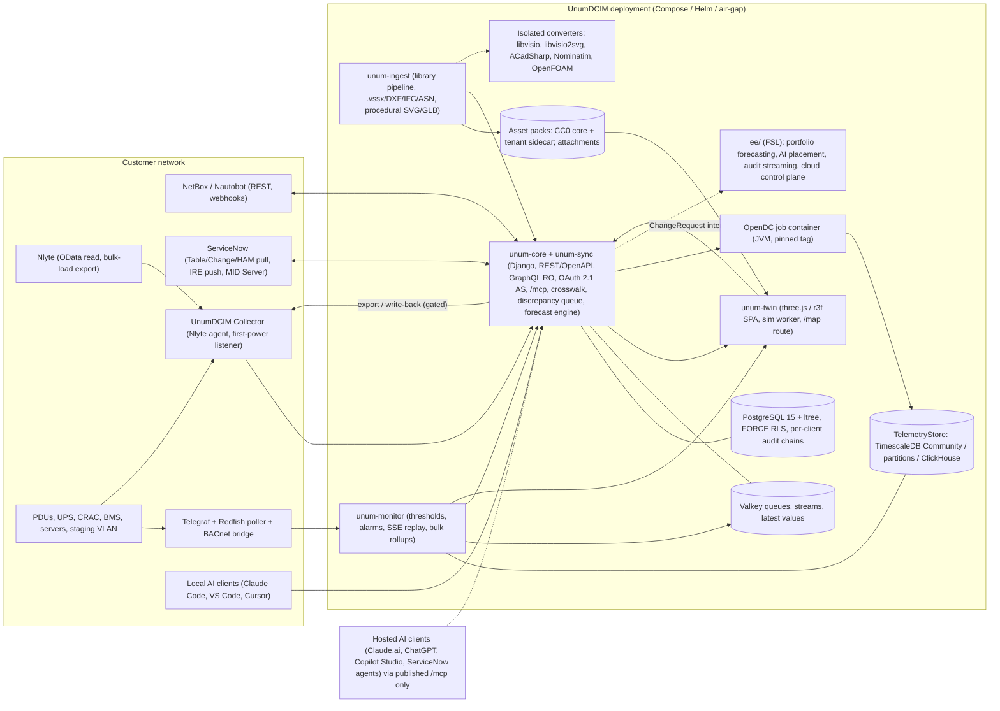

> **This is the condensed decision walkthrough and the index of the record.** The full documents named below live in this directory (`00-walkthrough.md`, `01-addendum-a.md`, `02-addendum-b.md`); ADRs are in `../adr/`; the canonical fact list is `../fact-sheet.md`. Session-directory paths mentioned in the Context section refer to the research session that produced these files and are not needed to read the record.

# UnumDCIM: Design Decision Walkthrough

## Context

Phillip wants to create an open-source, enterprise-grade DCIM (Data Center Infrastructure Management) platform, working name UnumDCIM. The project directory `/Users/phillipfernandez/StudioProjects/UnumDCIM` is empty: no code, no repo. Greenfield.

Stated goals (original request):

1. A strong asset library assembled from existing libraries (NetBox/Nautobot devicetype-library, vendor data, product images, Visio stencils, any source of accurately sized shapes) with an ingestion workflow that normalizes them.
2. A digital twin (replica) of the data center, borrowing UX and engine ideas from data-center games.
3. Feature parity with enterprise DCIM suites (Nlyte, Sunbird, Schneider EcoStruxure IT, peers).
4. Coexistence with incumbent DCIM systems, sharing data both ways. Nlyte first.

Requirements added after the first draft (2026-09-08):

5. ServiceNow integration with automation to push and pull data-center updates (bidirectional).
6. Scope beyond data centers: server rooms, IT closets, IDF and MDF spaces, and managing inventories for multiple clients (MSP-style operation).
7. Hardware receiving and onboarding as a first-class workflow.
8. Demand management and forecast management for power, cooling, space and any other relevant IT resource, as a key requirement.
9. An MCP (Model Context Protocol) server so AI assistants can engage with the system directly.

The ask is a walkthrough of the decisions required to design the offering. This plan is the condensed walkthrough plus what gets written into the repo once approved.

**How it was produced.** Round 1 (2026-09-07/08, 111 agents): 10 researchers over every source Phillip listed, Nlyte's integration surface and enterprise-OSS comparables; adversarial verification of 50 key claims (18 confirmed, 12 disputed on detail, 20 refuted on detail); three competing designs (NetBox-plugin platform, greenfield enterprise core, twin-first wedge); three judges (enterprise buyer, OSS maintainer, principal engineer); synthesis; completeness critic; gap-fill addendum. Round 2 (2026-09-08 to 11, 53 agents): 5 researchers on the added requirements; verification of 25 claims (6 confirmed, 3 disputed, 16 refuted on detail); an integrated design (Addendum B); a critic that raised 50 gaps and 15 conflicts with earlier decisions; a corrections pass (D75 to D83) that resolved every one. Corrected forms are used throughout; original wordings that failed verification are listed in section 7.

**Panel verdict (round 1).** Twin-first wedge scored 129 (won the buyer and maintainer lenses); NetBox-plugin platform 126 (won the principal-engineer lens on feasibility); greenfield core 117. The synthesis uses the twin-first spine on a greenfield, NetBox-superset data layer and grafts in the plugin design's NetBox compatibility policy, RackType/DeviceType targeting and zero-NLUL rule, plus the greenfield design's deviations list, provenance/ownership mixin, two-store library, telemetry federation and design-partner program. Judge-required corrections: the enterprise security baseline moves into the MVP; native alarming moves into Phase 2.

**Founder decisions recorded (2026-09-08).**

| Question | Answer | Effect |
|----------|--------|--------|
| Core license | Apache-2.0 | D04 final. GPL code and art never in-process; isolated containers only. |
| Hosted cloud within 24 months | No, self-hosted only | TimescaleDB Community is the self-hosted telemetry default, PostgreSQL partitions the fallback, ClickHouse for class L; SOC 2 slides to Phase 3; the Cloud tier leaves Phase 2. |
| Year-one funnel | Balanced | Phase 1 ships both the free twin for NetBox users and the Nlyte Collector; an Nlyte design partner must sign by the end of Phase 0 or the Collector slips to Phase 2. |
| Deliverable on approval | Decision docs + ADRs + repo hygiene | Section 8 items 1 to 7; no application scaffold. |

**Full documents (every citation), preserved under the session directory** `/Users/phillipfernandez/.claude/projects/-Users-phillipfernandez-StudioProjects-UnumDCIM/3a94bccb-dbef-48d9-85ad-be414b99c39d/tool-results/`:

- Walkthrough D01 to D31 with architecture, roadmap, risks, fact sheet: `bx9imm6nz.txt`
- Addendum A (corrections C1 to C15, D32 to D62, new facts): `b236n0voy.txt`
- Addendum B (D63 to D74 full form, B.7 roadmap, B.8 risks, B.9 questions, B.10 facts, B.11 refuted list): inside `/private/tmp/claude-501/-Users-phillipfernandez-StudioProjects-UnumDCIM/3a94bccb-dbef-48d9-85ad-be414b99c39d/tasks/wqde0k1jk.output` (key `addendumB`)
- Addendum B corrections (C.1 to C.7, D75 to D83): `brk0zcuj9.txt`
- Round-2 research digests: `bm5a38lx2.txt`; round-1 research digests: `bxr7x5x0q.txt`
- Raw journals: `.../subagents/workflows/wf_f693b63b-715/journal.jsonl` and `.../wf_2c7ea347-da7/journal.jsonl`

---

## 1. Executive summary: the decisions that shape everything

| # | Decision | Recommendation | Door |
|---|----------|----------------|------|
| D01 | Positioning | Twin-first, product-led wedge: an open, simulation-ready asset library plus a browser-native 2D/3D twin that installs beside an incumbent (Nlyte for enterprises, NetBox as the free funnel) with a per-field ownership ratchet, so it grows into a system of record and is never just a viewer | two-way scope, one-way ratchet |
| D02 | Substrate | Greenfield Django platform whose schema is a strict superset of NetBox 4.7 vocabulary; NetBox, Nautobot, Nlyte and ServiceNow are sync peers, not the substrate. No plugin bundle, no fork | one-way |
| D04 | License | Apache-2.0 core, permanent; GPL tooling only as process-isolated services | one-way |
| D05/D72 | Open-core boundary | Free forever: twin, library, all connectors, SSO, SCIM, RBAC, audit log, webhooks, air-gap, LTS releases, single-Organization demand/forecast (pools, reservations, demand intake, runway with intervals, alerts, MSP client and site rollups) and the MCP server. `ee/` under FSL-1.1-Apache-2.0 (auto-converts after 2 years) fences only multi-Organization portfolio rollups (cross-tenant aggregation), ML auto-model selection and ensembles, AI placement optimization, portfolio Monte Carlo, procurement-lead-time optimization, colo revenue analytics with rate plans, audit-event streaming, hosted control plane, certified-connector packaging, extended-support backports | one-way promise |
| D06 | Governance | DCO on core, CLA only inside `ee/`; register the mark now; zero dependency on NetBox Labs' Limited-Use components; foundation revisited at 3+ independent maintainers | one-way (CLA, mark) |
| D09 | Stack | Python 3.12 / Django 5.2 LTS control plane; TypeScript/React + three.js twin; Telegraf (unmodified) for collection; OpenDC (JVM) and ACadSharp (.NET) only as isolated containers | one-way |
| D11/D12 | Data model and source of truth | NetBox-superset schema with a written deviations list; Provenance mixin on every object; per-(tenant, entity, field) OwnershipPolicy with one owner per field; ExternalReference crosswalk; discrepancy queue; placement is one fact held as a ChangeRequest intent until the owner confirms | one-way |
| D08/D17 | Asset library | Bundle only CC0 data (netbox-community merged with nautobot devicetype-library); UnumDCIM definitions CC0, authored art CC-BY-4.0; every encumbered source fetched user-side into a tenant-private, license-tagged sidecar CI refuses to merge; procedural SVG/GLB as the always-available default | one-way (two-store split) |
| D14/D15 | Twin | three.js + react-three-fiber + drei (MIT), one scene graph for plan/elevation/orbit/walk, WebGL2 first-class, budgets validated in a Phase 0 spike on an Intel iGPU and a VDI software preset; sim owns state, renderers read it | one-way engine |
| D21/D32 | Nlyte coexistence | Read-first OData polling with customer credentials, snapshot hashing, crosswalk, discrepancy queue; customer-validated bulk-load export first; API write-back only after docs and a write account; Phase 0 validation gate; zero cooperation assumed | two-way |
| D10 | Datastores | PostgreSQL 15+ (ltree, tenant column, FORCE row-level security) + Valkey; `TelemetryStore` with TimescaleDB Community default, PostgreSQL partitions fallback, ClickHouse for class L | two-way behind interface |
| D63–D66, D75, D83 | ServiceNow push/pull | DiffSync adapter in core: pull via Table, Change and HAM tables; CMDB creates and updates only through the Identification and Reconciliation Engine with a registered discovery source, native keys and a shipped setup kit; retirement by state update, never deletion; MAC work attached to change requests; no Store app until a paying customer requires it | one-way (IRE rule) |
| D67–D69, D77 | Edge scope and multi-client | Typed SpaceClass on Location (data hall to closet); per-class feature applicability and floor-plan-less UX; Client under an MSP Organization enforced by FORCE RLS, composite keys, per-request client-id arrays and per-client audit chains; Supported tier per billable site with closets rolled up, or per weighted asset in MSP mode | one-way (class enum, Client entity, two table families) |
| D70, D76, D78, D79 | Receiving and onboarding | Asset (serialized unit, PO-to-retirement state machine, parent links for blades and modules) separate from Device; procurement objects; serial-first dock matching with a per-tenant identity precedence; staging-VLAN listener with a BMC credential ladder; peer enums as mapped projections | two-way |
| D71, D80 | Demand and forecast | ResourcePool, Reservation, DemandRequest, Forecast, Runway, Scenario on a rated → usable → committed → reserved → planned → measured → budgeted ladder; inventory-derived series as the universal input; 8-weekly-point gate; statsmodels/statsforecast ladder with bands and "show the math"; no deep learning in the reference install | two-way |
| D73–D74, D81 | MCP server | Mounted in `unum-core` at `/mcp`, spec 2026-07-28 with dual-era client support, Streamable HTTP only, OAuth 2.1 resource server with django-oauth-toolkit as authorization server issuing opaque tokens, grants resolved from RBAC (not scopes), pre-registered clients by default, reads annotated read-only, writes only as ChangeRequest intents executed after a different principal approves | one-way (placement, auth model) |
| D82 | Phase 1 scope | IRE push demonstrated on a test instance only, MSP mode and change attachment in Phase 2; a fourth (ServiceNow-shop) design partner sought; +1 integration engineer only when that partner signs | two-way |

---

## 2. Decision walkthrough: original scope (D01 to D31, with Addendum A amendments)

Each entry: why it matters, recommendation, the evidence that carries it, door type. Options with objections and full citations are in the preserved walkthrough.

### Stage A: before the first public commit

**D01 Positioning and wedge.** Incumbents built 15 feature categories over 10 to 15 years; Trellis died as "too large and complex." Own what no incumbent has: an open, redistributable, simulation-ready library and a browser-native game-grade twin. Day-one native-mastered objects: metric floor geometry, art and rack blueprints, overlays and scenarios, sensor placements, simulation-grade device attributes, plus cooling and upstream power chains where the peer lacks them (only NetBox/Nautobot lack these; dcTrack, FNT and Nlyte hold them in closed form, so the differentiator against them is openness). Funnels: free twin for NetBox users; Nlyte Collector for enterprises; ServiceNow-shop partner added by D82. "Installs in one hour" is an exit criterion, not a claim.

**D02 Substrate: greenfield.** NetBox's plugin API is documented-surface-only; facilities are out of scope; power stops at the Power Panel; GraphQL is read-only; three minors a year with breaks (4.7 requires PostgreSQL 15 and ltree; 5.0 makes RackType mandatory); tenancy is labels; NetBox Labs' Diode and Branching carry a Limited Use License barring products that compete with NetBox Labs. Borrow NetBox's vocabulary, permission-constraint design, change-log design and REST conventions verbatim (Apache-2.0). A thin optional NetBox plugin (deep-link tab plus event-rule action) comes later. One-way.

**D03 What parity means.** Publish the 13 table-stakes items as a roadmap contract: asset lifecycle with scaled elevations; capacity (U, power, cooling, weight, ports); full power chain with one-line diagrams and trace; structured cabling with patch panels; MAC workflow and work orders; SNMP/Modbus/BACnet monitoring with thresholds; PUE/sustainability; 2D + 3D; dashboards and BI export; REST/OpenAPI + webhooks + ServiceNow/VMware connectors; RBAC/SSO/MFA/audit; multi-site tenant isolation; mobile barcode audit. Sequence: library + twin + chains + capacity + sync at MVP; monitoring and alarms in Phase 2; workflow, cabling completion, sustainability, mobile in Phase 3; AI/AR later. Pass-through ports and basic circuit trace are modeled from Phase 1 (D49).

**D04 License: Apache-2.0 (founder-confirmed).** Admits every high-value reuse candidate (three.js/r3f/drei MIT, datacenter-survival MIT, OpenDC MIT, FlowGate BSD-2, Telegraf MIT, Nautobot SSoT Apache-2.0, draw.io VSSX importer Apache-2.0, ACadSharp MIT, devicetype-library CC0, statsmodels BSD-3, statsforecast Apache-2.0, official MCP Python SDK MIT, django-oauth-toolkit BSD-2). Excludes in-process GPL code and art (openDCIM, RackTables, GLPI, dctycoon sprites, libvisio2svg, LibreDWG, OpenFOAM, Nominatim), which run only as isolated containers. Never relicense the core.

**D05 Open-core boundary (as revised by D72).** One rule, one text, published in the README before v1: free forever = twin, library, all ingestion and sync connectors, OIDC/SAML/LDAP, MFA, SCIM (a deliberate differentiator), object and field RBAC, change log, webhooks, OpenDC integration, air-gap install, LTS releases, single-Organization demand and forecast management (ResourcePool, Reservation, DemandRequest, Runway, Scenario, trend runway with prediction and conformal intervals, headroom dashboards, exhaustion and lead-time alerts, ServiceNow demand mirror, MSP client and site rollups within one Organization), and the MCP server with all its tools. FSL tier = multi-Organization portfolio rollups (cross-tenant aggregation), ML auto-model selection and ensembles, AI placement optimization, portfolio Monte Carlo, procurement-lead-time optimization, colo revenue analytics with rate plans, audit-event streaming, hosted control plane, certified-connector packaging, extended-support backports. Rationale: dcTrack ships days-of-supply and project reservations in its base product and Schneider folded Capacity into IT Advisor's Unified Module in June 2026, so an open DCIM without them would rank below incumbents' base tiers.

**D06 Governance.** DCO for core, CLA only for `ee/` (GitLab pattern); Grafana/LF-style trademark policy; never "NetBox" in the product name; Diode protobufs/SDK (Apache-2.0) may be an optional producer output, the Diode server and Branching never a dependency; upstream a NetBox PR for DeviceType mm dimensions and typical power; foundation donation revisited at 3+ independent maintainers.

**D07 Business model (as revised by D57, D69, C.2).** Support tiers first, single-tenant Cloud only when cloud enters scope, FSL enterprise tier third; paid services (Nlyte migration, ServiceNow setup, library curation) are the first revenue. Supported tier priced per billable site (a building or campus containing at least one data_hall, computer_room, micro_edge_dc or server_room; closet-class Locations roll up to their parent building); in MSP mode, or wherever closet-class assets exceed 50% of weighted assets, the Supported tier uses the D69 weighted-asset unit instead. The per-cabinet trigger is retired; the weighted managed asset is the only usage unit. `ee/` entitlements are licensed per Organization by an unweighted asset-count band. Offline Ed25519 license files, no phone-home, expired licenses degrade `ee/` to read-only. Do not use the undated Uptime "49% cannot justify ROI" figures as current statistics.

**D08 Library data licensing.** Two physical stores enforced in code and CI: `library-core` (CC0 definitions, CC-BY-4.0 authored art, shipped) and `library-sidecar` (per-tenant, user-fetched, SPDX-tagged, never merged). Image-rights audit and takedown policy precede the first public pack (D61). One-way.

**D09 Stack.** Python/Django + DRF + drf-spectacular + Strawberry (read-only GraphQL); TypeScript/React/Vite + three.js; deterministic simulation core in TypeScript; Go only as an unmodified Telegraf binary plus a small Redfish PowerDistribution poller if needed; JVM (OpenDC) and .NET (ACadSharp) as isolated containers; a small Python staging listener in the Collector image (D79). One-way for the ORM language.

**D10 Datastores (founder: self-hosted only).** PostgreSQL 15+ with ltree, a mandatory tenant column and client column on client-scoped tables (D77) under FORCE row-level security with a non-owner application role; Valkey (BSD-3) rather than Redis 8; `TelemetryStore` interface with TimescaleDB Community as the self-hosted default (its `tsl/` tree permits internal use and value-added SaaS, bars bare DBaaS; counsel review before any hosted tier), PostgreSQL partitions where Timescale is not installable, ClickHouse for class L (switch above 50k active series or 5k writes/s) and mandatory for any future hosted tier. Timescale Toolkit `stats_agg` only as an optional accelerator behind `ForecastEngine` (Timescale License). NATS JetStream optional for multi-site fan-in in Phase 3.

**D11 Canonical data model.** Shared base = NetBox 4.7 vocabulary (Region/SiteGroup/Site/Location, RackGroup, RackType-first physical attributes, Rack, DeviceType/ModuleType with airflow/weight/cooling_method/end_of_life, Module/ModuleBay, front/rear ports with port mappings, Cable with multi-termination, PowerPanel/PowerFeed/PowerPort/PowerOutlet, CoolingSource/Feed/Intake/Outflow, Tenant, CustomField, Tag). Extensions: PowerSource and PowerNode (Redfish PowerEquipmentType vocabulary, parent link, kVA/kW, voltage, phases, A/B); PanelExtension and Breaker (openDCIM and Nautobot shapes, destination_panel); DC circuits; CoolingUnit capacity with derating; metric floor geometry (D13); SpaceClass on Location (D67); RackTemplate; Scenario/SimulationRun; Sensor/Reading; ChangeRequest/WorkOrder intents; ExternalReference; Row, Aisle, Containment, FloorTile, Contract/Warranty/SupportEntitlement, Part/Spare with StockLocation, CablePathway, TenantAllocation referencing a Party, MeteringPoint and FacilityMetrics (D50, D55); Asset and the procurement objects (D70); ResourcePool, Reservation, DemandRequest, Forecast, Runway (D71); Client/Party (D68); Attachment (D78); no-code custom object types in core in Phase 2. Written deviations from NetBox: multi-port feeds, PowerSource above panels, cooling loops as connections, metric geometry, typed SpaceClass. Keys: NetBox slug for library types, UUIDv7 for instances. One-way for the shared subset at v1.0.

**D12 Source-of-truth semantics.** Only the owning system writes a field; other systems' values land in staging. ExternalReference rows keyed (system_instance, entity_set, native_id); external IDs never primary keys; secondary matching scored (serial 1.0, asset tag 0.9, MAC 0.8, name+rack+U 0.7; auto-link ≥ 0.9, review 0.7 to 0.89). Discrepancies show side-by-side values, owner-wins default, logged override, badge on the rack in the twin; a discrepancy must persist across two snapshots. Placement is one fact: a drag in the twin creates a ChangeRequest intent rendered as a ghost until the owner confirms. Identity fields follow the D76 precedence list. Any "override" of an externally owned field is a staged value plus a logged discrepancy override, never a canonical write. Demotion (D39) only where a verified write-back path exists; the universal exit is the site bundle (D44). One-way.

**D13 Floor geometry.** Metric-first: per-room origin and rotation, declared tile grid, rack footprint from RackType outer dimensions plus yaw; grid references derived, not stored; grid-calibration step in importers; adapters for Nlyte GridReference, Nautobot floor-plan tiles, netbox-floorplan-plugin (LGPL, data only), OpenDC RoomTile. One-way.

**D14 Twin engine.** three.js + react-three-fiber + drei, vendored and pinned (never CDN globals; drei's detect-gpu pointed at a self-hosted benchmark URL). Budgets: ≤ 1,000 draw calls, 100k instances via InstancedMesh and BatchedMesh, three LOD tiers, three-mesh-bvh picking, demand rendering, quality slider. Phase 0 gate: 10k racks / 100k devices within budget on an Intel iGPU under WebGL2, plus the VDI software preset and the map route (D67). Unity, Unreal, Godot web and Bevy rejected for license, web or maturity reasons; Babylon.js is the viable swap. One-way.

### Stage B: MVP build

**D15 Twin UX.** One scene graph with camera modes (orthographic plan, isometric, orbit, rack-elevation preset, optional PointerLock walk behind a toggle) plus an SVG/HTML overlay for labels and print. Ship: tile-grid snapping with row alignment and occupancy map; U-slot drag to nearest free range with ghost preview (edge cases per D48); rack templates; port-level cable drawing with media validation; animated flow overlays on power and network paths; heat tiles as fact / estimate / CFD; EOL, warranty, redundancy and discrepancy badges; inspector pane; guided tutorial and sample site; keyboard alternatives and 24 px targets (WCAG 2.2). Hand cabling and rack mounting is the most praised game mechanic; missing tutorials the top complaint. Concurrency (D42): per-object versions, 409 on stale intents with a merge dialog, advisory soft locks; CRDT rejected.

**D16 Asset formats.** GLB (glTF 2.0, ISO/IEC 12113:2022) with EXT_mesh_gpu_instancing, Draco/KTX2; SVG elevations; WebP rasters; packs versioned and served from object storage or side-loaded; procedural SVG/GLB from dimensions as the default; a commissioned CC-BY-4.0 stylized facility set (founder question 10). OpenUSD export server-side only (official WASM exists since 25.11/26.03 but core-only). Omniverse interop-only (free for production and redistribution since May 2026 per NVIDIA; non-OSI, NVIDIA-platform-only).

**D17 Library schema and pipeline.** Seed at 2026-09-08: 7,181 device types across 327 manufacturers, 2,002 module types, 140 rack types, 2,472 elevation images (~909 MB), networking-heavy, no mm dimensions/typical power/heat/EOL/3D; commercial libraries claim 44,000+. Superset record keyed by NetBox slug with mm dimensions, typical/max/idle W, heat with confidence, PSU data, CPU/memory/GPU (OpenDC-ready), EOS/EOL, SKUs, media with license. Tiers: 0 bundled CC0; 1 user-fetched sidecar via fetch recipes (Cisco, APC, VisioCafe, Icecat post-counsel, Sketchfab CC0/BY/BY-SA, HPE Power Advisor, Cisco EoX with the customer's SNTC/PSS credentials); 2 customer imports (Nlyte Materials, Sunbird exports, Device42, openDCIM XSD, RackTables names). Normalizer clones devicetype-library's JSON Schema + pytest CI; versioned lossless mapper to NetBox 4.3/4.5/4.6/4.7. Launch gate: top-200 server/PDU/UPS/CRAC/switch SKUs enriched; in-app "contribute this model" flow with a rights attestation. Wall-mount, 2-post and open-frame RackTypes added to the CC0 library (D67).

**D18 Visio stencils.** Own Apache-2.0 OOXML reader porting geometry logic from draw.io's `importer.js` or Apache POI XDGF; libvisio (MPL-2.0) for binary .vss in a worker container; libvisio2svg (GPL-2.0) only as an optional isolated EMF vectorizer; Aspose rejected; [MS-VSDX] is not under the Open Specification Promise (patent US 8825722 listed), so counsel review. Legal: Cisco "use them freely, but you may not alter them"; NetZoom bars extraction and requires a separate license to bundle (blocked); Juniper's site notice prohibits reproduction; VisioCafe "© VSD Grafx" with no automated-download terms; APC "released to the public for free" with no license. Never bundle vendor art; fetch recipes default to "open vendor page, user downloads, tool ingests" (D61).

**D19 Enrichment connectors.** Icecat (OPL 1.4: anti-ML clause verbatim; purpose restriction UNVERIFIED, counsel; derived fields tagged and excluded from AI paths), HPE Power Advisor, Cisco EoX, Lenovo Press, Sketchfab; measured power-profile learning in Phase 3 only from customer telemetry, published as opt-in CC0 aggregates.

**D20 CAD/BIM ingestion.** DXF (ezdxf, dxf-parser, three-dxf, MIT) and IFC (web-ifc MPL-2.0 + ThatOpen MIT) in core; DWG via ACadSharp (MIT, .NET, R14 to R2018) as a Phase 2 sidecar.

**D21 Nlyte integration.** Verified surface: OData-style API at `/nlyte/integration/api/odata/` with `GET auth/AuthenticateBasic`, `@odata.nextLink` paging, `$expand`/`$filter`, entity sets Servers, Cabinets, PowerStrips, Networks, Chassis, LocationGroups, manufacturers, `*Materials`, `PowerStrips(id)/GetRealtimeValues`, reads only, evidenced by VMware FlowGate (BSD-2, archived). No public docs, EULA, rate limits, `$metadata` or delta support; no webhooks; bulk load is spreadsheet-driven (template format UNVERIFIED); v16 advertises Windows and Linux-Docker deployment and hosted tenants; no connection, power-path, panel, breaker, port or floor-plan entity evidenced in OData. Design: on-prem Collector container (Python/httpx) or HTTPS mode; self-throttled staging, off-hours full pulls, concurrency 2; startup probe tries `$metadata` and falls back to `$top=1` sampling; enumerations discovered per customer; grid calibration; GetRealtimeValues into telemetry; Materials into the Tier 2 sidecar; optional SQL data-warehouse reader. Phase 1 overlays from Nlyte limited to per-outlet realtime values; chains via D33 fallbacks. Reverse path: bulk-load export validated against a partner's templates; write-back under D47. A one-way cut-over switch (D21b, named-admin approved) flips ownership from Nlyte or any other DCIM writer to UnumDCIM for migrations. Zero cooperation from Carrier assumed.

**D22 NetBox/Nautobot and the sync framework.** DiffSync-pattern adapters (Nautobot SSoT, Apache-2.0). NetBox adapter over DRF REST + OpenAPI with ETag/If-Match, cursor pagination, all-or-none bulk, `changelog_message`, event-rule webhooks, `last_updated` polling fallback; versioned mappers 4.3 to 4.7 and 5.0; compatibility policy: current and previous minor, CI against main, connector releases within 30 days of each NetBox minor. Default NetBox OwnershipPolicy (D40) with write-back opt-in per tenant and dry-run first. Crosswalk rows added: Client → NetBox/Nautobot Tenant (TenantGroup = MSP Organization), SpaceClass → Nautobot LocationType (lossless) and NetBox custom field (lossy), SpaceClass → Nlyte LocationGroups and dcTrack LOCATION type (fidelity UNVERIFIED), SpaceClass → ServiceNow `cmn_location_type`. Also Nautobot, openDCIM and RackTables migration wizards, GLPI, Device42, i-doit, vSphere, spreadsheet import, an optional Hudu read-first adapter in Phase 3 conditional on an MSP design partner.

**D23 Public API.** DRF REST + OpenAPI 3.1 as the only write API with NetBox conventions (bulk ≤ 1,000 all-or-none, ETag/If-Match, `changelog_message`, prefixed `udt_` tokens, OAuth2 client credentials); read-only Strawberry GraphQL; HMAC webhooks; SSE with replay; read-only OData feed and SQL views through non-owner tenant-scoped roles with FORCE RLS (D58). Bulk import at scale (D41): staging tables, 1,000-row chunks, idempotent upserts by ExternalReference, dry-run diff, resumable; 100k assets/hour on the reference install applies to UnumDCIM's own importer, not to the ServiceNow push (D63).

**D24 Plugin model.** In-process Django plugins with a documented, versioned API; out-of-process connectors/collectors/converters as containers with a manifest (any license); frontend overlay/panel plugins as versioned ES modules; certified-connector program in the Supported tier.

**D25 Security and tenancy (in the MVP).** Object permissions with JSON constraints extended to field-level masks behind an interface (OpenFGA later); OIDC/SAML/LDAP; optional bundled Keycloak as air-gap IdP (not the MCP authorization server, D81); SCIM 2.0; MFA; change log with pre/post snapshots; Organizations as the hard boundary (tenant column + FORCE RLS) with Client beneath an MSP Organization (D68, D77); security.txt and a 5-working-day SLA. Secrets (D25b): envelope encryption with pluggable KMS (local key file, OpenBao MPL-2.0, customer-provided Vault, cloud KMS), site-scoped collector leases, rotation, documented FIPS mode; control actions (outlet switch, door unlock, firmware push, BMC AssetTag write) require a second-principal approval, execution window and immutable audit. Audit (D59, D77): append-only tables, one hash chain per (tenant, client) anchored into the tenant chain, WORM export, retention ≥ 7 years default, GDPR erasure by pseudonymization.

**D26 Deployment.** Docker Compose reference (app, worker, PostgreSQL, Valkey, twin, ingest; optional monitor, collector, Nominatim, sidecars) with a one-hour target; Helm chart; Kopf operator later; offline bundle with no phone-home; Sigstore signing, SPDX/CycloneDX SBOM, SLSA provenance; stateless app replicas over PostgreSQL HA; OpenTelemetry; example Grafana dashboards as JSON only. Air-gap sneakernet (D60). Backup/DR (D26b): reference RPO 24 h / RTO 4 h; Supported RPO 15 min / RTO 2 h with PITR; `unum backup/restore`; monthly restore-verification job. Browser matrix (D35): Chrome/Edge/Firefox N-2, Safari N-1, WebGL2 required, Full / Standard / VDI-software presets. Attachments (D78): `Attachment` model with local-filesystem default and customer-supplied S3-compatible backend; no object store bundled. Opt-in anonymized usage ping (D37), off in air-gap builds. PgBouncer, if used, in transaction pooling mode (D77).

**D27 Release cadence.** Three minors a year with tick-tock, one major a year aligned to Django LTS (5.2 to Apr 2028, 6.2 to Apr 2030), biweekly patches, security backports to N-2; public LTS every 18 months (3 years plus 2 years security), extended support paid; OpenAPI diffed in CI; collector/core N-1; full-fidelity `unumdcim-site` bundle guaranteed for every LTS (D44).

### Stage C: operations layer

**D28 Telemetry and monitoring.** Separate `unum-monitor` service with its own store. Collector contract: Telegraf configs generated from inventory (SNMPv3, Modbus, OPC UA, IPMI, MQTT with `xpath_protobuf` for Sparkplug B, legacy Redfish Chassis Power/Thermal); a UnumDCIM Redfish PowerDistribution v1.6.0 / Facility v1.4.2 poller; BACpypes3 (MIT, pre-alpha) BACnet/IP bridge; OTLP ingest; latest-value cache in Valkey; federation from Power IQ, IT Expert REST, Prometheus remote-read and Nlyte GetRealtimeValues. Series and alarms carry tenant and client labels; portal and MCP reads go through core-issued client-scoped tokens validated by introspection; a bulk rollup read endpoint serves the forecast engine (D80). Alarm engine (D52): threshold/derivative/absence/composite rules with hysteresis; raised → acknowledged → escalated → cleared; maintenance windows tied to ChangeRequests; email/SMS/webhook/Slack/Teams/PagerDuty/SNMP-trap channels; Telegraf disk buffering and active/standby collectors; polling tiers 1/5/15 min; retention raw 90 days, 5-min rollups 2 years, hourly 7 years. Discovery (D51): read-only via Redfish, SNMP, LLDP, vSphere into the discrepancy queue; never auto-promoted; no agents.

**D29 Simulation and thermal.** Tiers: static capacity on current plus planned state; deterministic power-chain/heat engine ported from datacenter-survival's MIT sim, re-parameterized and labeled "planning estimate"; OpenDC as an out-of-process job (pinned tag v2.4u) scoped to three questions (annual energy/carbon by hall, host-consolidation what-if, availability under a failure prefab), gated on ≤ 10% power MAPE at a design partner (D56); CFD via Cadence/Schneider connectors and an optional isolated OpenFOAM container. Estimate tier visible only after rack-inlet MAE ≤ 2 °C on ≥ 80% of sensored racks at two partners. Capacity model per D43 as extended by D71.

**D30 Workflow (as revised by C.2 item 2).** Intent-based Project / ChangeRequest / WorkOrder / Approval; ChangeRequest present from Phase 1 as the placement intent; the minimal approve/reject intent screen ships with D12; ServiceNow Change attachment and the approval gate move to Phase 2 (D65); Jira and BMC adapters, the full approval UI and the technician PWA stay Phase 3. Never depend on netbox-branching. Validation engine (D53) in Phase 2 ported from nautobot-app-data-validation-engine (Apache-2.0). Reporting (D54): free reports, CSV/Excel, scheduled emails, Grafana JSON, server-side SVG/PDF drawing export and DXF via ezdxf. Sustainability (D55): metering points per EN 50600-4-2 / ISO/IEC 30134-2:2026 (which replaced the 2016 edition on 16 January 2026), WUE (-9:2022), CUE (-8:2022), CER (-7:2023), ERF (-6:2021); EU Delegated Regulation 2024/1364 template in Phase 3.

**D31 Community (as revised by D82).** Library-first: "request a model" queue, in-app contribution flow with rights attestation, monthly packs, public demo site, connector marketplace, contributor leaderboard, governance seat for top library contributors; design partners before MVP freeze: one Nlyte shop, one NetBox shop, one colo, and a fourth ServiceNow shop with HAM (ideally SPM) targeted for Phase 1 month 6; openDCIM/RackTables migration wizards; built-in ROI reporting. Legal operations (D61). Staffing (D38 as revised): 6 FTE Phase 0, 9 in Phase 1 plus one integration engineer from month 6 only if the ServiceNow partner signs, 12 in Phase 2, 15 in Phase 3; SI partner program from Phase 2. Migration playbook (D21b) packaged as a paid service.

---

## 2b. Addendum B: ServiceNow, edge scope, multi-client, receiving, demand/forecast, MCP (D63 to D83)

Corrected forms from the round-2 critic and corrections pass are used; where a correction overrides the first draft, the corrected text wins.

### ServiceNow (requirement 5)

**D63 ServiceNow adapter architecture.** A DiffSync-style adapter inside `unum-sync`; no Store app in v1.
- **Pull** (baseline): Table API scheduled delta pulls on `sys_updated_on` (15-minute baseline, nightly full snapshot with hash comparison) over the physical CMDB classes, `cmdb_rel_ci`, `alm_hardware`/`alm_asset`, `alm_stockroom`, `alm_transfer_order`, `proc_po`/`proc_rec_slip`, `cmn_location`, `core_company`, `cmdb_model`/`cmdb_hardware_product_model`, `task_ci`, `change_request` via `/api/sn_chg_rest/change`, and `dmn_demand` where SPM exists; honor `X-Total-Count`, 429/`Retry-After`, `X-RateLimit-*`; Batch API only for small ordered read sets.
- **Push into the CMDB**: creation and attribute updates of `cmdb_ci` rows only through the Identification and Reconciliation Engine (`POST /api/now/identifyreconcile/enhanced`, `/query` dry-run first) with a registered `UnumDCIM` discovery source (v1: documented one-time admin step; a fix script only when the D66 scoped app exists), `sys_object_source_info` native keys, `last_discovered` set to the confirmation time, `maskedAttributes` recorded as provenance conflicts. Import Sets with `CMDBTransformUtil` only as a fallback for independent CIs (dependent CIs cannot go through Import Sets). Never write `cmdb_ci` through the Table API. Fixed write order per run: `core_company` (lookup only unless UnumDCIM is company master) → `cmn_location` (lookup, append missing children) → `cmdb_model` (lookup; create only when UnumDCIM is model master, else a "model missing" discrepancy with a slug hint) → `alm_hardware` resolution by serial → independent CIs → dependent CIs in the same payload → relations. Before pushing a device CI, resolve the existing `alm_hardware` row by serial and asset tag and include `serial_number`, `asset_tag`, `model_id` so the Asset-CI synchronizer matches rather than creates; assets the synchronizer auto-creates within 30 minutes of a push surface as "auto-created asset" discrepancies. Coexistence: if any other DCIM discovery source (Nlyte, dcTrack, Device42, Hyperview, NetBox Labs) stamped placement attributes in the last 90 days, those attributes default to pull-only and the OwnershipPolicy marks them external; the D21b cut-over switch flips ownership under named-admin approval. Throughput modes: canary (≤ 10 CIs, read-back), steady (60 items/min), bulk (post-canary, admin-enabled, off-hours, enhanced payloads of up to 250 items, concurrency 2, governed by rate-limit headers; documented estimate 5,000 to 15,000 items/hour; a 100k-CI initial population is a multi-night run).
- **Retirement and relationships (D83, ADR 0019 as amended)**: never delete a CI; retire by IRE value updates (`install_status = Retired` or `Absent`, `operational_status`, `hardware_status`, `life_cycle_stage` where mapped, `last_discovered`). Relationship removal: the Phase 0 spike tests whether `/enhanced` partial payloads prune omitted relations (UNVERIFIED); if not, one documented exception permits `DELETE /api/now/table/cmdb_rel_ci/{sys_id}` only for rows created by the UnumDCIM integration user whose endpoints are UnumDCIM-stamped or mastered (founder question 23); foreign relations become discrepancies.
- **Inbound real-time hint**: Business Rule + `RESTMessageV2.executeAsync` with an OAuth profile (no IntegrationHub license) optionally via `setMIDServer`, or a Flow Designer REST step (IntegrationHub; free-transaction tier no longer guaranteed); UnumDCIM's inbound webhook accepts only OAuth 2.0 bearer tokens from a per-tenant django-oauth-toolkit client-credentials client (HMAC dropped); MID Server keystore import documented for private CAs; the pull remains the record.
- **Auth**: inbound OAuth 2.0 client credentials (Washington DC and later) with a Web Service Access Only integration user holding `itil` or `asset` plus table roles; basic auth fallback; one integration user per tenant/workload.
- **Test instances**: a partner sub-production or vendor instance is the CI target (founder question 19); a Personal Developer Instance for smoke tests only (auto-upgrades, no HAM Pro/SPM/Event Management; program terms for automated commercial testing UNVERIFIED). Compatibility: N supported; N-1 tested where an instance is available.
- Depends on D12, D22, D47, D75. One-way for the IRE rule; two-way for the rest.

**D64 CMDB class and ownership mapping.** Spaces: `cmn_location` hierarchy plus `cmdb_ci_datacenter`, `cmdb_ci_computer_room`, `cmdb_ci_zone`, `cmdb_ci_rack` (rack units, in use, power consumption), `cmdb_ci_pdu`, `cmdb_ci_pdu_outlet`, `cmdb_ci_ups`, `cmdb_ci_crac`/`hvac`, `cmdb_ci_power_eq`, `cmdb_ci_circuit`, and CI Class Models container classes where installed; closets as `cmn_location` plus `cmdb_ci_computer_room` (no OOB closet class). U-position and power paths are not modeled OOB on device CIs: publish them as `u_` fields (`u_rack_position`, `u_rack_height_u`, `u_rack_face`, `u_space_class`, `u_unum_model_slug`, tenant-configurable names) plus `In Rack::Rack contains` and `Powers::Powered by` relations (`Cools::Cooled by` UNVERIFIED, used only if present); ServiceNow's OOB `cmdb_rel_rollup` can recompute rack units in use and power consumption from "Rack contains", so the default is "let ServiceNow roll up". Ownership by lifecycle segment: ServiceNow HAM masters the procurement segment (On order, In stock and substates, In transit, Missing, Retired substates such as Disposed/Sold) and asset tag, serial (per D76), model, cost, contract, warranty, assigned-to; UnumDCIM masters the placement segment (`install_status`/`hardware_status` for devices it has placed or staged: Pending Install, Installed, In Maintenance, Retired, Absent) and location, rack, U, orientation, power path, cooling, capacity; the setup kit includes a reconciliation rule granting UnumDCIM priority on those attributes; if the customer refuses it, the tenant runs in request mode (installation raises a `change_task` for the HAM group and UnumDCIM waits for the pulled value). `cmn_location`: ServiceNow masters it when the table is populated at connect time (≥ 1 row referenced by `alm_stockroom`, `cmdb_ci` or `sys_user`), otherwise UnumDCIM; in either mode UnumDCIM only appends missing child rows, never renames or re-parents. Per-source attribute history on the ServiceNow side needs the Multisource CMDB feature; UnumDCIM keeps its own staged copies regardless. Two-way.

**D65 Change, work orders, alarms, receiving and demand attachment (Phase 2).** Work orders create or look up a `change_request` (normal, standard from template, emergency), add affected CIs via `task_ci`, create a `change_task` per MAC step, store the change number. Editable state mapping: New/Assess/Authorize → intent submitted (ghost visible, reservations soft); Scheduled → approved (reservations firm, WorkOrder ready); Implement → executable; Review → verifying; Closed successful → applied; Closed unsuccessful → failed with ghost retained; Canceled or rejected → intent withdrawn, ghost removed, reservations released. Alarms to Event Management (`/api/global/em/jsonv2`, `message_key` correlation) where the ITOM Event Management/Health subscription exists. Receiving: pull `proc_po`, `proc_rec_slip` and In-stock assets; reverse receipt into HAM when the physical receipt happens at a UnumDCIM dock via Table API inserts into `proc_rec_slip`/`proc_rec_slip_item` (UNVERIFIED that receiving logic fires; test on the partner instance) with a `change_task` fallback; create `alm_hardware` from UnumDCIM only when it is HAM master. Demand: mirror-only in v1 (SPM masters `dmn_demand` when present; UnumDCIM never writes it; extra UnumDCIM states are local sub-states); a push path is deferred to founder question 24. Licensing checklist: Event Management, SPM, Procurement, HAM Pro, CI Class Models and Domain Separation are all probed at connect time and absent features disable their functions with a named message. Depends on D30, D63, D75. Two-way.

**D66 Store and certification posture.** No Store app or Service Graph Connector in v1. Verified constraints: certification requires partner-program membership (the Build Partner Program since January 2026; single undisclosed annual fee; a new Access Tier of unverified scope), a ServiceNow design review, validation with two customers, Store release and per-release upgrades; SGC entitlement is via ITOM or ITAM subscription-unit SKUs (ITOM sold as Advanced/Prime since April 2026); the claim that IRE-pushing apps cannot be certified is UNVERIFIED and not load-bearing; certification duration unknown (plan one family-release cycle). Revisit when a paying customer requires it. Two-way.

**D75 ServiceNow setup kit and connect-time probe.** A versioned kit (documents plus an admin-reviewed XML update set) containing: the discovery-source admin step; a per-class table of required identification rules (kit-supplied `cmdb_identifier` entries for `cmdb_ci_pdu_outlet`, `cmdb_ci_zone`, `cmdb_ci_circuit` and container classes, keyed on `sys_object_source_info`); the recommended reconciliation-rule set mirroring the D64 table; required `cmdb_rel_type` entries; the `u_` dictionary entries; the OAuth registry entity, integration user and roles; the inbound business rule and OAuth profile; a rate-limit rule; the `cmdb_rel_rollup` guidance. The probe checks each item and produces a readiness report; push is disabled until the discovery source, identification rules, reconciliation rules, relationship types and dictionary entries pass; it also detects the plugins in D65, asset auto-creation settings, foreign DCIM discovery sources and `cmn_location` population. Versioned per family release with CI fixtures. Depends on D63 to D66. Two-way.

### Scope: server rooms, closets, IDF/MDF (requirement 6a)

**D67 Space classes and edge-site behavior.** Typed `SpaceClass` on `Location` only (Row, Aisle and the colo cage remain distinct objects per D50; NetBox Location has no type field, NetBox declined native location classes in issue #21041, so the class projects to NetBox as a custom field or tag and 1:1 to Nautobot `LocationType`, which alone enforces attachments). Fixed set: region, campus, building, floor, data_hall, computer_room, micro_edge_dc, server_room, equipment_room, telecom_room (TR/IDF), main_telecom_room (MDF), entrance_facility, telecom_enclosure, plus stock locations (dock, staging, burn-in, stockroom). Vocabulary from TIA-942-C (May 2024; micro edge data centers; 5 kPa floor loading for rooms under 20 m²), TIA-569-E, TIA-606-C (administration classes 1 to 4, identifiers like B1-TR2-PP05-P12), ISO/IEC 11801; the equivalences telecom_room ≈ HDA/IDA and main_telecom_room ≈ MDA/ENI/MD are editorial; standards texts are paywalled, so product copy claims no compliance. Feature applicability per class: floor geometry, aisles, containment, cooling chain, tile load and CFD tiers only for data_hall, computer_room and micro_edge_dc; TR/IDF/MDF default to no floor plan, wall-mount/2-post/open-frame rack types (NetBox form-factor slugs verbatim, 10/19/21/23-inch widths), patch-panel-dense cabling, single-feed power with optional -48 V DC, one or two sensors, list/elevation/map UX, and a procedural closet scene from rack count. TIA-606-C-compatible identifier generator as the default naming template. Bulk onboarding via CSV/XLSX (address, class, contact, rack rows, latitude/longitude); CSV coordinates are the default path; geocoding is an explicit opt-in per tenant through a pluggable provider defaulting to a self-hosted Nominatim container (GPL, isolated; OSM data under ODbL sent to counsel; attribution stored per geocoded Location; extract size and import time documented as estimates), never Google Geocoding for persisted coordinates, public Nominatim only for tiny batches. Map view on MapLibre GL JS (BSD-3) as a separate `/map` route in `unum-twin`, never beside the three.js scene, with a static basemap image and SVG pins on VDI/iGPU presets and a bundled public-domain basemap for air-gap. Depends on D11, D13, D22. One-way for the enum.

### Multi-client (MSP) operation (requirement 6b)

**D68 MSP tenancy model.** Organization stays the hard boundary; `Client` is a `Party` with MSP scoping beneath an MSP Organization and is the root of every client-scoped record; `TenantAllocation` references a Party, so a colo tenant needing a portal is a Client with `scoping = portal_only`. Scoping applies to lists, search, dropdowns, exports, imports, the API and MCP tools (Snipe-IT and GLPI patterns, verified; Device42 hierarchical permissions); MSP staff spanning clients see the union; MSP superusers see all. Enforcement: FORCE row-level security, non-owner application role, composite `(id, tenant_id)` keys everywhere and `(id, tenant_id, client_id)` on client-scoped tables (cross-client references fail at the schema level for client-scoped tables and at the policy level for shared tables), `pgrls`-style lint and per-tenant isolation tests every release, including monitor reads and SSE streams. Schema-per-tenant reserved for instance-per-client packaging. Client-scoped credentials: tokens and MCP grants carry explicit client/site scope independent of the user's full permissions, reusing the D25b lease mechanism. Branding limited to logo, colours and domain-per-organization in Phase 3 (cost grounds). MSP mode is reversible per install; ServiceNow domain separation is disable-able but schema-persistent and is not documented as entitlement-gated, so `sys_domain` is populated conditionally only on domain-separated instances, with one ServiceNow connection profile per client. Hudu's "unlimited companies" and per-client export are UNVERIFIED; the precedent argument rests on Snipe-IT, GLPI and Device42. Per-client data residency pushes toward instance-per-region (founder question 14). Depends on D10, D25, D44. One-way for the Client entity.

**D77 Shared-versus-scoped records, session scoping, per-client audit chains.** Client-scoped tables (NOT NULL `client_id`): Location, Row, Aisle, Rack, Device, Asset and procurement objects, Cable, power-chain nodes, ResourcePool, Reservation, DemandRequest, Forecast, Scenario, ChangeRequest/WorkOrder, ReceivingRecord, TenantAllocation, ExternalReference, alarm instances, attachments, MCP task records, ServiceNow connection profiles. MSP-shared tables (no `client_id` column): Organization, Client/Party, users and grants, library sidecar and RackTypes/DeviceTypes, custom-field definitions, alarm channel definitions, other sync profiles, license files, the audit index. Shared physical resources (an MSP dock or staging room) belong to a reserved MSP-self client; ReceivingRecords at a shared dock belong to the MSP-self client with each ReceivingLine carrying the target `client_id`. Session mechanism: one transaction per request with `SET LOCAL unum.tenant_id` and `SET LOCAL unum.client_ids` (an array; MSP superusers get `*`); policies use `client_id = ANY(...)`; PgBouncer in transaction mode only; background workers set the same variables from the job's recorded scope. Audit: one hash chain per (tenant, client) with heads anchored into the tenant chain; offboarding = freeze → export (per-client D44 bundle plus the client chain) → hand the WORM export to the client or escrow → detach the chain and purge client-scoped rows, leaving a tombstone in the tenant chain; the MSP contract template states that content leaves with the client (founder question 26). Depends on D10, D25, D25b, D44, D59, D68. One-way for the two table families and per-client chains.

**D69 MSP metering.** Unit = operational effort per managed asset (racks, PDUs, UPS, cooling units, servers, network devices, patch panels; cables, blanking panels and components excluded), with a site-class weight: data_hall/computer_room/micro_edge_dc 1.0, server_room 0.5, closet classes (telecom_room, main_telecom_room, equipment_room, entrance_facility, telecom_enclosure) 0.25, stock locations 0.1; floor = 500 weighted assets aggregated at MSP level, no per-client or per-site minimum. Weights apply to the Supported tier (effort pricing); `ee/` entitlements per Organization by unweighted asset band. Published before the first invoice; usage per client exposed through the read-only OData/SQL views. Verified context: Sunbird's public price is $19.50/cabinet/month but fractional quarter-rack licensing exists since dcTrack 8.0 and is not on the public price page; Hyperview $3/asset/year with a 500-asset minimum. Two-way (effectively one-way after the first invoice).

### Hardware receiving and onboarding (requirement 7)

**D70 Asset lifecycle and receiving.** Two objects: `Asset` (serialized physical unit with procurement lifecycle, `Asset.parent` for blades, modules, PSUs, line cards and optics, which link to a Module or InventoryItem in the NetBox projection) and `Device` (placement and role); installation links them and syncs serial and asset tag (netbox-inventory pattern, MIT). State machine: planned → ordered → inbound → received → in_stock (available, reserved, defective, quarantine, pending_install, pending_transfer) → staged → installed (active, powered_off, off_site, offline, failed, in_maintenance) → decommissioning → retired (disposed, sold, donated, vendor_credit, lease_return, returned), plus in_transit and missing (lost, stolen). Peer enums as editable projection tables: NetBox `Device.status`; ServiceNow `alm_hardware` (hardware assets have seven states: On order, In stock, In transit, In use, In maintenance, Retired, Missing; Build is for bundles only; substates configurable; synchronization via `AssetAndCISynchronizer` and the `alm_asset_ci_state_mapping` / `alm_hardware_state_mapping` tables); dcTrack Planned/Installed/Storage/Archived; Hyperview `assetLifecycleState`; Nlyte Asset Status/Sub-Status (Planned Procurement/Received etc., UNVERIFIED, probed at the D32 gate). Procurement objects: Supplier, PurchaseOrder/POLine, Shipment/ASN and ShipmentLine (expected serials, SSCC-18, tracking; X12 856 carries one `REF*SE` per serialized unit; the importer is an in-house Apache-2.0 minimal segment reader, no third-party EDI library; format-agnostic CSV path), ReceivingRecord/ReceivingLine (`kind ∈ {serialized, quantity}`: serialized lines create N Assets, quantity lines increment Part/Spare stock; an item becomes an Asset the moment it carries a serial), Stockroom/StockLocation as space classes rendered as non-rack bins, TransferOrder, DisposalOrder, RMA, SupportEntitlement/Warranty. Dock identity precedence per D76; ASN/CSV import pre-creates expected assets; unknown serial quick-creates into quarantine; reject → RMA; every scan is an append-only audit event; damage photos stored per D78. Receiving UI: Phase 1 desktop form; Phase 3 technician PWA (HID scanner first, html5-qrcode Apache-2.0 or quagga2 MIT camera second, offline queue, MSP client selector). Workflow linkage: BOM lines derive from planned ghost objects; reserving a received asset to a ChangeRequest satisfies the work order's materials gate; staged placement is a ChangeRequest intent; installation closes the intent and flips the projections. Vendor entitlement connectors as customer-credentialed recipes: Dell TechDirect Warranty API (OAuth, 100 service tags per query), Cisco SN2INFO (75 serials per call, SNTC/PSS; pagination at 50 UNVERIFIED), Lenovo (rep-issued ClientID, no documented batch cap), HPE (a gated beta server-warranty endpoint via GreenLake Compute Ops Management exists; manual CSV default); vendor terms for MSP use UNVERIFIED. Do not depend on NetBox Labs' Asset Lifecycle (commercial-only, GA 2026-06-30 on Cloud and Enterprise Premium, model still moving). ZTP: expose "staged" as the trigger status for external ZTP/PnP/Ironic systems. Received-not-installed, reserved and on-order quantities feed the demand model. Depends on D11, D30, D46, D50, D51. Two-way.

**D76 Identity-field ownership across NetBox, ServiceNow HAM and the Asset.** One owner per field per Asset, chosen by an ordered per-tenant precedence list: default for `serial_number` and `asset_tag` is ServiceNow HAM (if HAM is present and a matching `alm_hardware` row exists) → UnumDCIM Asset (dock scan or ASN) → NetBox device (D40); NetBox-only estates keep D40 verbatim; Nlyte estates insert Nlyte after HAM; `mac_address` follows the same list with NetBox interfaces ahead of the Asset. Tie-break: the first recorder (earliest provenance timestamp) owns; the other value is a discrepancy. The owner is stored per field on the Asset's provenance record and shown by `unum.inventory.provenance`; non-owners receive projections. Depends on D12, D40, D46, D64, D70. One-way for "one owner per field".

**D78 Attachment storage.** `Attachment` model (tenant/client-scoped, content hash, MIME allowlist, size cap, virus-scan hook) with a local-filesystem backend on a shared volume or ReadWriteMany PVC by default and a customer-supplied S3-compatible backend configured from the D25b store; no object store bundled (MinIO is AGPL); attachments included in the site bundle and per-client export. Two-way.

**D79 First-power listener and BMC credential bootstrap.** A small Python staging listener in the UnumDCIM Collector image, one per staging VLAN, site-scoped lease per D25b, confined to staging VLANs by configuration (production VLANs refused), with candidate and rate caps: SSDP M-SEARCH for `urn:dmtf-org:service:redfish-rest:1` (SSDP is optional in Redfish and may be disabled, so it is never the only hook) plus passive DHCP-lease observation and an ARP/ND sweep fallback; reads `SerialNumber`, `SKU`, `UUID`, `Manufacturer`, `Model`; posts candidates to core, which matches inbound/in_stock assets and proposes `staged` into the discrepancy queue (never auto-promoted). Credential ladder: per-device password captured at the dock from the vendor label → per-manufacturer default-credential recipe (Apache-2.0 data file, documented, no bundled secrets) → none (reported as "found, unauthenticated"); on first success rotate to a generated per-device password in the vault; write `AssetTag` (writable alongside `HostName`; serial, SKU, part number and UUID are read-only) only after an approved WorkOrder under D25b. LLDP neighbor capture proposes rack/ToR placement into the discrepancy queue. Depends on D25b, D50, D51, D58, D70. Two-way.

### Demand and forecast management (requirement 8)

**D71 Demand and forecast model and algorithms.** Objects: `ResourcePool` (one per node of the power, cooling, space, port, IP and compute hierarchies attached to the ltree; rated capacity, derating policy, redundancy policy), `Reservation` (soft, firm, committed; quantity; optional exact placement; start and expiry with auto-release; release-on-planned-decommission; holder = DemandRequest, Project or TenantAllocation; auto-created from planned devices and intents), `DemandRequest` (client-scoped intake: driver, quantities per resource type or "racks of profile X", location constraints, need-by date, term, priority, probability; states Draft, Submitted, Screening, Qualified, Approved, Deferred, Completed mirrored from SPM, with local sub-states Reserved, Fulfilled, Closed, Rejected; SPM state names are configurable since the Australia release; approval creates Reservations and a Project/ChangeRequest), `Forecast` (method, horizon, p10/p50/p90, model metadata, training-window hash; `forecast_points` table with retention), `Runway` (per pool and threshold: exhaustion-date band, days remaining, procurement lead time per resource type shipped as labeled placeholders only, alert when exhaustion minus lead time enters the horizon; twin badges and MCP), `Scenario`. Capacity ladder per pool: rated → usable (continuous-load factor, N/N+1/2N/A-B, cooling aging, diversity) → committed (per tenant max(installed allocated, contracted), summed, plus untenanted installed load; overage reported separately as drawn minus contracted) → reserved → planned → measured → budgeted (p95 over N weeks plus margin, refreshed weekly, fallback to similar-model profile then nameplate × 0.6; implemented independently of Sunbird's patent-pending Auto Power Budget with a freedom-to-operate note; founder question 21). `ResourcePool.contracted` lives on TenantAllocation and rolls up to the Party. Resource types: space_u, floor_area_m2, tiles, floor_load_kg, weight_kg, power_kw and power_a per phase/leg at every power-chain node, cooling_kw, ports_copper, ports_fiber, cross_connects, ip_addresses, vcpu, ram_gb, storage_tb, bandwidth_gbps. Algorithm ladder: time-weighted weekly aggregates → segmented trend (fit after the last detected step) for inventory-derived series and OLS with prediction interval and x-intercept for measured series (statsmodels) → damped Holt/ETS or Theta when at least two seasons exist (season = 7 days for measured power/cooling, 52 weeks for inventory series, so seasonal ETS is effectively Phase 3) → conformal intervals (statsforecast; needs n_windows × h < length) → Croston/TSB for request arrivals → grouped cross-sectional reconciliation (site × client, then row and rack; hierarchicalforecast; cooling, floor-load and weight pools excluded from strict additivity and reported as constraints) → probability-weighted pipeline overlay with Monte Carlo bands. Gate: no statistical forecast below 8 weekly points ("insufficient history; planned overlay only"). No deep learning in the reference install; "show the math" names the series source. Rejected: Prophet (maintenance mode), NeuralProphet (beta), Timescale Toolkit as a default. Evidence: Uptime 2025 (n=638) 71% at least somewhat concerned about forecasting capacity, "very concerned" up nine points since 2023; modal rack density 1 to 3 kW for 30%. Vocabulary: ITIL 4/5 "capacity and performance management". Bring ResourcePool, Reservation and linear runway into Phase 1; demand intake, alerts and the SPM mirror into Phase 2. Depends on D11, D28, D30, D43, D80. Two-way.

**D80 Forecast series sources and cross-service reads.** The inventory-derived series (committed and planned per pool per day, materialized nightly from the change log and current intents into `pool_series`) is the universal input; measured series from `unum-monitor` are additive when present, read through `GET /api/v1/rollups/bulk?pools=…&from=…&to=…&agg=daily_p95` with tenant/client labels enforced by the core-issued token; the budgeted rung requires measured series. Depends on D28, D58, D59, D71, D77. Two-way.

**D72 Open-core boundary revision.** As stated in D05: the only forecasting fence is multi-Organization portfolio rollups plus the ML/AI and revenue-analytics list; everything single-Organization, including MSP client and site rollups, is core. One-way promise once published.

### MCP server for direct AI engagement (requirement 9)

**D73 MCP placement, protocol and authorization.** The MCP server lives inside `unum-core` as a Django-ASGI-mounted sub-app at `https://<instance>/mcp` (canonical RFC 8707 resource URI), Streamable HTTP only (never HTTP+SSE; stdio only via an optional local developer proxy). Target the 2026-07-28 specification (stateless: no sessions, `_meta` protocol fields, `Mcp-*` headers, `server/discover`, MRTR, `subscriptions/listen`, mandatory `ttlMs`/`cacheScope`; Roots, Sampling, Logging and DCR deprecated with earliest removal on or after 2027-07-28) with dual-era serving of 2025-11-25 and 2025-06-18 clients (ServiceNow's AI Agent Studio client, Claude.ai connectors, Copilot Studio); legacy sessions with `stateless_http=True` or a single-replica deployment (behavior for elicitation-free legacy tools confirmed in the Phase 0 spike per the SDK's legacy-clients page). Runtime: official Python SDK v2 (`mcp` 2.x, MIT; `MCPServer.streamable_http_app()`, `TokenVerifier`/`AuthSettings`, RFC 9728 metadata routes; host lifespan enters `session_manager.run()`; `allowed_hosts` set in production); FastMCP 4 (Apache-2.0) adopted only if the Phase 0 probe finds no server-side Tasks support in the official SDK; django-mcp-server (stuck on 2025-03-26) and mcp-django (dev-only) rejected. Authorization server: django-oauth-toolkit 3.4.1+ (BSD-2-Clause; RFC 8707, 9728, 8414, 7591/7592, 9207, CIMD; PKCE required since 2.0; the RFC 9207 `iss` and S256-only gates are opt-in flags to be turned on) fronting the platform's OIDC/SAML/LDAP federation; Keycloak's RFC 8707 support is an undocumented experimental flag, so it stays the air-gap IdP behind DOT until 26.8 is verified. Tenant scoping: every tool takes an explicit `org` argument annotated `x-mcp-header: Org` (mirrored as `Mcp-Param-Org` for gateway rate limiting and audit); the server rejects any org or client outside the token's grants; lists filtered by scope with `cacheScope: private`; `unum.org.list` enumerates accessible orgs for MSP users. Capability scopes (least privilege, step-up via `insufficient_scope`): `mcp:inventory.read`, `mcp:capacity.read`, `mcp:forecast.read`, `mcp:twin.read`, `mcp:telemetry.read`, `mcp:change.propose`, `mcp:change.execute` (off by default), `mcp:discrepancy.override`, `mcp:receiving.propose`, `mcp:sync.read`, `mcp:sync.trigger` (pull only). Depends on D09, D23, D25, D68, D81. One-way for placement and the resource-server model.

**D81 Token model, client registration defaults, reachability.** Tokens are opaque django-oauth-toolkit access tokens verified in-process (DB lookup, expiry, RFC 8707 audience = the `/mcp` URI, scopes), after which the subject's RBAC grants (Organization, Clients, sites) are loaded into the request context and shown on the consent screen; grants are never encoded as scopes; introspection enabled only for future external resource servers. Registration defaults: enterprise/air-gap profile = pre-registered clients only, DCR off, CIMD off; cloud-connected profile = CIMD with an egress allowlist (Anthropic, OpenAI, Microsoft, customer domains) and DCR only with an admin-issued initial access token; Claude Code's loopback redirect and the `https://claude.ai/api/mcp/auth_callback` redirect ship as pre-registered client templates. Reachability matrix (published): local clients (Claude Code, VS Code, Cursor, LAN/VPN agents) need no inbound exposure; hosted clients (Claude.ai/Desktop connectors, ChatGPT, Copilot Studio) require the operator to publish `/mcp` and the authorization endpoints through a hardened reverse proxy (an explicit, documented deviation from the no-inbound-holes reference install); ServiceNow AI Agent Studio → UnumDCIM requires a published endpoint (a MID-Server-relayed path is UNVERIFIED and not promised). Depends on D23, D25, D26, D37, D68, D73, D77. One-way for "grants are not scopes".

**D74 Tool catalog, resources, prompts and safety.** Names `unum.<domain>.<verb>`, deterministic order, reads `readOnlyHint=true`/`openWorldHint=false`, writes create ChangeRequest intents with `destructiveHint=false` and an `idempotency_key`; structured output with the text form also populated. Inventory: search, list, get, changelog, provenance, trace. Capacity: summary, find_space, power_chain. Demand/forecast (core): demand.list, demand.propose (intent), forecast.list_scenarios, forecast.get, forecast.run (Tasks), runway.get. Operations (Phase 2): telemetry.latest, alarms.list, alarms.acknowledge (intent confirmed by a user), cabling.trace, circuits.list, library.search. Twin: deep_link, snapshot (scoped to the D54 SVG/PDF exporter; 3D renders deferred, no headless renderer in the reference install), view_state. Change intents: propose_placement, propose_move, propose_decommission, propose_field_update (on an externally owned field this produces a staged value plus a logged discrepancy override under `mcp:discrepancy.override`, never a canonical write), change.list/get/submit; `unum.change.execute` only executes an intent already approved by a different principal in the UI or by the ServiceNow change gate (elicitation confirms execution, it is not approval; the check is on the intent record, so a proposer cannot approve through any surface). Receiving: list_shipments, propose_receipt, match_devicetype, status. Sync: sync.status, sync.discrepancies, sync.trigger (pull runs and dry-run diffs only; write-back never triggerable via MCP), servicenow.lookup_ci (server-held credentials). ChatGPT aliases `search` and `fetch` (read-only). Resources (`unum://org/{org}/site/{site}`, `.../rack/{rack_id}`, `unum://org/{org}/device/{device_id}`, `.../capacity/summary`, `unum://org/{org}/forecast/{scenario_id}`, `unum://org/{org}/change/{cr_id}`, `.../twin/scene.glb`, `unum://org/{org}/library/devicetype/{slug}`), change and sync resources subscribable. Prompts: capacity-review, rack-audit, receiving-checklist, forecast-brief, discrepancy-triage. Tasks (`io.modelcontextprotocol/tasks`) for forecast runs, sync pulls and renders, with handle-plus-poll fallbacks; task records in PostgreSQL under RLS bound to (tenant, client, sub) with random 128-bit ids, TTL 24 h, results purged after 7 days; synchronous tools kept under Claude.ai's 240-second timeout; results capped below client limits (25k tokens Claude Code, 150k characters Claude.ai). Injection controls (labeling is not a control): per-field allowlists via `fields=` with conservative defaults (free-text `description`/`comments` excluded unless requested), 512-character caps on free text with a truncation marker, stripping of control and zero-width characters and instruction-pattern prefixes, an opt-in "names only" mode per untrusted sync peer, and a written statement that residual tool-result injection risk is accepted and logged. Every `tools/call` and `resources/read` audited with `sub`, `client_id`, request UUID and `traceparent`; `requestState` AEAD-protected and bound to `sub`, TTL and request digest; tool descriptions static, versioned and reviewed in CI; `list_changed` and version bumps force re-approval; per-token and per-org rate limits. Licensing split: UnumDCIM calling ServiceNow REST consumes no Assists; ServiceNow agents calling UnumDCIM's MCP need Now Assist Pro Plus/Enterprise Plus and consume Assists per call. Precedents: NetBox Labs' netbox-mcp-server (Apache-2.0, read-only tools `netbox_get_objects`, `netbox_get_object_by_id`, `netbox_get_changelogs`, `netbox_search_objects`; NetBox Labs' governed-write story is "NetBox Agents", SaaS-only); Nautobot's server is commercial and read-only; ServiceNow's MCP Server Console (Zurich, expanded May 2026, Now Assist SKUs, OAuth 2.0 authorization code only, CIMD from Zurich P7). Roadmap: Phase 1 read tools and prompts; Phase 2 intents, operations, receiving and pull-only sync tools with elicitation and Tasks; Phase 3 MCP Apps viewer, enterprise-managed authorization (ID-JAG), client-credentials extension for `unum-monitor`. All Apache-2.0 core. Depends on D12, D30, D47, D73, D81. Two-way.

**D82 Phase 1 scope rebalancing.** IRE push, change attachment and MSP mode move to Phase 2; Phase 1 keeps ServiceNow pull with the probe and readiness report, IRE push demonstrated on the test instance with the setup kit applied, the Asset lifecycle data model with importers and the desktop receiving form, inventory-derived runway, read-only MCP, edge UX and bulk onboarding. A fourth (ServiceNow-shop) design partner is sought but is not a Phase 1 exit dependency; D38 adds one integration engineer from Phase 1 month 6 only if that partner signs. Two-way.

---

## 3. Reference architecture

- **`unum-core`** (Python/Django monolith: org, party/client, dcim, power, cooling, cabling, floor, capacity, demand, library, workflow, provenance, sync, mcp apps) on PostgreSQL 15+ (ltree, tenant and client columns, FORCE RLS, per-request `SET LOCAL` scope variables) and Valkey; REST/OpenAPI, read-only GraphQL, OData feed and SQL views through non-owner roles, SSE, HMAC webhooks, the OAuth 2.1 authorization server (django-oauth-toolkit) and the `/mcp` endpoint; Provenance, OwnershipPolicy, ExternalReference, ChangeRequest intents, per-client audit chains; `unum-sync` as an app with DiffSync adapters (NetBox, Nautobot, Nlyte OData, ServiceNow with the setup-kit probe and IRE emitter, ServiceNow Change, vSphere, Device42, GLPI, i-doit, migrators, optional Hudu); forecast engine and `pool_series` materialization in the worker; `ee/` (FSL) for portfolio forecasting, AI placement, audit streaming, cloud control plane.
- **`unum-ingest`** (Python CLI/service): CC0 corpora mirror, fetch recipes and customer imports into the sidecar, .vssx (own reader), DXF, IFC, GLB, ASN/CSV, normalizer, procedural SVG/GLB with LOD tiers, review queue, signed asset packs. Isolated containers: libvisio (MPL), optional libvisio2svg (GPL), ACadSharp (.NET), Nominatim (GPL, opt-in).
- **`unum-twin`** (TypeScript/React/Vite on three.js via r3f/drei): one scene graph, instancing and LOD, engine-agnostic domain layer, command stack synchronized with the change log, overlay/panel plugin SDK, in-browser deterministic sim worker, separate `/map` route on MapLibre with static fallback; embeddable via deep links.
- **`unum-monitor`** (Phase 2, separate service with its own schema/store, OAuth2 client credentials to core): OTLP ingest from Telegraf, Redfish PowerDistribution poller, BACnet bridge, federation connectors; `TelemetryStore`; tenant/client labels on series and alarms; thresholds, traps, notifications, streaming with replay; bulk rollup read endpoint.
- **Customer-network components**: UnumDCIM Collector image (Nlyte OData agent, staging-VLAN first-power listener), Telegraf and pollers; per-collector tokens bound to tenant and site; N-1 compatibility with core. ServiceNow reaches self-hosted installs through a MID Server (outbound 443); hosted MCP clients only through a deliberately published, hardened `/mcp`.
- **Sidecars**: OpenDC job container (JVM, pinned tag); optional OpenFOAM; CFD connectors.
- **Deployment**: Compose reference, Helm with subcharts, Kopf operator later, signed offline bundle, no phone-home; attachment storage on a shared volume or customer S3-compatible endpoint.

---

## 4. Phased roadmap with exit criteria (consolidated)

**Phase 0: Foundations (months 0 to 3).** Apache-2.0 core + FSL `ee/` layout; DCO/CLA split; trademark filing; governance charter with the single open-core rule (D05/D72); schema v1 with deviations list, Provenance/OwnershipPolicy, ExternalReference, ChangeRequest intent, metric geometry, UUIDv7, SpaceClass, Client/Party with `client_id`, FORCE RLS, composite keys, Asset/Device split and procurement objects, ResourcePool/Reservation; Tier 0 library build with image-rights audit and procedural SVG/GLB; twin performance spike including the VDI software preset and the map route; Compose one-hour install; cosign/SBOM/SLSA/security.txt; OTel; string externalization and metric storage; staffing plan; design partners recruited (Nlyte shop, NetBox shop, colo; ServiceNow shop sought); Nlyte validation gate (D32) and OData mock; ServiceNow test instance (partner sub-production preferred) with IRE payload fixtures, `/query` dry-run, relation-pruning spike (D83), setup-kit v0 and probe (D75); django-oauth-toolkit conformance spike with opaque tokens and consent-screen grants; MCP dual-era spike (Claude Code v2 runtime and a 2025-06-18 client) with a negative cross-client test and the Tasks-support probe; license-allowlist CI check extended to DOT, Nominatim (container only) and the in-house EDI reader; NFR targets for size classes S/M (D34); upstream NetBox PR for DeviceType dimensions/power.
*Exit:* 10k racks / 100k devices within budget under WebGL2 on an Intel iGPU and the VDI preset; CC0 pack passes the rights audit; schema round-trips a NetBox 4.7 export losslessly; three design partners signed; Nlyte capability record and supported-version matrix; with a Discovery-style reconciliation rule set installed, a 100-CI IRE payload round-trips with placement attributes accepted and HAM-owned attributes masked exactly as the D64 table predicts, masked entries visible in the discrepancy queue; `/mcp` answers `server/discover` from a 2026-07-28 client and `initialize` from a 2025-06-18 client in one deployment with opaque DOT tokens; isolation suite passes for two synthetic clients across every list/search/export/import/API/MCP path; SpaceClass projects losslessly to a Nautobot LocationType fixture; Tasks support recorded as present or absent.

**Phase 1: MVP beside NetBox, Nlyte and ServiceNow (months 3 to 10).** Twin with plan/iso/orbit/elevation/walk-toggle, snapping, U-slot placement with the edge-case suite, rack templates, port-level cabling with pass-through ports and basic circuit trace, power/network path overlays where UnumDCIM or NetBox hold topology, Nlyte per-outlet realtime overlays, badges, inspector, tutorial, sample site; native-mastered objects with one-line SVG and the capacity ladder; interactive deterministic sim; NetBox/Nautobot adapters with compatibility policy and dry-run write-back; Nlyte Collector (read, hashing, crosswalk, calibration, probe, discrepancy queue) and reverse-path export designed against a partner's templates; ServiceNow pull with the probe and readiness report, IRE push demonstrated on the test instance only, inbound OAuth webhook; Asset lifecycle with child assets, ASN/CSV importer, ServiceNow HAM slip import, attachments, desktop receiving form; inventory-derived runway with the 8-point gate and "show the math"; MCP read-only tools, `search`/`fetch`, prompts, local clients; edge-site UX (rack list, elevation, procedural closet scene, `/map` route) and bulk onboarding with CSV coordinates by default and TIA-606-style identifier templates; openDCIM/RackTables wizards; staged bulk import validated at class L; concurrency versioning; .vssx reader, DXF/IFC underlays, Icecat (post-counsel) and HPE Power Advisor connectors; top-200 SKU pack; REST/OpenAPI, GraphQL, webhooks; OIDC/SAML/LDAP, MFA, SCIM, object and field RBAC, Organizations + RLS, change log, envelope encryption, append-only audit; Helm chart, offline bundle with sneakernet ingest; attribution manifest and contributor attestation; site bundle format; opt-in analytics; public launch with the contribution flow. MSP mode is not in Phase 1.
*Exit:* a Nlyte partner's estate renders within one hour from read-only credentials; a NetBox site round-trips with zero unexplained discrepancies over 30 days; a proposed rack move becomes a confirmed placement through the reverse path without reopening a discrepancy; a partner's or vendor instance's CMDB racks, PDUs and devices render in the twin within one hour from a read-only integration user, and IRE push succeeds on the test instance with the setup kit applied; a 300-closet CSV onboards in under 30 minutes with map pins and procedural scenes; a received asset reaches `installed` via a ChangeRequest with the NetBox and ServiceNow projections flipped; Claude Code and one non-Anthropic local client complete a capacity question and a rack lookup against `/mcp` with per-org scoping proven by a negative test; class-L NFRs met; retirable incumbent module: Floor Planner view and any 3D/AR add-on.

**Phase 2: Nlyte-coexistence release and operations (months 10 to 20).** Ownership promotion UI and "modules retirable" report; migration playbook and paid service; demotion mechanics; Nlyte write-back where a customer verifies endpoints; IRE push on customer instances with the setup kit and bulk mode; ServiceNow change attachment with the state-mapping table, Event Management (where licensed), SPM demand mirror, reverse receipt into HAM; MSP mode with the D77 inventory, per-client audit chains, read-only client portal, monitor scoping, per-client metering views and export, D69 published; `unum-monitor` with the collector contract, Redfish PowerDistribution poller, BACnet bridge, federation, native thresholds and alarms, bulk rollup endpoint; discovery; staging listener and BMC bootstrap (D79); demand intake, reservations with expiry and decommission release, runway alerts, grouped reconciliation, Scenario comparison including OpenDC (three-question scope with validation gate); validation engine; free reporting set and drawing export; metering points and PUE overlays; custom object types; offline license files; OpenBao/Vault/KMS backends; PITR backups; documented plugin API, connector manifests, twin SDK, certified-connector program; MCP intent, operations, receiving and pull-only sync tools with elicitation and Tasks (or FastMCP 4); vendor entitlement connectors; legacy .vss via libvisio, DWG via ACadSharp, Sketchfab and Cisco EoX connectors; thin optional NetBox plugin; community translations; first public LTS; Supported tier and SI partner program.
*Exit:* a customer runs threshold alarming for at least one hall from UnumDCIM instead of NEO/Power IQ; sync survives one Nlyte and two NetBox minor upgrades with mapper-version changes only; a MAC work order executes only after its ServiceNow change reaches Implement and closes from UnumDCIM; a cancelled ServiceNow change withdraws the ghost and releases reservations; a DemandRequest approved in UnumDCIM or mirrored from SPM creates Reservations that move the runway date, and the runway alert fires on a partner's real series; an MSP operator sees a cross-client rollup while a client-portal user of client A cannot enumerate client B through UI, API, export, MCP or telemetry (automated negative tests); a client offboarding produces a verifiable detached chain while the tenant chain still verifies; a Redfish-discovered server on a staging VLAN is matched to its inbound asset and proposed as staged without auto-promotion; retirable: NEO/Power IQ for migrated devices, Nlyte materials catalog as a read source.

**Phase 3: Enterprise parity and native system of record (months 20 to 36).** MAC workflow with approvals, work orders, projects, technician PWA including the receiving dock with HID/camera scanning, offline queue and label printing; RFID collectors; ServiceNow/Jira/BMC ticket adapters; audit-event streaming, portfolio forecasting, ML ensembles, AI placement and portfolio Monte Carlo in `ee/`; structured cabling completion; EU EED reporting template; measured power-profile learning; outlet control with approvals; NATS option; ClickHouse default for large estates; OpenFOAM isolated service and CFD connectors; OpenUSD export; colo TenantAllocation portal on OpenFGA scopes; per-client branding (logo, colours, domain); MCP Apps viewer, ID-JAG, client-credentials extension; thermal estimate tier promoted only after the D56 gate; optional Hudu adapter; Store/SGC scoped app only on customer demand; Keycloak as MCP authorization server only if 26.8 ships supported RFC 8707 + CIMD; FIPS 140-3 guide; WCAG 2.2 AA audit; Kubernetes operator; SOC 2 and FedRAMP 20x readiness when cloud enters scope; foundation decision revisited.
*Exit:* at least one design partner runs UnumDCIM as system of record with Nlyte as downstream mirror or retired; the 13-item table-stakes list fully met with published RFP responses; a dock audit of one closet site completes on the PWA offline and reconciles with zero lost scans; at least one MSP runs UnumDCIM for ≥ 10 clients with pass-through billing from the metering views; the MCP server passes the published client matrix; 3-year LTS in force.

---

## 5. Risks and mitigations (1 to 40)

1. Viewer trap → Provenance/OwnershipPolicy and intents in Phase 0; native-mastered objects at MVP; retirement-oriented roadmap.
2. Greenfield source-of-truth cost → port NetBox designs verbatim; scope police at gates; design partners before MVP freeze; migration wizards.
3. Nlyte uncertainty (reads only evidenced; Carrier hostile) → read-first, D32 gate, FlowGate fixtures, D47 protocol, ServiceNow hub alternative.
4. Placement split-brain → placement is one fact; twin edits are intents.
5. Library coverage and rights → two-store CI, image audit, procedural art, top-200 gate, counsel on VSDX and Icecat.
6. Over-claiming physics → fact/estimate/CFD tiers; D56 gates.
7. NetBox Labs competitive response → Apache-2.0 surfaces only, upstream contributions, never the NetBox mark.
8. Upstream churn (three.js, NetBox 5.0, OpenDC 3.0, datacenter-survival, FlowGate archived) → pinning, versioned mappers, isolated jobs.
9. Browser ceilings (VDI, iGPU, mobile Safari) → WebGL2 first-class, budgets, presets, Phase 0 gate.
10. Enterprise gates before revenue → support-first revenue, paid services from Phase 1.
11. Telemetry licensing and scale → `TelemetryStore` interface, ClickHouse path, TSL counsel before any hosted tier.
12. Open-core backlash → one rule published before v1; connectors, SSO, SCIM, RBAC, audit, LTS, demand/forecast and MCP never fenced.
13. Incumbents beside NetBox (Sunbird's NetBox connector, NetBox Labs Discovery/Assurance/Change Management/Agents) → differentiate on openness; track quarterly.
14. Nlyte chain topology unreachable → D33 fallbacks.
15. Icecat purpose scope → D45 counsel gate.
16. RLS bypass via BI roles → non-owner roles, FORCE RLS, application-layer OData.
17. Credential sprawl and unapproved control actions → D25b.
18. Restore never tested → monthly CI restore job.
19. Thermal heuristic shown as fact → D56.
20. Vault BSL entanglement → customer-provided only; OpenBao documented.
21. ServiceNow licensing traps (IntegrationHub free tier not guaranteed; SGC needs ITOM or ITAM SUs; Event Management needs ITOM Health; SPM demand needs the SPM SKU; Procurement plugin; HAM Pro; Unrestricted User counting; ServiceNow agents calling UnumDCIM's MCP need Now Assist Pro Plus/Enterprise Plus and consume Assists) → D63 auth defaults, D75 probe, per-customer licensing checklist.
22. IRE gotchas (pre-registered discovery source; dependent CIs need parents; masked writes; rate limits; OOB rollups fight pushed totals) → setup kit, `/query` dry-run, `maskedAttributes` as conflicts, "let ServiceNow roll up".
23. Bidirectional loops with ServiceNow business rules → `sys_object_source_info`, `last_discovered`, `sys_updated_by` filtering, two-snapshot persistence.
24. MSP cross-client leak → D68/D77 enforcement stack, `pgrls` lint, per-release isolation tests including monitor reads.
25. Metering-unit collision → D69 published first; per-cabinet trigger retired.
26. Vendor entitlement API terms (MSP use, HPE) → customer-credentialed recipes, per-client credentials, CSV fallback.
27. Statistical over-claiming; Sunbird patent-pending budgeting → bands and planned overlay always shown, 8-point gate, independent budgeting policy with a freedom-to-operate note.
28. MCP protocol churn and tool poisoning → dual-era serving, pinned SDK, D74 controls, re-approval on tool-list change.
29. Authorization-server immaturity (DOT's MCP stack landed July/August 2026; opt-in `iss`/S256 gates; Keycloak experimental; open DCR endpoint) → Phase 0 conformance spike, strict flags on, DCR off and CIMD allowlisted by default.
30. GPL geocoder → isolated container, optional profile, pluggable provider.
31. Receiving-record ownership in MSP shared docks → MSP-self client owns the record, per-line client assignment, provenance side by side.
32. Legacy MCP clients and elicitation → handle-plus-poll fallbacks, documented client matrix, approval enforced out-of-band.
33. IRE relation pruning unknown → D83 spike; discrepancy surfacing; customer archival guidance.
34. ServiceNow asset auto-creation duplicates → serial resolution before push, connect-time settings probe.
35. Multiple DCIM writers into one CMDB (Nlyte Asset Sync) → pull-only default, D21b cut-over.
36. Test-instance availability and PDI terms → partner sub-production instance; PDI for smoke only; N-1 restated.
37. ODbL exposure from persisted geocodes → counsel review; CSV coordinates default; attribution stored.
38. Published `/mcp` for hosted clients widens the attack surface → D81 matrix, hardening guide, pre-registered clients.
39. Per-client audit chains add operational complexity → tombstones, CLI verification tooling.
40. Staging-listener abuse → VLAN confinement, candidate caps, vault-only credentials, D25b approval for AssetTag writes.

---

## 6. Founder questions

Answered: 1 funnel (balanced), 2 hosted cloud (no, 24 months), 3 license (Apache-2.0), deliverable (docs + ADRs + hygiene).

Open, with the recommended default in parentheses:

4. Paywall owner: facilities operator free vs IT management/compliance paid (buyer-based rule as written).
5. Foundation trajectory: single-vendor with charter now (recommended) vs seeding an LF/CNCF path at launch.
6. Pursue the Nlyte Technology Partner Program? (Only after a design partner requests certified write-back.)
7. Thermal ambition ceiling: sensor/estimate only (recommended), isolated OpenFOAM, or vendor CFD connectors.
8. First-person walk mode: behind a toggle (recommended), deferred, or technician PWA first.
9. Launch-critical compliance gates: SOC 2 (cloud), WCAG 2.2 AA (public sector), FIPS/FedRAMP 20x (US federal).
10. Commission a CC-BY-4.0 stylized facility art set before launch? (Yes if budget allows.)
11. Binary .vss on day one? (Phase 2.)
12. Is there an Nlyte customer who can be the Phase 0 design partner? (Required for the balanced funnel.)
13. MSP unit of tenancy: Client as a Party beneath the MSP Organization (recommended) or Client as a full Organization with an umbrella role.
14. Per-client data residency inside one install? (If yes, instance-per-region packaging.)
15. Does the design partner run ServiceNow HAM Pro and SPM? (Decides receiving-slip, normalization and demand paths.)
16. MCP execution policy: `unum.change.execute` only after a different principal approves in the UI or ServiceNow (recommended) or never via MCP.
17. Which MCP clients must be supported at launch? (Local clients; hosted clients as a documented deviation.)
18. Metering unit MSPs will accept: weighted managed asset (recommended), per site, per client or per user.
19. Phase 0 ServiceNow test target: partner sub-production instance (recommended) or PDI only.
20. Move the closet-first technician workflow ahead of Phase 3 if an MSP design partner signs? (Yes if signed.)
21. Budgeting policy defaults (percentile, window, margin) and opt-in per tenant until counsel reviews the freedom-to-operate note.
22. Does any target customer model DCIM-managed rooms as CSDM 5 Facility Service Instances? (Adds a CSDM layer to D64 if so.)
23. Table API DELETE exception for `cmdb_rel_ci` when IRE cannot prune relations: acceptable (recommended, narrowly scoped) or never.
24. Demand push into `dmn_demand`: ever, or mirror-only permanently? (Mirror-only until a partner instance exists.)
25. Hosted MCP clients: will target customers publish `/mcp`? (Local clients only at launch.)
26. Per-client audit chain detachment: does "content leaves with the client" satisfy expected MSP customers, or must the MSP retain a sealed copy?
27. Staffing trigger: confirm the +1 integration engineer is contingent on a signed ServiceNow-shop partner.
28. Supported-tier unit switch: the 50%-weighted-closet threshold, or "MSP mode always weighted asset".

---

## 7. Fact sheet

### Rely on these (verified against primary sources, 2026-09-07 to 11)

- **Licenses:** NetBox, Nautobot, Nautobot SSoT, nautobot-app-floor-plan, data-validation-engine, CESNET inventory-monitor-plugin, netbox-lifecycle, netbox-qrcode, netbox-mcp-server: Apache-2.0. NetBox Labs Diode server/plugin and netbox-branching: NetBox Limited Use License 1.0; Diode protobufs/SDK: Apache-2.0. devicetype-library (both): CC0-1.0. netbox-floorplan-plugin: LGPL-3.0. three.js, r3f, drei, Pixi, Konva, Fabric, ACadSharp, ezdxf, dxf-parser, three-dxf, ThatOpen, Telegraf, ipmi_exporter, BACpypes3, datacenter-survival, server-survival, vsdx-js, netbox-inventory, netbox-inventory-plus, quagga2, official MCP Python SDK (`mcp` 2.2.0), django-mcp-server, jschuller/mcp-server-servicenow, django-multitenant, django-tenants, django-postgres-rls, pgrls: MIT. Babylon.js, snmp_exporter, Keycloak, OpenFGA, Grafana Alloy, OpenDC-STEAM, draw.io, Apache POI, ClickHouse, NATS, Kafka, ServiceNow/ServiceNowDocs mirror, html5-qrcode, FastMCP 4, MCP TypeScript SDK v2 (new code), MCP Tasks and Apps extensions, statsforecast, hierarchicalforecast, neuralforecast, Darts, GluonTS, Ironic: Apache-2.0. OpenDC: MIT. FlowGate, vr-dc-ex: BSD-2. python vsdx, gofish, Valkey, statsmodels, scikit-learn, sktime, django-rls, MapLibre GL JS: BSD-3. django-oauth-toolkit: BSD-2-Clause (addendum-author check, URL in the addendum; mechanically confirmed by the license-allowlist CI in Phase 0). libvisio, web-ifc, OpenBao: MPL-2.0. libvisio2svg, libemf2svg: GPL-2.0. dctycoon: GPL-3.0. LibreDWG: GPL-3.0-or-later. OpenFOAM: GPL. Nominatim: GPL-3.0-or-later Python, GPL-2.0 other files, Apache-2.0 Lua config (addendum-author check). openDCIM: GPL-3.0 via README/headers. RackTables: GPL-2.0. GLPI: GPL-3.0-or-later. i-doit Open, Snipe-IT, Grafana server, Zabbix 7: AGPL-3.0. MinIO: AGPL-3.0. Redis 8: RSALv2/SSPLv1/AGPLv3. HashiCorp Vault: BSL 1.1 (licensor IBM). Sentry and Snuba: FSL-1.1-Apache-2.0. TimescaleDB: Apache-2.0 outside `tsl/`, Timescale License inside; Timescale Toolkit: Timescale License. OpenUSD: Tomorrow Open Source Technology License 1.0. Prophet, NeuralProphet: MIT (not adopted). championswimmer/datacenter-tycoon: no license. OpenDT: no license. Icecat: Open Content License 1.4.
- **NetBox:** 4.7.0 released 2026-09-02 (PostgreSQL 15+, ltree, cooling models, end_of_life, plugin extension of core GraphQL types); facilities out of scope; PowerPanel the furthest upstream element; GraphQL read-only; Rack physical fields deprecated in favor of RackType, mandatory in 5.0; Location has no type field and native location classes were declined (issue #21041); RackType form factors include 2-post-frame, 4-post-frame, 4-post-cabinet, wall-frame, wall-frame-vertical, wall-cabinet, wall-cabinet-vertical with 10/19/21/23-inch widths; tokens are not tenant-scoped independently of the user; NetBox Cloud tiers Starter (certified plugins), Professional (adds compatible), Premium (private). Nautobot LocationType (parent, nestable, content_types) is the only NetBox-family construct that enforces attachments. devicetype-library at 2026-09-08: 7,181 device types, 327 manufacturers, 2,002 module types, 140 rack types, 2,472 images. NetBox Labs Asset Lifecycle: public preview 2026-05-19, GA 2026-06-30 on Cloud and Enterprise Premium, plugin v0.3.1, model still changing. NetBox Labs netbox-mcp-server v1.2.1: read-only tools `netbox_get_objects`, `netbox_get_object_by_id`, `netbox_get_changelogs`, `netbox_search_objects`; NetBox Agents (public preview 2026-08-27, SaaS-only) is the governed-write story.
- **Nlyte:** Carrier-owned since 2021-10-05; OData path, Basic-auth login, nextLink paging, entity sets and GetRealtimeValues from FlowGate (reads only); VA TRM lists Windows Server/.NET/IIS/SQL Server/SSIS and FIPS 140-2/3; v16 (2025-11-19) adds MQTT/Sparkplug B, SNMP trap enhancements, Windows and Linux-Docker deployment, multi-tenant cabinet views; 16.0.300 (2026-02-26) retired connectors and added a CDU device type; no public API docs, EULA or terms; alarms via SMS/email only; Receiving module scans in batch and reconciles to ITSM-generated assets; Placement & Optimization bulk-allocates up to 100 servers per project; Copilot navigates the OData API (not an MCP server).
- **ServiceNow:** IRE REST endpoints `identifyreconcile`, `/enhanced`, `/query`, `/queryEnhanced` need `itil` or `asset` and a registered `discovery_source` choice; Import Sets reach IRE via `CMDBTransformUtil`, not for dependent CIs; the scoped `sn_cmdb.IdentificationEngine` API exists; `sys_choice` cannot ship as a scoped application file; IRE stamps `discovery_source`/`last_discovered` and honors `sys_object_source_info`; reconciliation rules are per class/attribute with per-source priority and return `maskedAttributes`; Table API `sysparm_limit` default 10000, `X-Total-Count`, no bulk insert; rate-limit rules per user/role/all with 429 and `X-RateLimit-*`; Batch API on the default semaphore pool; base physical classes include `cmdb_ci_rack` (rack units, in use, power consumption), `cmdb_ci_pdu_outlet`, `cmdb_ci_crac`, `cmdb_ci_circuit`; CI Class Models adds container and panel classes; no OOB U-position on device CIs; OOB `cmdb_rel_rollup` on "Rack contains" (KB0788463); `cmn_location` parent hierarchy outside the CMDB; Change API at `/api/sn_chg_rest/change`, affected CIs in `task_ci`; HAM tables `alm_hardware`, `alm_stockroom`, `proc_rec_slip`, `alm_transfer_order`; hardware asset states On order, In stock, In transit, In use, In maintenance, Retired, Missing ("you shouldn't modify state values"; Build is for bundles); Asset-CI sync via `AssetAndCISynchronizer` and mapping tables; receiving slips per receipt; model normalization is HAM Pro; inbound OAuth 2.0 client credentials from Washington DC; Web Service Access Only integration users; `RESTMessageV2` needs no IntegrationHub, Flow Designer REST step does, and the free-transaction tier is no longer guaranteed; MID Server outbound-only on 443; Event Management inbound `/api/global/em/jsonv2`; two family releases a year (Zurich 2025-09-10, Australia GA 2026-05-05, Brazil Q4 2026); domain separation is request-to-activate, disable-able but not removable, with a Zurich activation utility and "Delete by Domain"; SGC certification requires partner-program membership (Build Partner Program since January 2026), a design review, two customers, Store release and per-release upgrades, entitled via ITOM or ITAM SU SKUs; MCP Server Console (`sn_mcp_server`) shipped in Zurich with expanded tool types GA May 2026, needs Zurich P9 / Australia P2, OAuth 2.0 authorization code only, CIMD from Zurich P7 / Australia P1, JWT tokens, endpoint pattern `/sncapps/mcp-server/mcp/<server>` (UNVERIFIED); AI Agent Studio MCP client speaks 2025-06-18 over Streamable HTTP/SSE with authless, API key or OAuth 2.1, tools only, Now Assist Pro Plus/Enterprise Plus, one extra Assist per call; SPM demand default states Draft, Submitted, Screening, Qualified, Deferred, Approved, Completed (configurable since Australia); precedents: Nlyte Asset Sync (ServiceNow masters asset attributes, Nlyte location/cabinet/U), Sunbird connector (bidirectional via MID Server; 9.3 adds OAuth2 and custom tables), NetBox Labs CMDB Integration v2.0 (Store-certified 2026-04-29, scoped app with its own attributes table, system-of-record per object type, Correlation ID matching, commercial license), Device42 (one-way, IRE, free), Hyperview (push-only to Import Sets).
- **MCP:** current spec 2026-07-28 (stateless; `_meta` protocol fields; `Mcp-*` headers; `server/discover`; MRTR; `subscriptions/listen`; `ttlMs`/`cacheScope` required; Roots/Sampling/Logging/DCR deprecated with earliest removal on or after 2027-07-28; HTTP+SSE deprecated); authorization OAuth 2.1 with RFC 9728, RFC 8707, RFC 8414/OIDC discovery, RFC 9207, PKCE S256, token passthrough forbidden; official Python SDK `mcp` 2.2.0 with `streamable_http_app()`, `TokenVerifier`/`AuthSettings`, dual-era serving (legacy sessions in-process); TypeScript SDK v2 Apache-2.0/MIT; FastMCP 4.0 (2026-08-31); django-oauth-toolkit 3.4.0/3.4.1 implement RFC 8707/9728/8414/7591/7592/9207 and CIMD, `iss` and S256-only as opt-in flags; Keycloak 26.7 has an undocumented experimental `resource-indicators` flag, CIMD behind `--features=cimd`; Claude Code v2.1.232+ runs 2026-07-28 with DCR, CIMD or pre-registered clients, `anthropic/requiresUserInteraction`, 25k-token result cap; Claude.ai/Desktop connectors need Streamable HTTP, support the 2025-03-26 to 2025-11-25 auth specs, 150k-character results, 240-second timeout; ChatGPT deep research needs read-only `search`/`fetch`; Copilot Studio Streamable HTTP only; Nautobot's official MCP server is commercial and read-only; OWASP MCP Tool Poisoning guidance; MCPTox average 36.5% description-poisoning success.
- **Edge/MSP:** TIA-942-C (May 2024; micro edge data centers; 5 kPa under 20 m²); TIA-569-E (May 2019, E-1 June 2022); TIA-606-C classes 1 to 4; Sunbird cites customers with 300 IDF sites and ~400 telco closets; Sunbird $19.50/cabinet/month with fractional quarter-rack licensing since dcTrack 8.0; Hyperview $3/asset/year, 500-asset minimum; Hudu $27/user/month annual with API on all plans; IT Glue API Enterprise-only ($44/user, 5-user minimum) with US, EU and AU endpoints; Snipe-IT company scoping and GLPI recursive entities; Device42 Building/Room/Rack with hierarchical permissions; PostgreSQL RLS bypasses (owners without FORCE, superusers/BYPASSRLS, referential-integrity checks); public Nominatim 1 request/second; Google Geocoding forbids storing results except place IDs; MapLibre ships no tiles.
- **Receiving:** dcTrack requires an approved Install request for Planned → Installed; X12 856 carries one `REF*SE` per serialized unit; Redfish `AssetTag` and `HostName` writable, serial/SKU/part number/UUID read-only, SSDP optional; Dell TechDirect Warranty API 100 service tags per query; Cisco SN2INFO 75 serials per call (SNTC/PSS); Lenovo rep-issued ClientID; HPE gated beta warranty endpoint via GreenLake Compute Ops Management; Ironic auto-discovery keyed by MAC with a DoS caveat and ironic-inspector retired.
- **Demand/forecast:** statsmodels 0.15.0, statsforecast 2.1.1, hierarchicalforecast 1.5.1, scikit-learn 1.9.0 (Python ≥ 3.11), Darts 0.47.0, GluonTS 0.17.0 current; Prophet 1.4.0 in maintenance mode; NeuralProphet beta since June 2024; Timescale Toolkit `stats_agg` is TSL and not in the built-in hyperfunction subset; Sunbird days-of-supply charts live in Power IQ, Auto Power Budget is patent-pending, dcTrack's default budget is 60% of nameplate; Schneider IT Advisor 10.0 (June 2026) folded Base, Capacity and Change into one Unified Module and is discontinuing the per-10-rack Capacity SKUs; Uptime 2025 (n=638): 36% very and 35% somewhat concerned about forecasting capacity; ISO/IEC 30134-2:2026 replaced the 2016 PUE edition on 16 January 2026; "demand management" is not an ITIL 4 practice; ITIL (Version 5) modules exist.
- **Round-1 facts retained:** OpenDC MIT, Kotlin/Java, v2.4u (May 2026), SDK master-only, no cooling/network/PDU modeling; pshenok games MIT with a headless deterministic sim; dctycoon GPL-3.0 archived; Waseku "Data Center" Unity 6.4 with no cooling/power model; three.js/r3f/drei MIT, glTF 2.0 ISO/IEC 12113:2022; ACadSharp MIT reads DWG R14 to R2018; OpenUSD official WASM since 25.11/26.03 (core only); Omniverse free for production and redistribution since May 2026 but non-OSI and NVIDIA-only; Cisco icons "use freely, don't alter"; Cisco Support APIs entitled to SNTC/PSS; Telegraf `xpath_protobuf` decodes Sparkplug B; Redfish PowerDistribution v1.6.0 and Facility v1.4.2; EU Delegated Regulation 2024/1364; PostgreSQL RLS bypass rules; Vault BSL 1.1; OpenBao MPL-2.0.

### Refuted or corrected during verification (do not rely on the original wording)

Round 1: "No permissive DWG parser"; "OpenUSD has no official WASM build"; "Omniverse requires a subscription for production"; "Cisco requires unmodified format plus a credit line"; "NetBox plugin docs list explicit prohibitions"; "NetBox has no cooling model"; "RackType lacks mm dimensions"; "Device types import only via YAML"; "NetBox Cloud admits only certified plugins"; "Change Management plugin is NLUL" (unverified); "Nlyte OData supports writes" (vendor-asserted only); "Nlyte is Windows-only"; "BDM templates are Excel with obtainable schemas" (unverified); "Nlyte claims 150k racks per instance" (2015 marketing); "OpenDC SDK is in tagged releases"; "Sunbird library is 37,000" (44,000); "devicetype-library has 6,667 types" (drifts daily); Uptime "6+ months / 6 to 12 months / 49%" figures as current; "packet flow is the most praised game mechanic"; "vr-dc-ex is the only OSS DC 3D codebase"; "Unreal charges $1,850/seat to all non-game orgs"; "drei is all-MIT and air-gap safe"; "TimescaleDB TSL blocks a DCIM SaaS"; "Telegraf covers every DCIM protocol except BACnet"; "Elastic and Redis switched to AGPL"; "Zabbix LTS is a paid entitlement"; "every core relicensing produced an LF fork"; "openDCIM 26.01 shipped"; "MS-VSDX parsing is license-clean"; "Vertiv publishes ungated stencils" (unverified).

Round 2: "IRE REST is the only IRE-compatible push path and a scoped app cannot create the discovery source" (other IRE paths exist; a fix script can insert the choice); "ServiceNow MCP Server GA on 2026-05-05 with no DCR" (Console shipped in Zurich; CIMD supported from Zurich P7; DCR unsupported; client speaks 2025-06-18); "SGC needs TPP membership and only ITOM Visibility entitles it" (Build Partner Program since January 2026; ITAM SUs also entitle); "base CMDB has no rack-units-in-use calculator" (OOB `cmdb_rel_rollup` exists; `cmdb_ci_circuit` exists); "NetBox Labs, Sunbird and Nlyte converge on per-field SoR with serial keying" (NetBox Labs is per object type with Correlation ID; Sunbird details unverified); "domain separation is one-way and MSP-entitlement-gated" (disable-able; no documented entitlement gate); "NetBox Location lacks a type and Nautobot LocationType is 2.x-only" (LocationType dates to 1.4.0); "a 1-cabinet IDF costs the same as a 42U cabinet under Sunbird pricing" (fractional licensing exists but is unpublished); "Hudu includes unlimited companies and per-client export; IT Glue has two endpoints" (unverified; three endpoints); "NetBox Labs Asset Lifecycle is preview-only" (GA 2026-06-30); "vendor entitlement APIs: HPE has none" (gated beta endpoint exists); "ServiceNow hardware assets have eight states incl. Build" (seven; Build is for bundles; substates larger and configurable); "AssetTag is the only writable Redfish identity property" (HostName too; SSDP optional); "runway and reservations are base features at Sunbird, Device42 and FNT while Schneider sells Capacity per 10 racks" (Sunbird's runway is in Power IQ per node; Device42 details unverified; Schneider folded Capacity into the Unified Module in June 2026); "SPM demand has a fixed seven-state lifecycle" (configurable since Australia); "the official SDK serves legacy clients statelessly" (legacy sessions are in-process; sticky routing); "django-oauth-toolkit 3.4 is a complete MCP AS and Keycloak cannot parse `resource` at all" (`iss`/S256 gates are opt-in; Keycloak has an experimental flag); "NetBox's MCP tools are named get_objects etc. and writes are deferred to a NetBox Cloud Platform MCP" (tools are `netbox_`-prefixed; the write story is NetBox Agents); "Claude.ai's timeout is 300 seconds" (240).

### Still unverifiable

Nlyte OData `$metadata`, write verbs, rate limits, session TTL, entity stability, chain/floor-plan entities, endpoint licensing, asset status enumerations, bulk-load template formats (D32 gate); Icecat Fair Use Policy purpose restriction (D45); NetBox Labs Change Management license; Eclipse Tahu Sparkplug `.proto` license; whether the full Nlyte application runs on Linux-Docker; Gartner Market Guide, Verdantix and Omdia bodies; whether devicetype-library images are rights-cleared; IRE relation pruning via partial payloads (D83 spike); whether `proc_rec_slip` inserts via the Table API trigger receiving logic; ServiceNow PDI terms for automated commercial testing; the Build Partner Program fee and Access Tier scope; `Cools::Cooled by` relationship type; ServiceNow MCP endpoint pattern and any MID-Server path for MCP; Nlyte LocationGroups and dcTrack LOCATION type fidelity; Cisco SN2INFO pagination; Lenovo API batch caps; Hudu per-client export and company limits; ODbL status of persisted geocodes; ISO/IEC 30134 parts beyond those cited; whether the official Python SDK implements Tasks server-side (Phase 0 probe).

---

## 8. What gets written to the repo on approval

Founder chose decision docs + ADRs + repo hygiene; no application scaffold. Materialize in `/Users/phillipfernandez/StudioProjects/UnumDCIM`:

1. `docs/decisions/00-walkthrough.md`: the full round-1 walkthrough (D01 to D31, architecture, roadmap, risks, founder questions, fact sheet) from the preserved file, with Addendum A's corrections C1 to C15 applied in place, D05 rewritten to the single open-core rule, D07/D57 and D30 amended per C.2, and the fact sheet aligned with section 7 above.
2. `docs/decisions/01-addendum-a.md`: Addendum A verbatim (D32 to D62, roadmap amendments, risks 13 to 20, new facts).
3. `docs/decisions/02-addendum-b.md`: Addendum B full form (D63 to D74, B.7 to B.11) with the corrections document's C.1 corrections applied in place, C.4 re-labelings applied, and D75 to D83, C.2, C.5 to C.7 appended as "Addendum B, round 3".
4. `docs/adr/`: one ADR per one-way door. Status "accepted" for 0001, 0003, 0004 (founder answered); "proposed" for the rest: 0001 license (Apache-2.0); 0002 substrate (greenfield NetBox-superset); 0003 stack; 0004 open-core promise and `ee/` FSL (single rule per D05/D72); 0005 governance (DCO/CLA split, trademark); 0006 data model shared subset and deviations list; 0007 provenance, one owner per field, placement as one fact, identity precedence (D76); 0008 metric floor geometry; 0009 twin engine and sim-owns-state; 0010 two-store library; 0011 tenant column with FORCE RLS; 0012 append-only audit with per-client chains (D77); 0013 site bundle guarantee; 0014 metric storage with unit preferences; 0015 SpaceClass enum on Location only; 0016 Client/Party entity and the two table families (D68/D77); 0017 MCP placement, opaque-token resource-server model, grants are not scopes (D73/D81); 0018 CMDB creates and updates only through IRE, retirement by state update, relationship deletion only under the D83 exception; 0019 Supported-tier unit (billable site with closet rollup; weighted asset in MSP mode).
5. `docs/parity-checklist.md`: the 13 table-stakes items and differentiators with T/D tags and phase numbers.
6. `docs/fact-sheet.md`: section 7 plus Addendum A's A.5 and Addendum B's B.10 facts, each with its URL; a separate "corrected and unverified" list.
7. `docs/founder-questions.md`: section 6 with the recorded answers and the open items.
8. Repo hygiene: `LICENSE` (Apache-2.0), `README.md` (positioning, the open-core rule verbatim, status), `GOVERNANCE.md`, `CONTRIBUTING.md` (DCO, rights attestation for assets), `SECURITY.md` (5-working-day SLA), `.well-known/security.txt` placeholder, `CODE_OF_CONDUCT.md`, `docs/licenses/allowlist.md` (permitted inbound licenses, the isolation rule for GPL tooling, and the named first-party components such as the EDI reader), `docs/servicenow/setup-kit/README.md` placeholder describing D75's contents.
9. NOT IN SCOPE NOW: the Phase 0 application scaffold (monorepo layout, CI with license allowlist, cosign, SBOM, Compose stack).

### Verification

- Every URL in `docs/fact-sheet.md` resolves (scripted HEAD/GET check; failures listed, not dropped).
- Mermaid diagrams render (preview in the in-app browser).
- Addendum A corrections C1 to C15 and Addendum B corrections C.1/C.4 are grep-verified against the copied documents (none of the corrected phrasings remain, e.g. "300-second", "cannot be Store-certified", "5 to 8 weeks", "validates DOT-issued JWTs").
- The open-core rule appears in exactly one form across README, ADR 0004, `00-walkthrough.md` D05 and `02-addendum-b.md` D72.
- ADR list matches every decision marked one-way in sections 2 and 2b.
- License allowlist cross-checked against every reuse candidate named in the docs.
